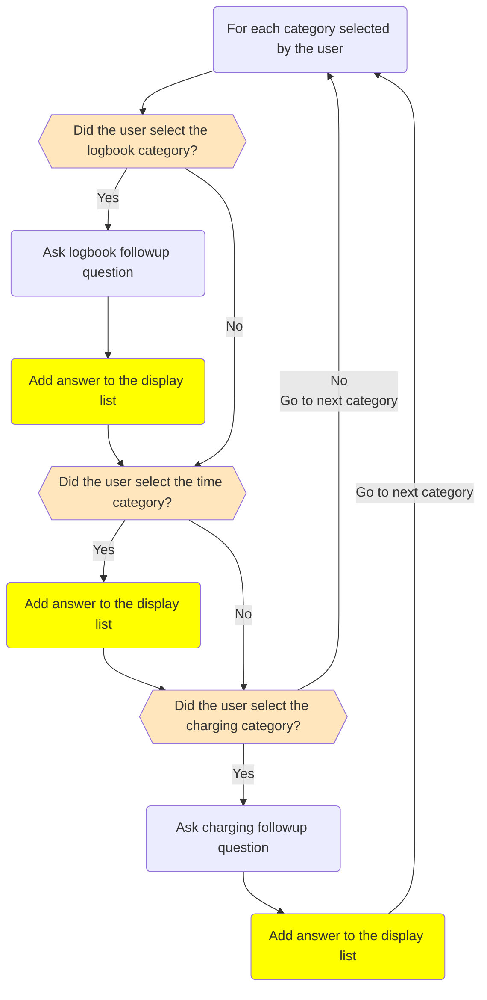

```mermaid
flowchart TD
    id0(For each category selected by the user)

    id0 --> id1{{Did the user select the logbook category?}}
    id1 -- Yes -->id2(Ask logbook followup question)
    id2 --> id3(Add answer to the display list)

    id3 --> id4
    id1 -- No --> id4{{Did the user select the time category?}}
    id4 -- Yes --> id5(Add answer to the display list)

    id5 --> id6
    id4 -- No --> id6{{Did the user select the charging category?}}
    id6 -- Yes --> id7(Ask charging followup question)
    id7 --> id8(Add answer to the display list)

    id6 -- No<br>Go to next category --> id0
    id8 -- Go to next category --> id0

    %% Define styles for flowchart items.  We want to make comments yellow
  %% and have a larger font size for regular items
  classDef commentClass fill:#faffd6,text-align:left
  classDef highlightClass fill:#ffff00
  classDef questionClass fill:#ffe6bc
  classDef boundaryClass fill:#eeeeee,text-fill-color:#fff
  classDef itemClass font-size:16pt
  classDef leftListClass text-align:left

  class id1,id4,id6 questionClass
  class id3,id5,id8 highlightClass
```