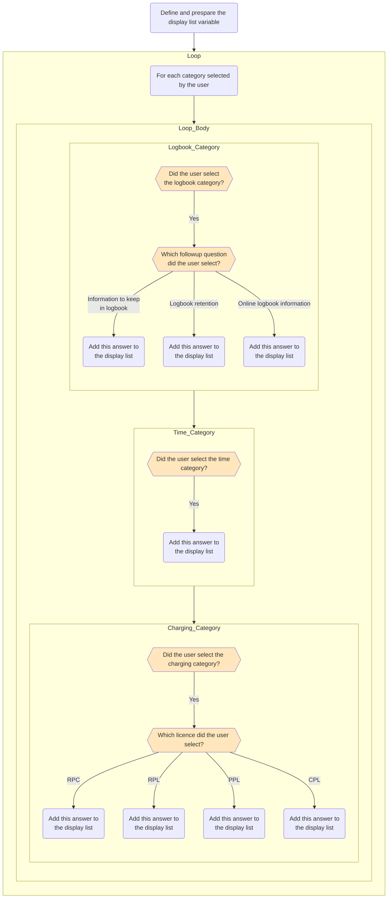

```mermaid
flowchart TD
  id00(Define and prespare the display list variable)
  id00 --> Loop
  subgraph Loop
    direction TB
    id0(For each category selected by the user)

    subgraph Loop_Body
      direction TB
      subgraph Logbook_Category
        direction TB
        id1{{Did the user select<br>the logbook category?}}
        id1 -- Yes -->id2{{Which followup question<br>did the user select?}}
        id2 -- Information to keep<br>in logbook -->id2a(Add this answer to<br>the display list)
        id2 -- Logbook retention -->id2b(Add this answer to<br>the display list)
        id2 -- Online logbook information -->id2c(Add this answer to<br>the display list)
      end

      subgraph Time_Category
        direction TB
        id4{{Did the user select the time category?}}
        id4 -- Yes --> id5(Add this answer to<br>the display list)
      end

      subgraph Charging_Category
        direction TB
        id6{{Did the user select the charging category?}}
        id6 -- Yes --> id7{{Which licence did the user select?}}
        id7 -- RPC --> id8a(Add this answer to<br>the display list)
        id7 -- RPL --> id8b(Add this answer to<br>the display list)
        id7 -- PPL --> id8c(Add this answer to<br>the display list)
        id7 -- CPL --> id8d(Add this answer to<br>the display list)
      end
      Logbook_Category --> Time_Category
      Time_Category --> Charging_Category
    end
    id0 --> Loop_Body
  end
  %% Define styles for flowchart items.  We want to make comments yellow
  %% and have a larger font size for regular items
  classDef commentClass fill:#faffd6,text-align:left
  classDef highlightClass fill:#ffff00
  classDef questionClass fill:#ffe6bc
  classDef boundaryClass fill:#eeeeee,text-fill-color:#fff
  classDef itemClass font-size:16pt
  classDef leftListClass text-align:left

  class id1,id2,id4,id6,id7 questionClass
```