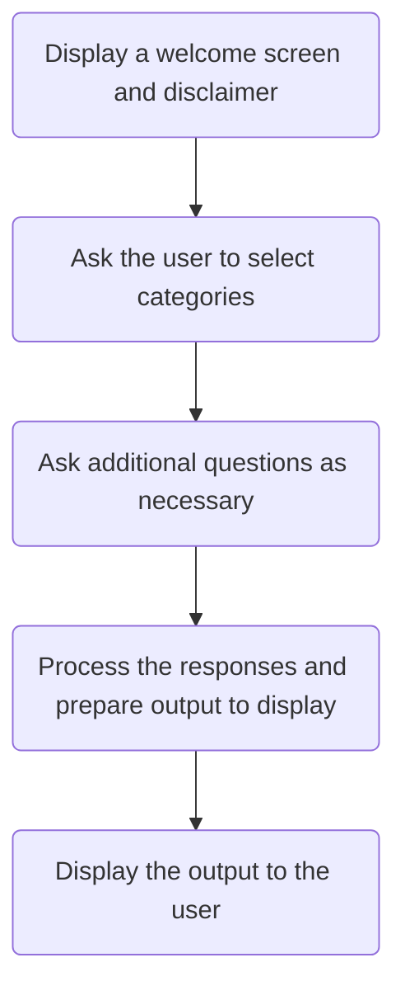
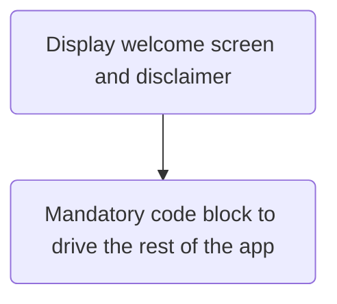
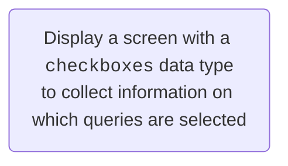
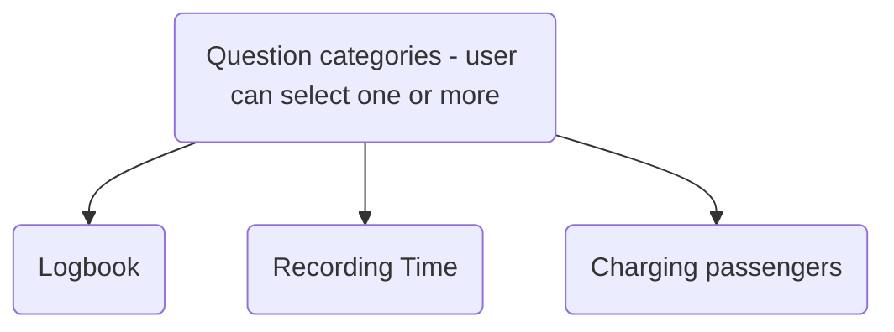
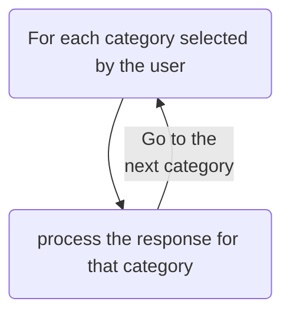

import {DisplayChapter} from '@site/src/components';
import {DisplayImage} from '@site/src/components';
import {DisplayGlossaryItem} from '@site/src/components';
import * as F from './_flowcharts';

This is the design document for this assessment.

## Client's requirements
In this assessment you have been asked by Ross and Keith Smith Aviation Lawyers (**RKS**)
to write an app to help their clients make certain enquiries about aviatin law.

As a first pass RKS have asked you to prototype the app with just three categories:
1. queries about pilots' logbooks;
1. recording time as a pilot in command; and
1. charging passengers.

A user should be able to select one or more cateogries.

The logbook category is further broken down into:
- What information should be kept in a logbook;
- for how long a logbook should be retained; and
- information about online logbooks.

The user should only select one of these.

For the charging category, the answer to the query will vary depending on the
user's pilot licence.  RKS have asked you to assume that any user will have only
one of a:
* Recreational Pilot Certificate (RPC);
* Recreational Pilot Licence (RPL);
* Private Pilot Licence (PPL); or
* Commercial Pilot Licence (CPL).

The app should display the output of all the queries on the app itself but also
make the results available for download or email via PDF.

RKS has informed us that most pilots, although not familar with the law, are
generally familiar with the different parts of aviation legislatin and any information
provided should cite supporting legislative provisions.

Finally, RKS would like the app to look attractive.  They are happy to style the
app as we please but would like the app to incorporate their
[logo](_static/vickers_vimy_logo.png).

## Design
:::note
The [Iteration](/docs/textbook/chapter_06/filtering) contains another example of the
drill-down design method we will apply here.
:::

As a first pass we could say our application is going to do this:

Let's work through each of these steps.

## Displaying the welcome screen and disclaimer
This part is straightforward.  We should create a single <DisplayGlossaryItem item='mandatoryquestionblock' />
to display welcome text and follow it with a <DisplayGlossaryItem item='mandatory' /> code block which will
drive the rest of the application.

So, this first part looks like this:


This screen and code block should go into the `main.yml` file.

## Selecting queries
The key part is the ability to select multiple queries.  We will need to use a variable
with a `checkboxes` datatype to store the user's selections.


This will be a question block.  We can put this question block in the `questions.yml` file along with 
the other questions we will ask.

## Asking additional questions
Our flow looks something like this:

We know we have additional quesitons for the Logbook category, and we need to ask the
user their licence type for the Charging Passengers category:

<F.Additional1 />

We will need additional <DisplayGlossaryItem item='questionblock' plural />
for the Logbook and Charging time questions.  Those question blocks
should display the choices as radio buttons.

From our flowchart it appears that we do not need to ask additional questions
for the Recording Time category.

### The Relevant Law
Civil aviation is controlled by a complex set of primary and subordinate legislation.
The primary Act that governs civil aviation is the *Civil Aviation Act 1988* (Cth) (**CAA**).
The CAA has a number of subordinate legislation that support it.  For the purposes of this
assessment we will deal with only the *Civil Aviation Safety Regulations 1998* (Cth) (**CASR**)
and some Civil Aviation Orders (**CAO**) which are subordinate legislation and legislative
instruments respectively.

More specifically, as starting points, RKS have told us that:
* legislation relevant to logbooks, pilot licences and time recording is in CASR Part 61; 
* legislation relevant to the Recreational Pilot Certificate is in CAO 95.55 and also
to documents of the delegated governing bodies to which CAO 95.55 refers.  However, 
RKS have advised us that, for the purposes of answering the passenger charging question
for a RPC holder we can limit ourselves to CAO 95.55 and the CASRs; and
* definitions relevant to the CASRs and CAOs are in a Dictionary at the end of the CASR; and
* although most terms relevant to this app are defined within the CASR and CAO not all are.

## Process the responses
There are two aspects of processing the responses.  One is determining which responses to
process, and the second is deciding what answers to display.

We have [already decided](#selecting-queries) to use [checkboxes](https://docassemble.org/docs/fields.html#fields%20checkboxes)
to record responses.  We will need to iterate over the values in our checkbox variable to determine which
categories our user has selected.

Each category ie: logbook, time and charging will only produce one answer.  Some categories require
follow-up questions (logbook and charging), and one does not.  Let's build this out:

<F.Process1 />

Like our [Iteration](/docs/textbook/chapter_06/filtering/00-10#evaluate-against-service-criteria) case study,
we should create a separate data structure, a 'display list', to display the answers to our responses.  Let's
build out our flowchart to reflect this:

<F.Process2 />

Our processing code should be written to a file called `process.yml`.

### The answers
In our [Iteration](/docs/textbook/chapter_06/filtering) case study we stored data in a
<DisplayGlossaryItem item='datablock' />.  A data block isn't quite so suitable for our purposes
in this context.  This is because our answers may be rather substantial - more than a line or
two of text - and we need to store to accommodate this.

:::note
It is possible to store long-form answers in a data block but doing so tends to make
the data block difficult to read and prone to errors.
:::

We will use Docassemble's [template blocks](https://docassemble.org/docs/initial.html#template).
Templates are designed to store long-form answers.  Templates also allow us to store a 'subject'
along with the 'content' of an answer.  We'll be able to use the subject to store heading text
for each of our answers.  We have a total of eight different answers (three for the logbook 
category, one for the timekeeping category and four for the charging category).  We can
store an answer for each in this form:
```yml
template: variable_name
subject: Friendly heading to display for this answer
content: |
  Content of the answer goes here.

  Use Markdown to format the answer's text.

  You can also use Mako, %if/%endif statements and 
  %for/%endfor loops in templates.

  See the Docassemble manual for more information
```

The templates can be stored in `templates.yml`.

### Bringing the processing together
We now have enough detail to build out our processing logic.

Firstly, we should define a new display list.  Once this is done we should iterate
over the categories our user has selected.

:::tip hints 
Our display list should be a [DADict](https://docassemble.org/docs/objects.html#DADict) with
keys for each selected category.

Re-read the section in this textbook on how to [add keys](/docs/textbook/chapter_05/00-40#adding-items)
to a dictionary.

In the [Iteration](/docs/textbook/chapter_06/filtering) case study we appended items to a list.  In this
assessment we will be adding new key/value pairs to a `DADict`.
:::

Our final processing logic looks someething like this:

<F.Process3 />

It would be best to place our processing logic into `process.yml`.  It's also likely we'll need to
use [groups](https://docassemble.org/docs/groups.html) and [gathering](https://docassemble.org/docs/groups.html#details)
much like we did in the Iteration case study.


## Displaying the answers
We need to display the answers in two places: the final screen of our app and also a PDF for download.
For the final screen we can use <DisplayGlossaryItem item='mako' upper /> `%for` loops and `%if` statements
as required to iterate over our list.  For example:
```yml
event: final_screen
question: Final Screen Header to go here
subquestion: |
    Explanation text can go here

    Then we could use a loop to iterate over
    our display list, for example:

    %for item in display_list:
    ${display_list[item].subject}
    ${display_list[item].content}
    %endfor
---
```

For the PDF attachment we can use the `attachments` specificer as discussed in
<DisplayChapter chapter='chapter_08' /> and in the [case study](/docs/textbook/chapter_06/filtering/00-60#pdf-attachment).

## Making the app beautiful
RKS want an app that follows the colours in their logo.  The rest is left up to our discretion.
Refer to <DisplayChapter chapter='chapter_07' /> and the [case study](/docs/textbook/chapter_06/filtering/00-60)
for guidance on making a beautiful-looking application. 