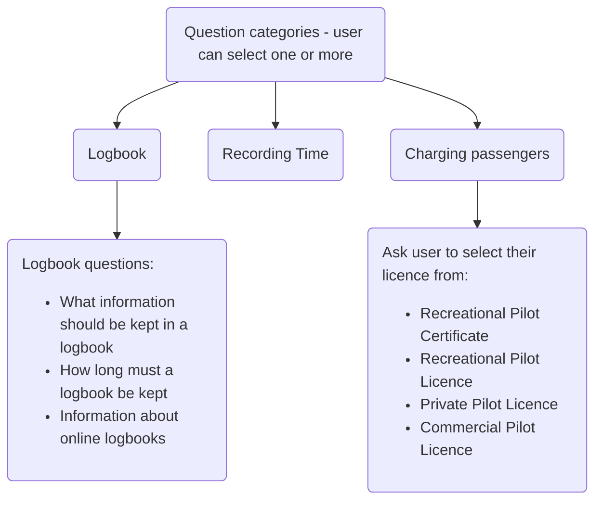

```mermaid
flowchart TD
  id0(Question categories - user can select one or more)
  id0 --> id1(Logbook)
  id0 --> id2(Recording Time)
  id0 --> id3(Charging passengers)

  id1 --> id4(Logbook questions:<ul><li>What information should be kept in a logbook</li><li>How long must a logbook be kept</li><li>Information about online logbooks</li></ul>)
  id3 --> id5(Ask user to select their licence from:<ul><li>Recreational Pilot Certificate</li><li>Recreational Pilot Licence</li><li>Private Pilot Licence</li><li>Commercial Pilot Licence</li></ul>)

  %% Define styles for flowchart items.  We want to make comments yellow
  %% and have a larger font size for regular items
  classDef commentClass fill:#faffd6,text-align:left
  classDef questionClass fill:#ffe6bc
  classDef boundaryClass fill:#eeeeee,text-fill-color:#fff
  classDef itemClass font-size:16pt
  classDef leftListClass text-align:left

  class id4,id5 leftListClass
```