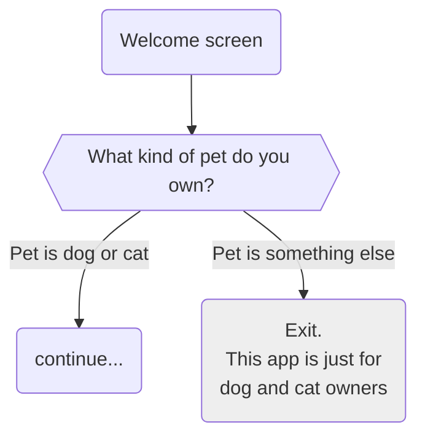

```mermaid
flowchart TD
    id000(Welcome screen)
    id000 --> id00{{What kind of pet do you own?}}
    id00 -- Pet is dog or cat --> id0(continue...)
    id00 -- Pet is something else --> id01(Exit.<br>This app is just for<br>dog and cat owners)

    %% Define styles for flowchart items.  We want to make comments yellow
    %% and have a larger font size for regular items
    classDef commentClass fill:#faffd6,text-align:left
    classDef questionClass fill:#ffe6bc
    classDef boundaryClass fill:#eeeeee,text-fill-color:#fff
    classDef itemClass font-size:16pt
    classDef leftListClass text-align:left

    class id1,id4,id6,id7,id9 questionClass;
    class id01,id2,id3,id5,id10,id11 boundaryClass;
```