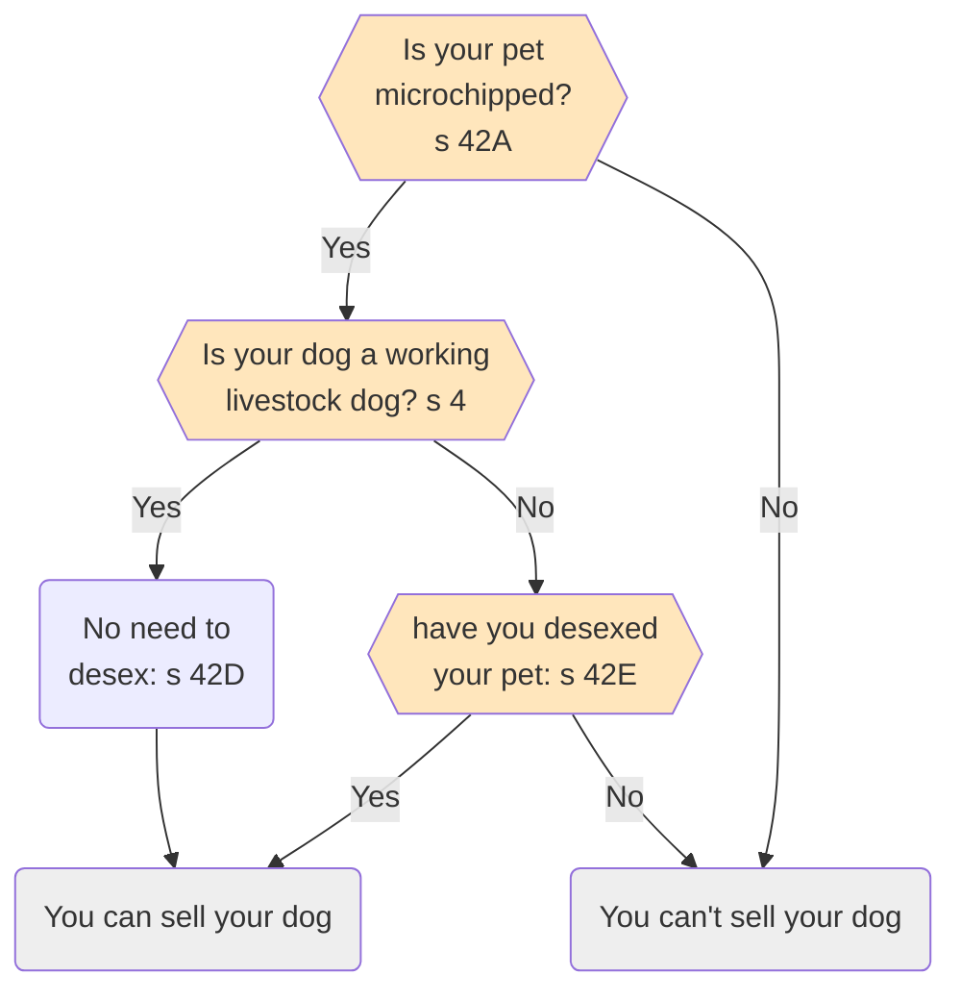

```mermaid
flowchart TD
    id6{{Is your pet<br>microchipped?<br>s 42A}}
    id6 -- Yes --> id7

    id7{{Is your dog a working<br>livestock dog? s 4}}
    id7 -- Yes --> id8(No need to<br>desex: s 42D)
    id7 -- No --> id9{{have you desexed<br>your pet: s 42E}}
    id8 --> id10
    id9 -- No --> id11

    id9 -- Yes --> id10(You can sell your dog)

    id6 -- No --> id11(You can't sell your dog)

    %% Define styles for flowchart items.  We want to make comments yellow
    %% and have a larger font size for regular items
    classDef commentClass fill:#faffd6,text-align:left
    classDef questionClass fill:#ffe6bc
    classDef boundaryClass fill:#eeeeee,text-fill-color:#fff
    classDef itemClass font-size:16pt
    classDef leftListClass text-align:left

    class id1,id4,id6,id7,id9 questionClass;
    class id01,id2,id3,id5,id10,id11 boundaryClass;
```