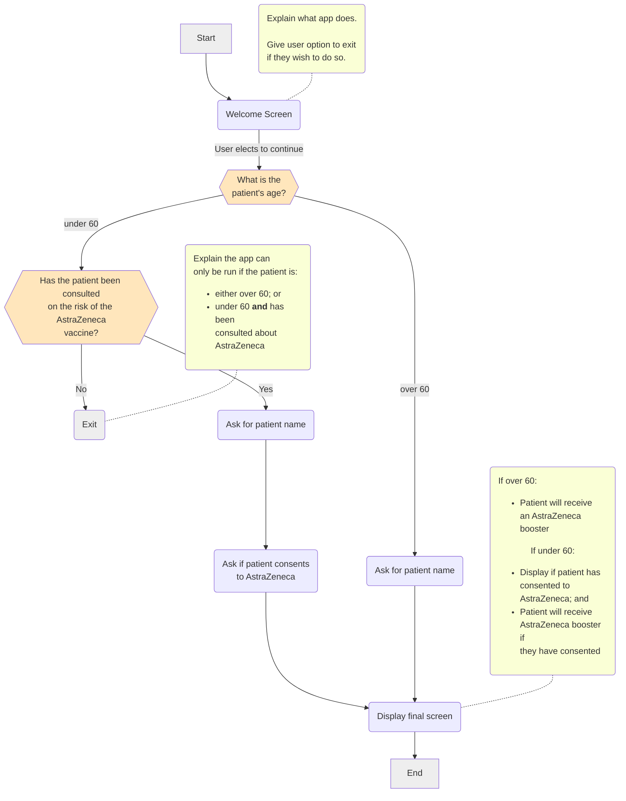

import {DisplayGlossaryItem} from '@site/src/components';

export const title = 'Ex2e';
export const video = 'C5.02.01, C5.02.02, C5.02.03, C5.02.04, D1.02, D2.02';

Implement these changes to **Ex2d**:

* instead of displaying boolean values, use readable text to explain if the user is getting a booster
* display the list of patients in a bullet list

Refer to the flowchart below.

:::tip hint
Use a `% for` loop in the <DisplayGlossaryItem item='subquestion' /> block
of your final screen to help you display the patient list.
:::

