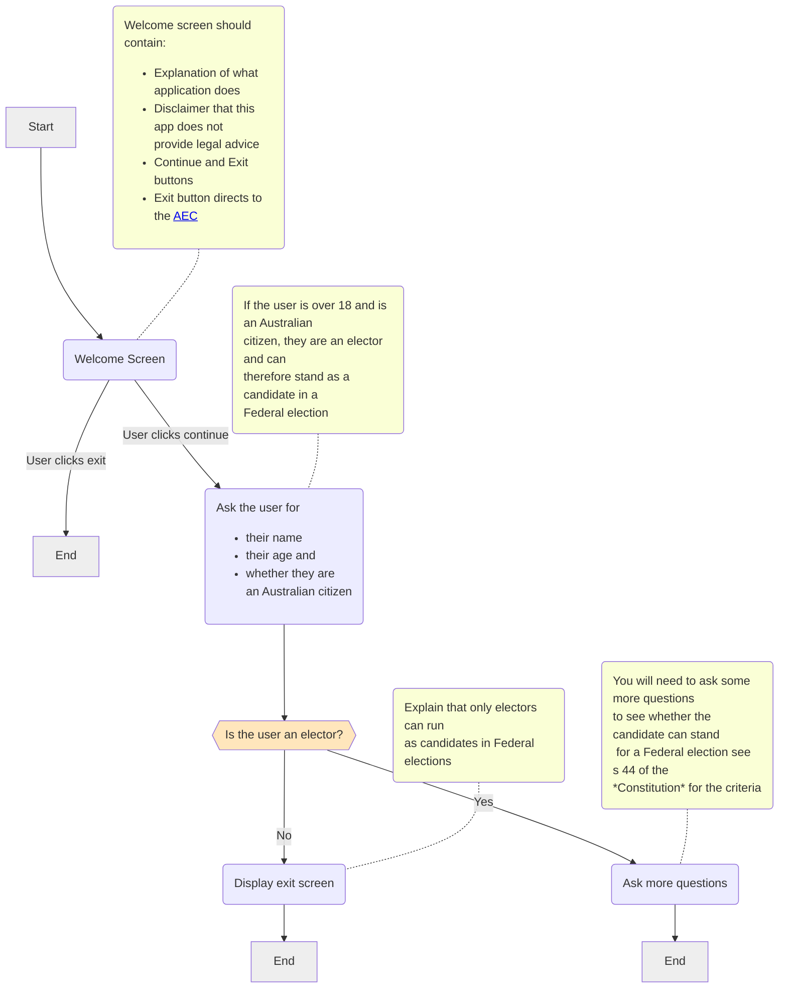

import {DisplayImage} from '@site/src/components';

export const title = 'Ex1h';
export const video = 'C1.05, C2.01, C3.01, C5.01, C5.02.01';

Create an app which assesses a candidate on whether they can stand for Parliament.
You should base your app on the following flowchart.

