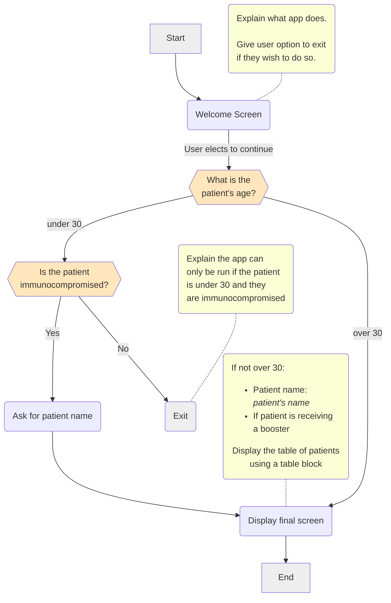

export const title = 'Ex2d';
export const video = 'C5.02.02, C5.02.03, C5.02.04';

Implement the flowchart below:

```mermaid
flowchart TD;
    id0[Start]
    id0 --> id1(Welcome Screen)
    id1 -- User elects to continue --> id2{{What is the<br>patient's age?}}
    id2 -- under 30 --> id3{{Is the patient<br>immunocompromised?}}
    id2 -- over 30 --> id4(Display final screen)
    id3 -- Yes --> id5(Ask for patient name)
    id3 -- No --> id6(Exit)
    id5 --> id4
    id4 --> id7[End]


    %% Define the comments here and then assign them below
    %% Assign comments to elements in the flowchart
    co1(Explain what app does.<br><br>Give user option to exit<br>if they wish to do so.)
    co2(Explain the app can<br>only be run if the patient<br>is under 30 and they<br> are immunocompromised)
    co3(If not over 30:<ul><li>Patient name: <i>patient's name</i></li><li>If patient is receiving a booster</li></ul>Display the table of patients<br>using a table block)

    co1 -.- id1
    co2 -.- id6
    co3 -.- id4

    %% Define styles for flowchart items.  We want to make comments yellow
    %% and have a larger font size for regular items
    classDef commentClass fill:#faffd6,text-align:left
    classDef questionClass fill:#ffe6bc
    classDef boundaryClass fill:#eeeeee,text-fill-color:#fff
    classDef itemClass font-size:16pt
    classDef leftListClass text-align:left

    %% Then assign flowchart items to styles here
    class co1,co2,co3 commentClass; 
    class id2,id3 questionClass
    class id0,id6,id7 boundaryClass
```