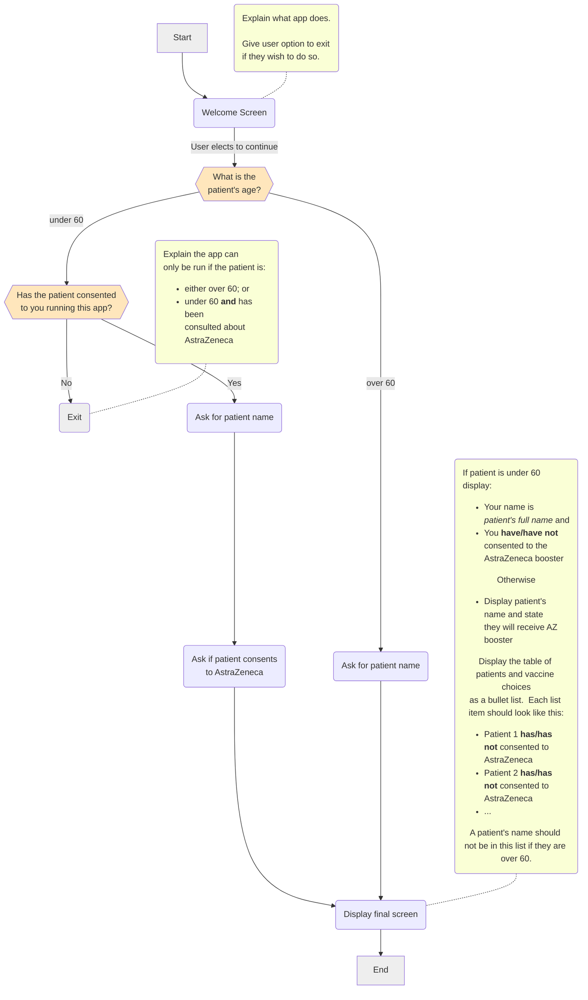

export const title = 'Ex2d';
export const video = 'C5.02.02, C5.02.03, C5.02.04';

Implement the flowchart below:

:::tip hint
You will want to implement your radio button choices as code.  
Refer to the Docassemble manual, starting 
[here](https://docassemble.org/docs/fields.html#choices)
:::

