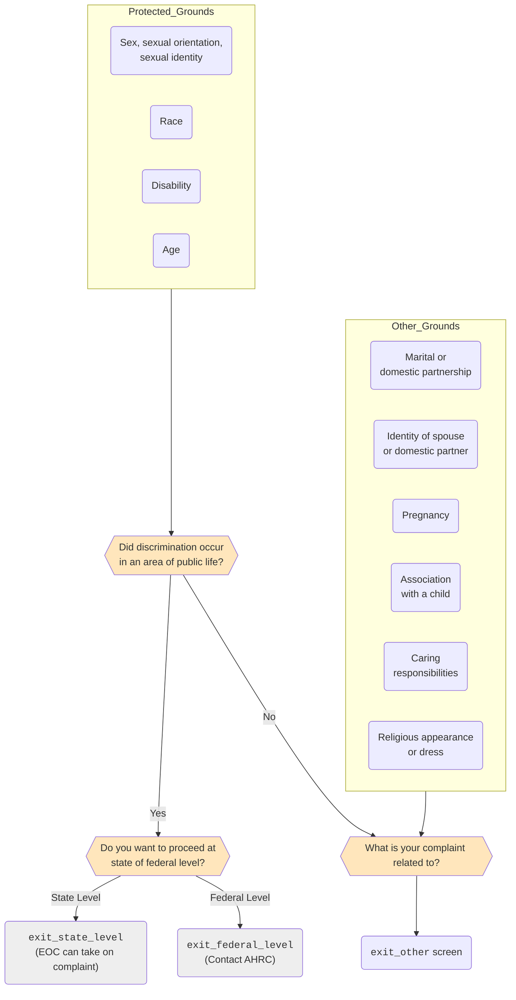

```mermaid
flowchart TD
    subgraph Protected_Grounds
        direction LR
        g00(Sex, sexual orientation,<br>sexual identity)
        g01(Race)
        g02(Disability)
        g03(Age)
    end
    subgraph Other_Grounds
        direction LR
        g10(Marital or<br>domestic partnership)
        g11(Identity of spouse<br>or domestic partner)
        g12(Pregnancy)
        g13(Association<br>with a child)
        g14(Caring<br>responsibilities)
        g15(Religious appearance<br>or dress)
    end
    Protected_Grounds --> id3{{Did discrimination occur<br>in an area of public life?}}

    id3 -- Yes --> id4{{Do you want to proceed at<br>state of federal level?}}
    id4 -- State Level --> id5("<code>exit_state_level</code><br>(EOC can take on complaint)")
    id4 -- Federal Level --> id6("<code>exit_federal_level</code><br>(Contact AHRC)")

    id3 -- No --> id7
    Other_Grounds --> id7{{What is your complaint related to?}}
    id7 --> id8(<code>exit_other</code> screen)


    %% Define styles for flowchart items.  We want to make comments yellow
    %% and have a larger font size for regular items
    classDef commentClass fill:#faffd6,text-align:left
    classDef questionClass fill:#ffe6bc
    classDef boundaryClass fill:#eeeeee,text-fill-color:#fff
    classDef itemClass font-size:16pt
    classDef leftListClass text-align:left

    class id0,id2,id3,id4,id7 questionClass;
    class co0,co1,co2 commentClass;
    class id1,id5,id6 boundaryClass;
```