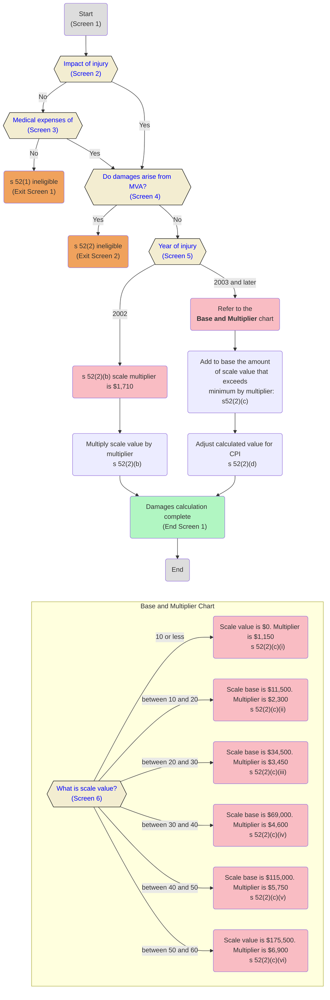

```mermaid
flowchart TD
    start("Start
        (Screen 1)")
    start --> q01{{"Impact of injury
        (Screen 2)"}}
    q01 -- No --> q02{{"Medical expenses of
        (Screen 3)"}}
    q02 -- No --> exit01("s 52(1) ineligible
        (Exit Screen 1)")

    q01 -- Yes --> q03{{"Do damages arise from MVA?
        (Screen 4)"}}
    q02 -- Yes --> q03

    q03 -- Yes --> exit02("s 52(2) ineligible
        (Exit Screen 2)")
    q03 -- No --> q04{{"Year of injury
        (Screen 5)"}}
    q04 -- 2002 --> calc01("s 52(2)(b) scale multiplier is $1,710")
    calc01 --> ac03("Multiply scale value by multiplier
        s 52(2)(b)")
    q04 -- 2003 and later --> calcChart("Refer to the<br><b>Base and Multiplier</b> chart")


    calcChart --> calc02("Add to base the amount
        of scale value that exceeds
        minimum by multiplier: s52(2)(c)")
    %% sv01 --> calc02("Add to base the mount of scale value that exceeds minimum by multiplier (s52(2)(c))")
    %% sv02 --> calc02
    %% sv03 --> calc02
    %% sv04 --> calc02
    %% sv05 --> calc02
    %% sv06 --> calc02

    calc02 --> calc03("Adjust calculated value for CPI
        s 52(2)(d)")
    calc03 --> ok01("Damages calculation complete
        (End Screen 1)")
    ac03 --> ok01

    ok01 --> end01(End)

    end01 ~~~ calc


    %% Post-2002 calculations
    subgraph calc [Base and Multiplier Chart]
    direction LR
    %% q04 -- 2003 and later --> q05{{"What s 52(2)(a) scale value assigned?"}}
    q05{{"What is scale value?
        (Screen 6)"}}
    q05 -- 10 or less -->sv01("Scale value is $0. Multiplier is $1,150
        s 52(2)(c)(i)")
    q05 -- between 10 and 20 --> sv02("Scale base is $11,500. Multiplier is $2,300
        s 52(2)(c)(ii)")
    q05 -- between 20 and 30 --> sv03("Scale base is $34,500. Multiplier is $3,450
        s 52(2)(c)(iii)")
    q05 -- between 30 and 40 --> sv04("Scale base is $69,000. Multiplier is $4,600
        s 52(2)(c)(iv)")
    q05 -- between 40 and 50 --> sv05("Scale base is $115,000. Multiplier is $5,750
        s 52(2)(c)(v)")
    q05 -- between 50 and 60 --> sv06("Scale value is $175,500. Multiplier is $6,900
        s 52(2)(c)(vi)")
    end

    classDef startEndClass fill: #dddddd
    classDef exitClass fill: #f0a25d
    classDef okClass fill: #b1f6c2
    classDef questionClass fill: #f3edd1,stroke: #000,color:blue
    classDef commentClass fill: #f5fba8
    classDef calcClass fill: #f9bcc3

    class start,end01 startEndClass
    class q01,q02,q03,q04,q05,q06 questionClass
    class exit01,exit02,exit03,exit04 exitClass
    class calc01,sv01,sv02,sv03,sv04,sv05,sv06,calcChart calcClass
    class ok01 okClass

```