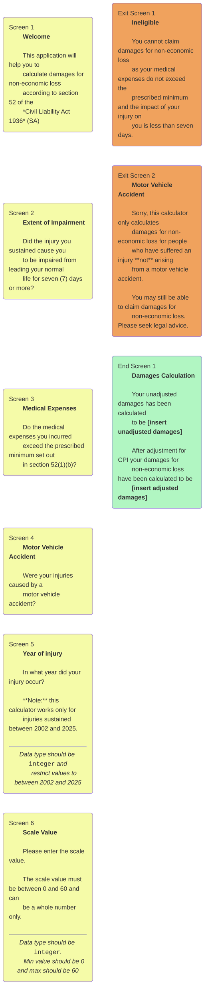

```mermaid
flowchart TD
    screen01("Screen 1
        <b>Welcome</b>
        
        This application will help you to
        calculate damages for non-economic loss
        according to section 52 of the
        *Civil Liability Act 1936* (SA)")

    screen02("Screen 2
        <b>Extent of Impairment</b>
        
        Did the injury you sustained cause you
        to be impaired from leading your normal
        life for seven (7) days or more?")

    screen03("Screen 3
        <b>Medical Expenses</b>
        
        Do the medical expenses you incurred
        exceed the prescribed minimum set out
        in section 52(1)(b)?")

    screen04("Screen 4
        <b>Motor Vehicle Accident</b>
        
        Were your injuries caused by a
        motor vehicle accident?")

    screen05("Screen 5
        <b>Year of injury</b>
        
        In what year did your injury occur?

        **Note:** this calculator works only for
        injuries sustained between 2002 and 2025.
        <hr><i>Data type should be </i><code>integer</code><i> and
        restrict values to between 2002 and 2025</i>")

    screen06("Screen 6
        <b>Scale Value</b>
        
        Please enter the scale value.

        The scale value must be between 0 and 60 and can
        be a whole number only.
        <hr><i>Data type should be </i><code>integer</code><i>.
        Min value should be 0 and max should be 60")

    exit01("Exit Screen 1
        <b>Ineligible</b>
        
        You cannot claim damages for non-economic loss
        as your medical expenses do not exceed the
        prescribed minimum and the impact of your injury on 
        you is less than seven days.")

    exit02("Exit Screen 2
        <b>Motor Vehicle Accident</b>

        Sorry, this calculator only calculates
        damages for non-economic loss for people
        who have suffered an injury **not** arising
        from a motor vehicle accident. 

        You may still be able to claim damages for
        non-economic loss. Please seek legal advice.")

    ok01("End Screen 1
        <b>Damages Calculation</b>
        
        Your unadjusted damages has been calculated
        to be <b>[insert unadjusted damages]</b>
        
        After adjustment for CPI your damages for
        non-economic loss have been calculated to be
        <b>[insert adjusted damages]</b>")

    screen01 ~~~ screen02 ~~~ screen03 ~~~ screen04 ~~~ screen05 ~~~ screen06
    exit01 ~~~ exit02 ~~~ ok01

    


    classDef startEndClass fill: #dddddd
    classDef exitClass fill: #f0a25d,text-align:left
    classDef okClass fill: #b1f6c2,text-align:left
    classDef questionClass fill: #f3edd1,stroke: #000,color:blue
    classDef commentClass fill: #f5fba8,text-align:left
    classDef calcClass fill: #f9bcc3

    class screen01,screen02,screen03,screen04,screen05,screen06,screen07,screen08,screen09,screen10 commentClass
    class exit01,exit02,exit03,exit04,exit05,exit06 exitClass
    class ok01,ok02,ok03,ok04,ok05 okClass
```