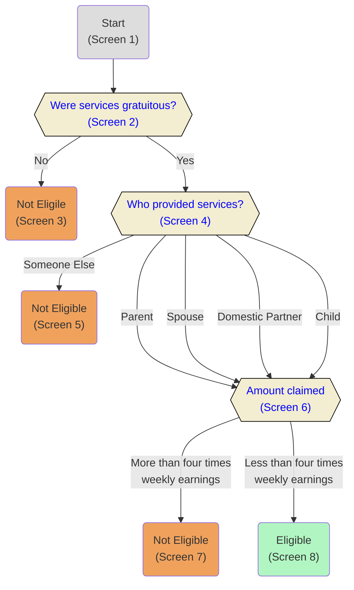

```mermaid
flowchart TD
    start01("Start<br>(Screen 1)")
    start01 --> q01{{"Were services gratuitous?<br>(Screen 2)"}}
    q01 -- No --> exit01("Not Eligile<br>(Screen 3)")
    q01 -- Yes --> q02{{"Who provided services?<br>(Screen 4)"}}
    q02 -- Parent --> q03{{"Amount claimed<br>(Screen 6)"}}
    q02 -- Spouse --> q03
    q02 -- Domestic Partner ---> q03
    q02 -- Child --> q03
    q02 -- Someone Else --> exit02("Not Eligible<br>(Screen 5)")
    q03 -- More than four times<br>weekly earnings ---> exit03("Not Eligible<br>(Screen 7)")
    q03 -- Less than four times<br>weekly earnings --->end01("Eligible<br>(Screen 8)")

    classDef startEndClass fill:#dddddd
    classDef exitClass fill:#f0a25d
    classDef okClass fill:#b1f6c2
    classDef questionClass fill: #f3edd1,stroke: #000,color:blue
    classDef commentClass fill: #f5fba8,font-size: 0.8em

    class start01 startEndClass
    class end01 okClass
    class q01,q02,q03,q04 questionClass
    class co00,co01,co02,co03,co04,co05,co06,co99 commentClass
    class exit01,exit02,exit03 exitClass
```