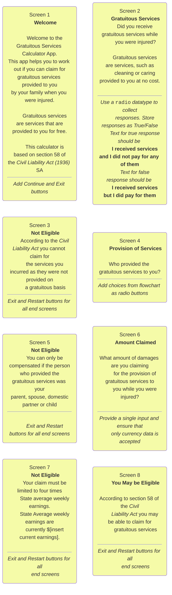

```mermaid
flowchart LR
    co01("Screen 1
        <b>Welcome</b><p>
        Welcome to the Gratuitous Services Calculator App.<br>This app helps you to work out if you can claim for<br>gratuitous services provided to you<br>by your family when you were injured.

        Gratuitous services are services that are<br>provided to you for free.

        This calculator is based on section 58 of<br>the <i>Civil Liability Act (1936)</i> SA</p><hr><i>Add Continue and Exit buttons</i>")

    co02("Screen 2
        <b>Gratuitous Services</b>
        Did you receive gratuitous services while
        you were injured?
        
        Gratuitous services are services, such as
        cleaning or caring provided to you at no cost.
        <hr><i>Use a </i><code>radio</code><i> datatype to collect
        responses. Store responses as True/False
        Text for true response should be </i>
        <b>I received services and I did not pay for any of them</b><i>
        Text for false response should be </i>
        <b>I received services but I did pay for them</b>")
    co03("Screen 3
        <b>Not Eligible</b>
        According to the <i>Civil Liability Act</i> you cannot claim for
        the services you incurred as they were not provided on
        a gratuitous basis</p><hr><i>Exit and Restart buttons for all end screens</i>")
    co04("Screen 4
        <b>Provision of Services</b>
        <p>Who provided the gratuitous services to you?</p><hr><p><i>Add choices from flowchart as radio buttons</i></p>")

    co05("Screen 5
        <b>Not Eligible</b>
        You can only be compensated if the person<br> who provided the gratuitous services was your<br> parent, spouse, domestic partner or child<hr>
        <i>Exit and Restart buttons for all end screens</i>")

    co06("Screen 6
        <b>Amount Claimed</b>
        <p>What amount of damages are you claiming
        for the provision of gratuitous services to
        you while you were injured?
        <hr><p><i>Provide a single input and ensure that
        only currency data is accepted</i></p>")

    co07("Screen 7
        <b>Not Eligible</b>
        Your claim must be limited to four times
        State average weekly earnings.
        State Average weekly earnings are
        currently $[insert current earnings].
        <hr><i>Exit and Restart buttons for all
        end screens</i>")

    co08("Screen 8
        <b>You May be Eligible</b>
        <p>According to section 58 of the <i>Civil
        Liability Act</i> you may be able to claim for
        gratuitous services
        <hr><i>Exit and Restart buttons for all
        end screens</i>")                                
    
    %% Lay the screens out in two columns
    co01 ~~~ co02
    co03 ~~~ co04
    co05 ~~~ co06
    co07 ~~~ co08

    %% Styles I use for all flowcharts.
    classDef startEndClass fill:#f4f3fd
    classDef exitClass fill:#f0a25d
    classDef okClass fill:#b1f6c2
    classDef questionClass fill: #f3edd1,stroke: #000,color:blue
    classDef commentClass fill: #f5fba8

    class co00,co01,co02,co03,co04,co05,co06,co07,co08 commentClass
```