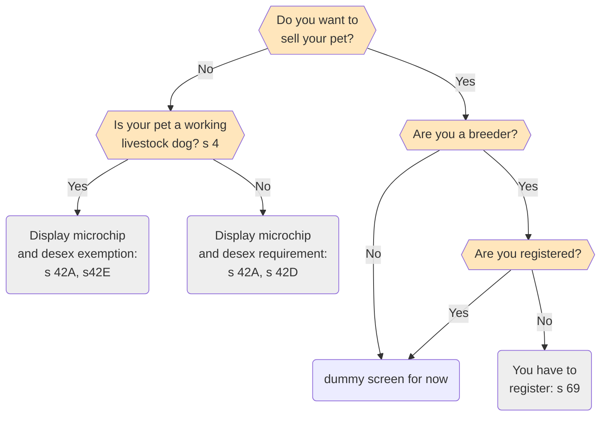

```mermaid
flowchart TD
    id0{{Do you want to<br>sell your pet?}}
    id0 -- No --> id1{{Is your pet a working<br>livestock dog? s 4}}
    id1 -- Yes --> id2(Display microchip<br>and desex exemption:<br>s 42A, s42E)
    id1 -- No --> id3(Display microchip<br>and desex requirement:<br>s 42A, s 42D)
    
    id0 -- Yes --> id4{{Are  you a breeder?}}
    id4 -- Yes --> id4a{{Are you registered?}}
    id4a -- Yes --> id6
    id4a -- No --> id5(You have to<br>register: s 69)

    id4 -- No --> id6(dummy screen for now)

    %% Define styles for flowchart items.  We want to make comments yellow
    %% and have a larger font size for regular items
    classDef commentClass fill:#faffd6,text-align:left
    classDef questionClass fill:#ffe6bc
    classDef boundaryClass fill:#eeeeee,text-fill-color:#fff
    classDef itemClass font-size:16pt
    classDef leftListClass text-align:left

    class id0,id1,id4,id4a,id7,id9 questionClass;
    class id01,id2,id3,id5,id10,id11 boundaryClass;
```