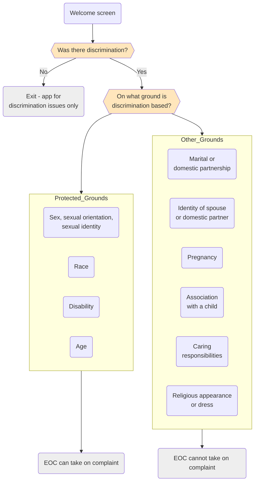

```mermaid
flowchart TD
    id00(Welcome screen)
    id00 --> id0{{Was there discrimination?}}
    id0 -- No --> id1(Exit - app for<br>discrimination issues only)
    id0 -- Yes --> id2{{On what ground is<br>discrimination based?}}
    id2 --> Protected_Grounds
    id2 --> Other_Grounds
    subgraph Protected_Grounds
        direction LR
        g00(Sex, sexual orientation,<br>sexual identity)
        g01(Race)
        g02(Disability)
        g03(Age)
    end
    subgraph Other_Grounds
        direction LR
        g10(Marital or<br>domestic partnership)
        g11(Identity of spouse<br>or domestic partner)
        g12(Pregnancy)
        g13(Association<br>with a child)
        g14(Caring<br>responsibilities)
        g15(Religious appearance<br>or dress)
    end

    Protected_Grounds --> id5(EOC can take on complaint)
    Other_Grounds --> id8(EOC cannot take on complaint)

    %% Define styles for flowchart items.  We want to make comments yellow
    %% and have a larger font size for regular items
    classDef commentClass fill:#faffd6,text-align:left
    classDef questionClass fill:#ffe6bc
    classDef boundaryClass fill:#eeeeee,text-fill-color:#fff
    classDef itemClass font-size:16pt
    classDef leftListClass text-align:left

    class id0,id2,id3,id4,id7 questionClass;
    class co0,co1,co2 commentClass;
    class id1,id5,id6,id8 boundaryClass;
```