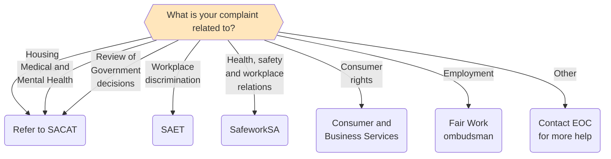

```mermaid
flowchart TD
    id7{{What is your complaint related to?}}
    id7 -- Housing<br>dispute --> id8(Refer to SACAT)
    id7 -- Medical and<br>Mental Health --> id8
    id7 -- Review of<br>Government<br>decisions --> id8
    id7 -- Workplace<br>discrimination --> id9(SAET)
    id7 -- Health, safety<br>and workplace<br>relations --> id10(SafeworkSA)
    id7 -- Consumer<br>rights --> id11(Consumer and<br>Business Services)
    id7 -- Employment --> id12(Fair Work<br>ombudsman)
    id7 -- Other --> id13(Contact EOC<br>for more help)


    %% Define styles for flowchart items.  We want to make comments yellow
    %% and have a larger font size for regular items
    classDef commentClass fill:#faffd6,text-align:left
    classDef questionClass fill:#ffe6bc
    classDef boundaryClass fill:#eeeeee,text-fill-color:#fff
    classDef itemClass font-size:16pt
    classDef leftListClass text-align:left

    class id0,id2,id3,id4,id7 questionClass;
    class co0,co1,co2 commentClass;
    class id1,id5,id6 boundaryClass;
```