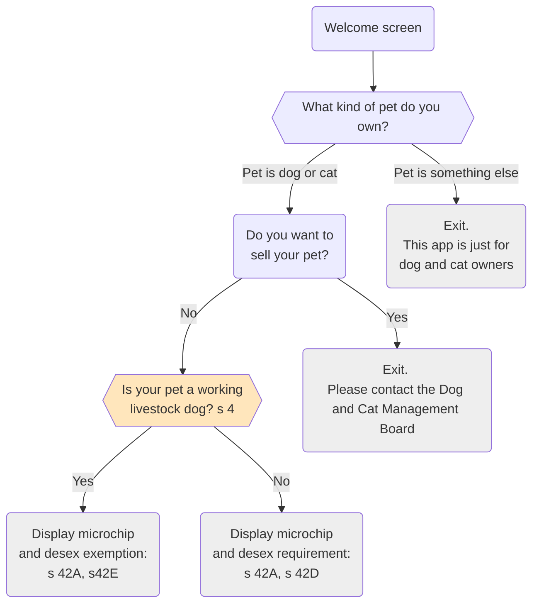

```mermaid
flowchart TD
    id000(Welcome screen)
    id000 --> id00{{What kind of pet do you own?}}
    id00 -- Pet is dog or cat --> id0
    id00 -- Pet is something else --> id01(Exit.<br>This app is just for<br>dog and cat owners)
    id0(Do you want to<br>sell your pet?)
    id0 -- No --> id1{{Is your pet a working<br>livestock dog? s 4}}
    id0 -- Yes --> id12(Exit. <br>Please contact the Dog <br>and Cat Management Board)
    id1 -- Yes --> id2(Display microchip<br>and desex exemption:<br>s 42A, s42E)
    id1 -- No --> id3(Display microchip<br>and desex requirement:<br>s 42A, s 42D)
    
    %% id0 -- Yes --> id4{{Are you a breeder?}}
    %% id4 -- Yes --> id4a{{Are you registered?}}
    %% id4a -- No --> id5(You have to<br>register: s 69)
    %% id4a -- Yes --> id6

    %% id4 -- No --> id6{{Is your pet<br>microchipped?<br>s 42A}}
    %% id6 -- Yes --> id7

    %% id7{{Is your dog a working<br>livestock dog? s 4}}
    %% id7 -- Yes --> id8(No need to<br>desex: s 42D)
    %% id7 -- No --> id9{{have you desexed<br>your pet: s 42E}}
    %% id8 --> id10
    %% id9 -- No --> id11

    %% id9 -- Yes --> id10(You can sell your pet)

    %% id6 -- No --> id11(You can't sell your pet)

    %% Define styles for flowchart items.  We want to make comments yellow
    %% and have a larger font size for regular items
    classDef commentClass fill:#faffd6,text-align:left
    classDef questionClass fill:#ffe6bc
    classDef boundaryClass fill:#eeeeee,text-fill-color:#fff
    classDef itemClass font-size:16pt
    classDef leftListClass text-align:left

    class id1,id4,id4a,id6,id7,id9 questionClass;
    %% class id01,id2,id3,id5,id10,id11 boundaryClass;
    class id01,id2,id3,id5,id10,id11,id12 boundaryClass;
```