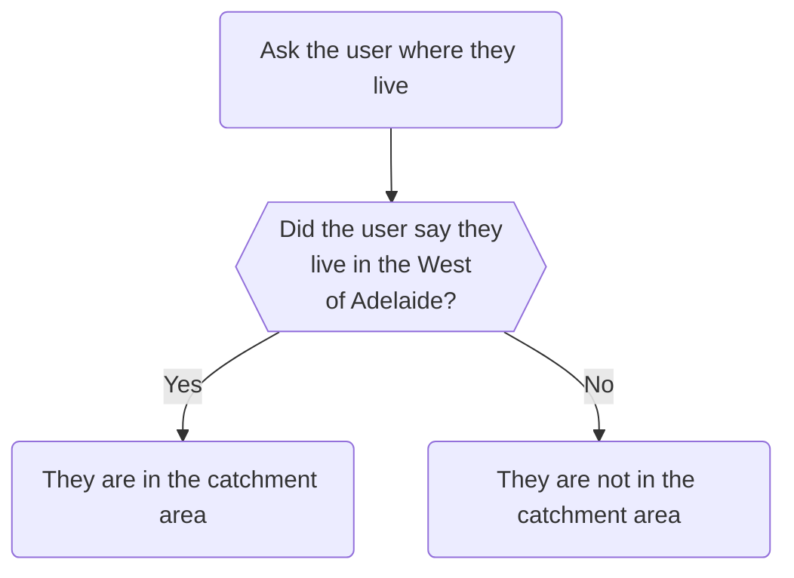
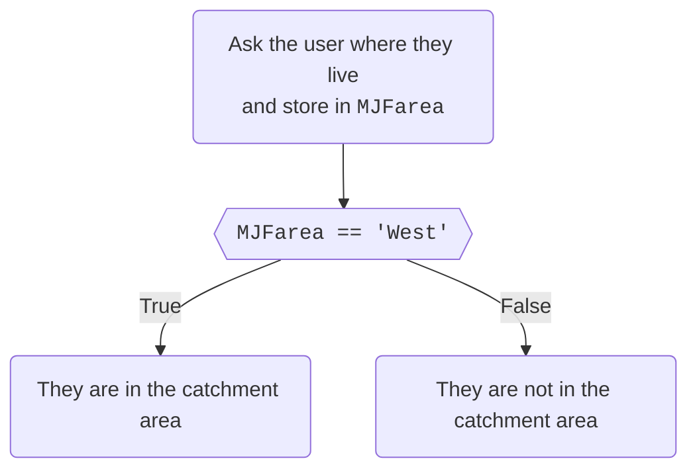

import {DisplayGlossaryItem} from '@site/src/components';
import {DisplayImage} from '@site/src/components';
import {DisplayChapter} from '@site/src/components';
import {Quizlet,Answer,Explanation} from '@site/src/components'

Now that we know about <DisplayChapter chapter='chapter_03' target='00-20#booleans' text='booleans' lower />
it's time to put them to good use.

Testing is at the heart of driving your app's logic.  A central premise of
coding is testing the truth or falsity of a proposition (usually the value of a variable)
and making logic decisions accordingly.

## Everything is True or False
We have <DisplayChapter chapter='chapter_03' target='00-20#booleans' text='slready discussed' lower />
the re-expression of questions into statements that can be tested to be true or false
(eg: 'Are you over 18?' -> 'You are over 18'). 

Let's use a simple example program that determines whether a user falls in the 
catchment are for a fictional 'Western Legal' community legal centre.  Western Legal
have told us they only deal with people who live in the west of Adelaide and they
want the app to let potential clients know whether they fall in Western's catchment
area or not.

We are going to write a simple program to deliver this.  Our program will need to make
a decision:  Is the user in the catchment area or not?  To make this decision we 
need to know where the user lives.  So, our logic flow might be something like this:


Ultimately, our simple program is going to display two lines.  
the first line
repeats back to the user what they input, and the second states whether the user is
in the catchment area or not.

<DisplayImage imageURL='/img/textbook/chapter_03/testing2.png' />

Our decision will drive what we put on the second line.

As we've already learnt, we can't test questions.  We can only test the truth
(or otherwise) of
statements.  If we convert that flowchart into a statement it might read something like
> If the user lives in the west then they are in the catchment area

Or, to put it in a more 'code-like' way:
> if the user chose 'West' then tell them they are in the catchment area.

When we ask that first question we need store the answer.  Let's store the answer
in a variable called `MJFarea`.
Now we can get even more code-y and re-express our proposition as follows:
> If the value of `MJFarea` equals 'West' then tell them they're in the catchment area.

One more step:
> If the statement *"The value of `MJFarea` equals `'West'`"* is true,
 then tell the user they're in the catchment area.

Now we have something we can code, because we can test for equality.

## Testing for Equality
This is by far the most common test that you will use.  A lot of program logic will depend
on collecting information from a user and then checking it against known criteria, 
much like the example above.

Python provides an **equality operator**, being a 'double-equals' sign (`==`).  This
is used much like an equals (`=`) in mathmeatics in that you put what you want to
test on both sides of the operator eg:
```python
MJFarea == 'West'
```
This statement above is how we express "The value of `MJFarea` is equal to `'West'`" 
in code.  The statment uses `==` to 
 test if the value of `MJFarea` is equal to `West`.  If it is,
then the result of that statement is `True`, otherwise it is `False`.

Let's update our flowchart and express the decision a true/false proposition

And now we can express this as code.

```yml showLineNumbers
mandatory: True
question: Western Legal Catchment Area
subquestion: |
  You stated that you live in the **${MJFarea}** of Adelaide

  # highlight-next-line
  % if MJFarea == 'West':
  You are in the catchment area
  % else:
  You are not in the catchment area
  % endif
---
question: Residential Location
subquestion: |
  In which part of Adelaide do you live?
fields:
  - no label: MJFarea
    input type: radio
    choices:
      - North
      - South
      - East
      - West
---
```
The <DisplayGlossaryItem item='ifstatement' /> that starts on line 6 (highlighted) 
takes our 
true/false proposition and evaluates it.  If the proposition returns `True` then 
the code on line 7 is displayed.  If the proposition returns `False` then the code
on line 9 is displayed.

:::note
The code above uses an <DisplayGlossaryItem item='ifstatement' />.  If statements are
covered in <DisplayChapter chapter='chapter_04' />.
:::

:::caution Don't confuse the equality (`==`) and assignment (`=`) operators!!
A common trap is to accidentally use the `=` operator instead of `==`
when testing for equality.

**Do not do this!!!**

You must be very careful to avoid confusing `==` and `=`.  The `==`
operator is used to test if
something is equal to something else.  The `=` operator is used to assign a value 
to a variable.  If you confuse the two, at best, you'll be presented with an error when
you debug your program, but at worst your program may run but behave unpredictably.

**Be careful!!!  This is a common trap for new coders!**
:::
<Quizlet>
    Which of these statements correctly expresses the true/false proposition
    'the value of `MJFage` is 18'?
    <Answer>
        `MJFage = 18`
    </Answer>
    <Answer isCorrect>
        `MJFage == 18`
    </Answer>
    <Explanation correctAnswer>
    Correct!

    We can't stress enough the importance of not confusing `=` and `==`.

    Also, note that we've used `==` to check numbers are equal.
    The `==` operator can be used to test equality for almost any data type.
    </Explanation>
</Quizlet>

## Testing for inequality
We use the **not equals* operator (`!=`) for testing inequality.  The operator is used
in the same was as `==` but returns the opposite result.  So, for example, if we know
that the value of `MJFarea` is `'West'`, then this code:
```python
MJFarea == 'West'
```
would return true, as we have already seen.  It follows that the true/false proposition
"`MJFarea` *does not equal* `'West'`" would be false.  Therefore, this code would 
return false:
```python
MJFarea != 'West'
```
Inequality tests are useful as exclusion criteria.  For example, a future version of our
app may exclude people from contacting Western Legal if they did not live in the West
of Adelaide.

## Mathematical tests
When it comes to dealing with numbers (ie: floats and integers), Python provides 
a number of tests in addition to equality.  These equate to the 'greater than', 
'less than' tests you would have learnt in maths.  Excepting the 'in betwteen' test,
these tests function
the same way as the equality operator, in that the test subjects are placed on the
left and right.  The tests are set out in the table below

<table id="mathCompTable">
    <tr>
        <th>Description</th>
        <th id="mathCompTableCol2">Operator</th>
        <th id="mathCompTableCol3">Example Test</th>
        <th>Comments</th>
    </tr>
    <tr>
        <td>Greater than</td>
        <td>`>`</td>
        <td>`MJFage > 18`</td>
        <td>The value of `MJFage` is 19 or more</td>
    </tr>
    <tr>
        <td>Greater than or equal to</td>
        <td>`>=`</td>
        <td>`MJFage >= 18`</td>
        <td>The value of `MJFage` is 18 or more</td>
    </tr>
    <tr>
        <td>Less than</td>
        <td>`<`</td>
        <td>`MJFage < 18`</td>
        <td>The value of `MJFage` is 17 or less</td>
    </tr>
    <tr>
        <td>Less than or equal to</td>
        <td>`<=`</td>
        <td>`MJFage <= 18`</td>
        <td>The value of `MJFage` is 18 or less</td>
    </tr>
    <tr>
        <td rowSpan={4} id='mathCompInBetweenCell'>In between</td>
        <td>`...<=...<...`</td>
        <td>`18 <= MJFage < 65`</td>
        <td>The value of `MJFage` is between 18 and 64</td>
    </tr>
    <tr>
        <td>`...<...<=...`</td>
        <td>`18 < MJFage <= 65`</td>
        <td>The value of `MJFage` is between 19 and 65</td>
    </tr>
    <tr>
        <td>`...<=...<=...`</td>
        <td>`18 <= MJFage <= 65`</td>
        <td>The value of `MJFage` is between 18 and 65</td>
    </tr>
    <tr>
        <td>`...<...<...`</td>
        <td>`18 < MJFage < 65`</td>
        <td>The value of `MJFage` is between 19 and 64</td>
    </tr>
</table>

:::tip
The four 'In between' operators can be hard to decipher.  It's best to analyse them
as two expressions from left to right.  For example, the first example:
```python
18 <= MJFage < 65
```
could be read as:

1. '18 is less than or equal to `MJFage`'; and then
1. '`MJFage` is less than 65'.

If both of these statements are true then the test passes.
:::
<Quizlet>
    Give this a go.  Which of the below statements says that `MJFyearborn` is between
    2000 and 2010?
    <Answer>
    `2000 <= MJFyearborn < 2010`
    </Answer>
    <Answer isCorrect>
    `2000 <= MJFyearborn <= 2010`
    </Answer>
    <Answer>
    `1999 < MJFyearborn < 2010`
    </Answer>
    <Explanation correctAnswer>
    Correct!

    The first and third tests fail because `MJFage` must be *less than* and not
    *less than and equal to* 2010.  We have to include 2000 and 2010 in our in 
    between test.
    </Explanation>
</Quizlet>

## String tests
We've already seen how to test if strings are equal.  The mathematical tests described
above are not so useful for strings and so we will not discuss them in this textbook.

We will however cover the `in` test.  The word `in` is used as an operator to determine
whether one string forms a part of another.  For example, the following statement would
return `True`
```python
'hell' in 'hello'
```

The opposite test is `not in`.  This code would return false:
```python
'hell' not in 'hello'
```
There are a number of other tests in addition to the mathematical tests that can be
performed on strings. Python provides a very powerful set of tests for strings,
including looking for substrings, looking for patterns, accounting for upper and 
lower case characters etc.  However, these are beyond the scope of this textbook. You
should find that the `==` and `in` operators should be enough.  

If you'd like more information on working with strings,
consult the [Python documentation](https://docs.python.org/3/).

## Logic tests
We have seen how to express one true/false proposition as code.  What happens when
we need to test more than one proposition?  For example, let's say that our Western
Legal app needs not only to check if a user is in the correct catchment area, but also
impose an income threshold.  Income thresholds are a common practice with community
legal centres so they ensure that the most needy are provided with legal services.

Let's say that Western Legal have told that they will only accept clients if they 
are in the catchment area *and* have earnt less than $30,000.00 in the last financial
year.

Our application is now an eligibility advisor.  Let's say it will display this to a
user:

<DisplayImage imageURL='/img/textbook/chapter_03/testing3.png' />

We now have two propositions to test:

1. that the user lives in the west of Adelaide; and
1. that the user earns less than $30,000 per year.

In our previous code, we expressed our true/false proposition in this way:
```python
MJFarea == 'West'
```
and embedded it into this <DisplayGlossaryItem item='ifstatement' />:
```yml
  #highlight-next-line
  % if MJFarea == 'West':
  You are in the catchment area
  % else:
  You are not in the catchment area
  % endif
```
This logic is sound.  The highlighted line makes the decision, and the subsequent
line in the if statement carry out the effects of that decision (in or not in the
catchment area).

Even though we have two criteria, we still want to use the same structure ie: one
if statement with two branches.  To do so we need to have *two* propositions on that
`% if` line.

We can do that.

Python provides a set of logical connectors that allows us to join multiple true/false
propositions together.  These are:

<table id="mathCompTable">
    <tr>
        <th>Connector</th>
        <th>Description</th>
        <th id="logicTableCol3">Example</th>
        <th>Comments</th>
    </tr>
    <tr>
        <td>`and`</td>
        <td>Both propositions must be `True`</td>
        <td>`MJFage == 18 and MJFarea == 'West'`</td>
        <td>This expression would evaluate to true only
        if both the value of `MJFage` vaule was 18 *and* 
        the value of `MJFarea` was west.</td>
    </tr>
    <tr>
        <td>`or`</td>
        <td>Any one of the propositions must be `True`</td>
        <td>`MJFage == 18 or MJFarea == 'West'`</td>
        <td>This expression would evaluate to `True` if any one, or both,
        of the propositions are True.</td>
    </tr>
    <tr>
        <td>`not`</td>
        <td>The proposition that follows `not` is not true</td>
        <td>`MJFage == 18 and not MJFarea == 'West'`</td>
        <td>This expression would evaluate to `True` only if `MJFage`
        was 18 and `MJFarea` was *not* `'West'`.</td>
    </tr>
</table>

It is possible to have more than one set of connectors.  The following example returns
`True` only if `MJFage` is 18, `MJFincome` is less than $30,000 and `MJFarea` is 'West'
```python
MJFage == 18 and MJFincome < 30000 and MJFarea == 'West'
```

We can also group connectors together using parentheses (`()`).  For example, the below
code is true if `MJFage` is greater than or equal to 18 and `MJFarea` is either `'West'`
or `'South'`:
```python
MJFage >= 18 and (MJFarea == 'West' or MJFarea == 'South')
```
Let's return back to our instructions.  We've been asked to tell users they are 
eligible for Western Legal services only if they live in the west of Adelaide and
they earn less than $30,000.  Clearly we now need to collect two pieces of information.
One, we already have in `MJFarea`.  Let's say we'll collect the user's income in 
a new variable called `MJFincome`.  Once we have both, we can modify that `% if` 
statement using an `and` connector to ensure that both conditions are true in order
for a user to be eligible:
```yml
  % if MJFarea == 'West' and MJFincome <= 30000:
```
That should do it!

Here is example code that implements our modified app.  Feel free to copy it into your
playground, run it and modify it.
```yml showLineNumbers
---
mandatory: True
question: Western Legal Triage
subquestion: |
  You stated that you live in the **${MJFarea}** of Adelaide
  and that last financial year you earnt **${currency(MJFincome)}**.
  
  % if MJFarea == 'West' and MJFincome <= 30000:
  You **are** eligible for our services.
  % else:
  You **are not** eligible for our services.
  % endif
---
question: Residential Locations
subquestion: |
  In which part of Adelaide do you live?
fields:
  - no label: MJFarea
    input type: radio
    choices:
      - North
      - South
      - East
      - West
---
question: Income threshold
subquestion: |
  How much did you earn last financial year?
fields:
  - no label: MJFincome
    datatype: currency
---
```
<Quizlet>
  Which of these correctly expresses the phrase 'the user lives in SA or NSW'?
  <Answer>
  `MJFstate == 'SA'`
  </Answer>
  <Answer>
  `MJFstate = 'SA' or 'NSW'`
  </Answer>
  <Answer isCorrect>
  `MJFstate == 'SA' or MJFstate == 'NSW'`
  </Answer>
  <Answer>
  `MJFstate == 'SA' or 'NSW'`
  </Answer>
  <Explanation correctAnswer>
  Correct!

  First, you must use `==` and not `=` when testing for equality.  Second, because
  we are testing for two conditions (whether the user lives in SA or whether the 
  user lives in NSW) we must have two equality tests.  Syntax such as `MJFstate == 'SA' or 'NSW'`
  would, at best, cause an error and at worst would cause your program to behave
  unpredictably.
  </Explanation>
</Quizlet>