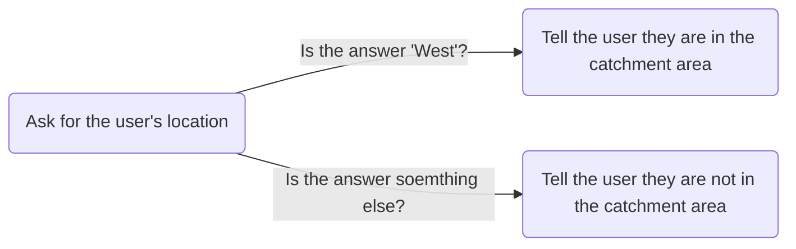

import {DisplayGlossaryItem} from '@site/src/components';
import {DisplayImage} from '@site/src/components';
import {DisplayChapter} from '@site/src/components';
import {Quizlet,Answer,Explanation} from '@site/src/components'

Now that we know about <DisplayChapter chapter='chapter_03' target='00-20#booleans' text='booleans' lower />
it's time to put them to good use.

Testing is at the heart of driving your app's logic.  A central premise of
coding is testing the truth or falsity of a proposition (usually the value of a variable)
and making logic decisions accordingly.

## Everything is True or False
We have <DisplayChapter chapter='chapter_03' target='00-20#booleans' text='slready discussed' lower />
the re-expression of questions into statements that can be tested to be true or false
(eg: 'Are you over 18?' -> 'You are over 18').  Python provides a number of tests
that you can apply. Let's work through some of them.

### Testing for Equality
This is by far the most common test that you will use.  A lot of program logic will depend
on collecting information from a user and then checking it against known criteria.

Let's use a simple example program that determines whether a user falls in the 
catchment are for a fictional 'Western Legal' community legal centre.  Western Legal
have told us they only deal with people who live in the west of Adelaide.  The program
will display something like this:

This is a simple program.  It asks the user in which part of Adelaide they live and
stores their response.

<DisplayImage imageURL='/img/textbook/chapter_03/testing1.png' />

The program then displays two lines: the first
repeats back to the user what they input, and the second states whether the user is
in the catchment area or not.

<DisplayImage imageURL='/img/textbook/chapter_03/testing2.png' />

We are interested in the second line.

We need to make a decision.  Is the user in the catchment area or not?  Let's represent
our decision-making as a decision tree.

As we've already learnt, we can't test questions.  We test the truth (or otherwise) of
statements.  If we convert that flowchart into a statement it might read something like
> If the user lives in the west then they are in the catchment area

Or, to put it in a more 'code-like' way:
> if the user chose 'West' then tell them they are in the catchment area.

Let's say that when we ask that first question we store the answer  in a variable
called `MJFarea`.  If that's the case then we can get even more code-like and 
re-express our proposition as follows:
> If `MJFarea` contains 'West' then tell them they're in the catchment area.

One more step:
> If the value of `MJFarea` *is equal to* `'West'` then tell the user they're in the catchment area.

Now we have something we can code, because we can test for equality.

