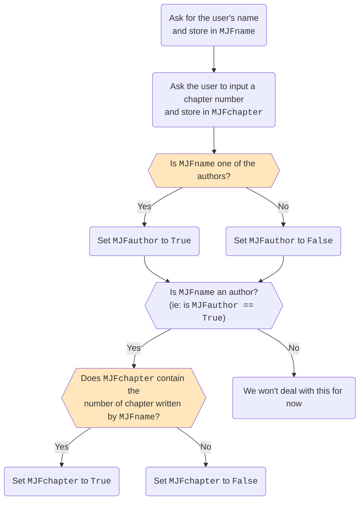

```mermaid
flowchart TD
  id0(Ask for the user's name<br>and store in <code>MJFname</code>)
  id0 --> id1(Ask the user to input a chapter number<br>and store in <code>MJFchapter</code>)
  id1 --> id2{{Is <code>MJFname</code> one of the authors?}}
  id2 -- Yes --> id2a(Set <code>MJFauthor</code> to <code>True</code>)
  id2 -- No --> id4(Set <code>MJFauthor</code> to <code>False</code>)
  id2a --> id4a{{"Is <code>MJFname</code> an author?<br>(ie: is <code>MJFauthor == True</code>)"}}
  id4 --> id4a
  id4a -- Yes --> id3{{Does <code>MJFchapter</code> contain the<br>number of chapter written by <code>MJFname</code>?}}
  id4a -- No --> id4b(We won't deal with this for now)

  id3 -- Yes --> id5(Set <code>MJFchapter</code> to <code>True</code>)
  id3 -- No --> id6(Set <code>MJFchapter</code> to <code>False</code>)

  %% Define styles for flowchart items.  We want to make comments yellow
  %% and have a larger font size for regular items
  classDef commentClass fill:#faffd6,text-align:left
  classDef questionClass fill:#ffe6bc
  classDef boundaryClass fill:#eeeeee,text-fill-color:#fff
  classDef itemClass font-size:16pt
  classDef leftListClass text-align:left

  class id2,id3 questionClass
  class if4b boundaryClass
```
