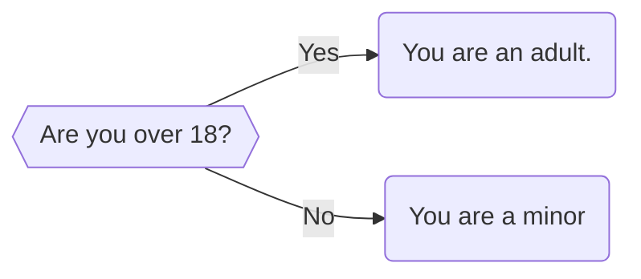
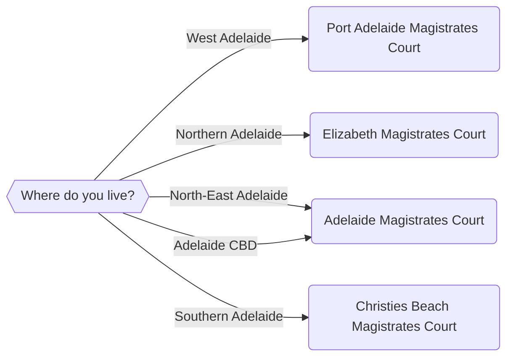

import {DisplayGlossaryItem} from '@site/src/components';

## An introduction to Logic
In this chapter, we will talk about logic and how to control the logic of our applications. We can use logic to make our app can do one thing or another depending on the input it receives. We can direct the flow of the program depending on how the user inputs certain information. We will do this using if statements.

For example, you might want your app to perform a set of initial eligibility checks before proceeding with your main analysis. You might want to check for age or residency, because your app only applies to adults who are not pensioners or South Australian residents. These kinds of preliminary questions are good to resolve early in your processing flow. Otherwise, your user might have to run through the whole app to find out they should have never run it in the first place! Therefore, we can ask the user a few preliminary questions and, based on those questions, decide which path the application should take. 

For a simple application, we can use logic and just one question to direct the flow of our application.

More complex decisions might have many different answers.  For example, when deciding on the closest court in the Adelaide region, we might want to ask our user a question with multiple options.


Therefore, the questions that we ask will influence how we structure our decision making processes. 

:::tip todo
Style the flowcharts with the styles we already have in other flowcharts
:::
:::tip todo
Is there a way to centralise the flowchart styles instead of copying them into
every single flowchart manually?

Is there a way to automatically assign, for example the `{{...}}` elements in the 
flowchart the appropriate style automatically?
:::

## Express logic in code - If statements
We need a way to express this decision-making process in code.  To do so we use  <DisplayGlossaryItem item='ifstatement' plural />.

An if statement tells a program to do something if a certain condition is met. This is the simplest type of if statement. We might express this the following way in pseudocode:

**IF** *user is 18 years or older* **THEN** *they are an adult*

A more complex if statement might tell a program to do something if a condition is met, and something else if that condition is not met. This is known as an if-else statement.

**IF** *user is 18 years or older* **THEN** *they are an adult* **ELSE** *they are a child*

(Note - this notation is taken from [this](https://austlii.community/foswiki/pub/DataLex/WebHome/ys-manual.pdf?_t=1700718132) manual published by AustLII on page 64)

We would then implement this if statement in Docassemble using the following code:

```yaml showLineNumbers title="Ch3_Age_Eligibility.yml" showLineNumbers
---
question: |
    Are you 18 years or older?
yesno: user18OrOver
---
code: |
    if user18OrOver:
        userIsAdult = 'You are an adult!'
    else:
        userIsAdult = 'You are a child'
---
mandatory: True
question: Here is your age status
subquestion: |
    Thank you for completing this survey.

    ${userIsAdult}
buttons:
    - Exit: exit
    - Restart: restart
---
```
This application will first display a button which asks the user whether they are 18 or over. Lines 7 to 10 in our code block then direct the flow of control of the application. If they are, the final screen will display that they are an adult.

**Put in a screencap from DA here**

Otherwise, the application will display that they are a child.

**Screencap here**

There are also multiple ways that we could evaluate whether the user is over 18. For example, we might simply ask the user whether they were over 18 or not, which might be sufficient to satisfy some statutory tests. Otherwise, we could ask the user to provide their age, and then evaluate whether this age was over 18 mathematically. 

```yaml showLineNumbers title="Ch3_Age_Eligibility_Numbers.yml" showLineNumbers
---
```

**IF** *user's age is 18 or more* **THEN** *they are an adult* **ELSE** *they are a child*

We would implement this test using the following code:

We can also use other tests to assess the value from other questions.

Review C2.01.  From memory I think we had these shortcomings.
- we need to cover it a bit more slowly.  Introduce if, then if/else, then if/elif.  Maybe have mini-quizzes after each one?
    - we want quite a few examples under here.
    - If/else will be used the most - it's for Yes/No answers
        - point back to the 'Yes/No' discussion we had in ch3a
    - If/elif is used when there's more than one answer
        - maybe show some simple ones (like the example above) but then go into some more complex ones
- Relate back to testing.  If statments basically test if something is true.  So, if age is over 18 would be to test the mathematical expression `age >= 18` is true.
- If we want to test something is false we need to
    1. either use the `else` part of the statement; or
    2. express our test so that it returns true.  For example if we want to test if someone is **not** over 18, then we re-express that test as someone being **under** 18 (`age < 18`)