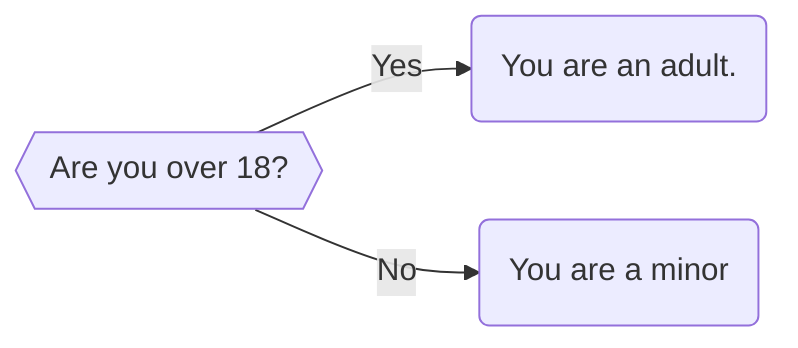
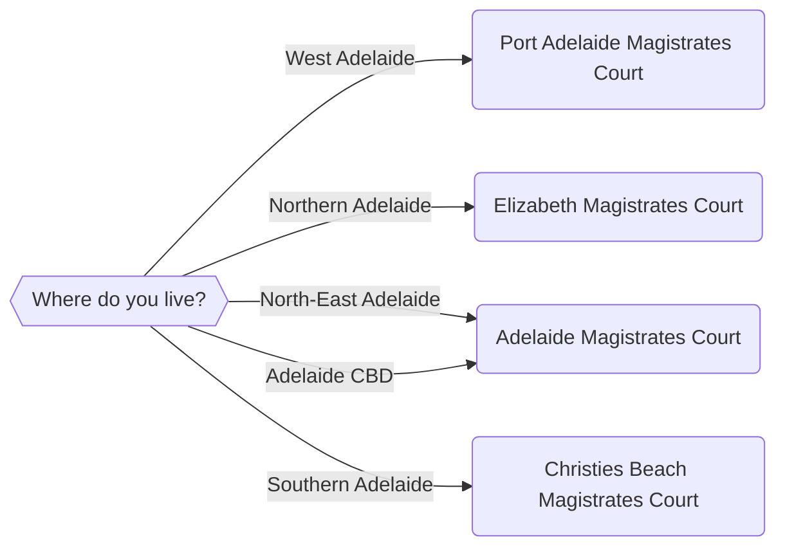

import {DisplayGlossaryItem} from '@site/src/components';
import * as Components from '@site/src/components'
import {Quizlet, Answer, Explanation} from '@site/src/components';

## An Introduction to Logic
In this chapter, we will talk about logic and how to control the logic of our applications. We can use logic to make our app can do one thing or another depending on the input it receives. We can direct the flow of the program depending on how the user inputs certain information. We will do this using if statements.

For example, you might want your app to perform a set of initial eligibility checks before proceeding with your main analysis. You might want to check for age or residency, because your app only applies to adults who are not pensioners or South Australian residents. These kinds of preliminary questions are good to resolve early in your processing flow. Otherwise, your user might have to run through the whole app to find out they should have never run it in the first place! Therefore, we can ask the user a few preliminary questions and, based on those questions, decide which path the application should take. 

For a simple application, we can use logic and just one question to direct the flow of our application.

More complex decisions might have many different answers.  For example, when deciding on the closest court in the Adelaide region, we might want to ask our user a question with multiple options.


Therefore, the questions that we ask will influence how we structure our decision making processes. 

## Express logic in code using If statements
We need a way to express this decision-making process in code.  To do so we use  <DisplayGlossaryItem item='ifstatement' plural />.

An if statement tells a program to do something if a certain condition is met. This is the simplest type of if statement. Let's take diagram 1 above. We might express this the following way in pseudocode:

**IF** *user is 18 years or older* **THEN** *they are an adult*

A more complex if statement might tell a program to do something if a condition is met, and something else if that condition is not met. This is known as an if-else statement.

**IF** *user is 18 years or older* **THEN** *they are an adult* **ELSE** *they are a child*

### If Statement Rules
In order to use an if statement in a code block, we need to follow three rules (otherwise Docassemble will generate a syntax error if we try to run this code):

* The if statement must be indented following the code block;
* There must be one space between the 'if' and the test that we are performing; and,
* The if statement must be closed with a semicolon immediately after the statement

:::info
Note that we do not need to add an ```else``` clause when writing an if statement. However, it is good practice to do so. We use if statements in Docassemble to redirect users to different endpoints or different questions. If our user enters a value which is not covered by our if statement, Docassemble will exit with the following error screen:

<Components.DisplayImage imageURL='/textbook/img/textbook/chapter_04/docassemble_finished.png' altText='Docassemble has finished executing and will show this screen' />

In the alternative, if we are declaring a variable in our if statement (see [Chapter 3](/docs/textbook/chapter_03)), we might encounter an error. For example, if we do not have an else statement we might get this error:

<Components.DisplayImage imageURL='/textbook/img/textbook/chapter_04/docassemble_error_no_else.png' altText='Docassemble has finished executing and will show this screen' />

These are things to be mindful of when planning how you will use if statements.
:::

## Implementing an If-Else Statement in Docassemble
Let's how we might implement the logic above using an if statement.

```yaml showLineNumbers title="Ch4_Age_Eligibility.yml" showLineNumbers
---
question: |
  Are you 18 years or older?
yesno: user18OrOver
---
code: |
  if user18OrOver:
    userIsAdult = 'You are an adult!'
  else:
    userIsAdult = 'You are a child'
---
mandatory: True
question: Here is your age status
subquestion: |
  Thank you for completing this survey.

  Here is your result: ${userIsAdult}

buttons:
  - Exit: exit
  - Restart: restart
---
```

### Line 7
Note line 7 of ```Ch4_Age_Eligibility.yml```. You will see that we have included a reference to the variable ```user18orOver```, followed immediately by a semicolon. What does this mean?

What we have used here is an equality operator. That allows us to test a particular value to drive our if statement.

Let's consider how our application will execute. It will first display a button which asks the user whether they are 18 or over. 

<Components.DisplayImage imageURL='/textbook/img/textbook/chapter_04/over_18_question_choice.png' altText='A Docassemble application with two options - yes or no' />

If the user presses **Yes**, that variable will contain the value True. Otherwise, if the user presses **No**, it will contain the value False. 

The line ```if user18OrOver:``` is effectively the same as writing ```if user18OrOver == True:```.

### Lines 7 to 10

Lines 7 to 10 in our code block direct the flow of control of the application. If the user presses yes on the first screen (that is, ```user18OrOver``` is True), the final screen will display that they are an adult.

<Components.DisplayImage imageURL='/textbook/img/textbook/chapter_04/adult_endpoint_screen_if_statement.png' altText='The endpoint displayed if the user says they are over 18' />

Otherwise, the application will display that they are a child.

<Components.DisplayImage imageURL='/textbook/img/textbook/chapter_04/child_endpoint_screen_if_statement.png' altText='The endpoint displayed if the user says they are under 18' />

### Flipping the Logic
We can also flip the logic of our if statement around. In Ch4_Age_Eligibility, Line 7 tests whether the user is 18 years or older. We can reverse this logic with the following code:

```yaml showLineNumbers title="Ch4_Age_Eligible_Reverse.yml" showLineNumbers
---
question: |
  Are you 18 years or older?
yesno: user18OrOver
---
code: |
  if not user18OrOver:
    userIsAdult = 'You are a child'
  else:
    userIsAdult = 'You are an adult!'
---
mandatory: True
question: Here is your age status
subquestion: |
  Thank you for completing this survey.

  Here is your result: ${userIsAdult}

buttons:
  - Exit: exit
  - Restart: restart
---
```
Writing ```not user18OrOver``` on Line 7 is the same as writing ```userOver18OrOver < 18```.

<Quizlet title="If Statement with Radio Buttons Quiz">
    Let's say that we want to create an if statement clause to check whether the variable `userResponse` contains 'Yes'. What if statement clause should we use?
    <Answer>
    `if userResponse = 'Yes':`
    </Answer>
    <Answer>
    `if userResponse:`
    </Answer>
    <Answer isCorrect>
    `if userResponse == 'Yes':`
    </Answer>
    <Explanation correctAnswer>
    That's right! Remember that we are evaluating a string variable to see whether it contains the string 'Yes'. Therefore, we need to evaluate that, and not a Boolean value. Also, you have correctly identified that the text for equality is `==` and not `=`.
    </Explanation>
    <Explanation incorrectAnswer>
    That's not quite right. Remember when constructing an if statement:
    * You need to test the value of the variable you are assessing using the correct datatype; and,
    * You need to use the correct test for equality
    </Explanation>
</Quizlet>

## Other equality operators and if statements
There are multiple ways that we could evaluate whether the user is over 18. For example, we might simply ask the user whether they were over 18 or not, which might be sufficient to satisfy some statutory tests. Otherwise, we could ask the user to provide their age, and then evaluate whether this age was over 18 mathematically. 

**IF** *user's age is 18 or more* **THEN** *they are an adult* **ELSE** *they are a child*

We would implement this test using the following code:

```yaml showLineNumbers title="Ch3_Age_Eligibility_Numbers.yml" showLineNumbers
---
question: |
  What is your age?
fields:
  - no label: userAge
    datatype: integer
---
code: |
  if userAge >= 18:
    userIsAdult = 'an adult'
  else:
    userIsAdult = 'just a child!'
---
mandatory: True
question: Your age
subquestion: |
  Thank you for completing this quiz
  
  You said your age was ${userAge}. Therefore, you are ${userIsAdult}
  
buttons:
  - Restart: restart
  - Exit: exit
---
```

As with ```Ch4_Age_Eligible_Reverse.yml```, we can also reverse the logic for our if statement here. 

```yaml showLineNumbers title="Ch3_Age_Eligibility_Numbers.yml" showLineNumbers
---
question: |
  What is your age?
fields:
  - no label: userAge
    datatype: integer
---
code: |
  if userAge < 18:
    userIsAdult = 'just a child!'
  else:
    userIsAdult = 'an adult'
---
mandatory: True
question: Your age
subquestion: |
  Thank you for completing this quiz
  
  You said your age was ${userAge}. Therefore, you are ${userIsAdult}
  
buttons:
  - Restart: restart
  - Exit: exit
---
```

Now, our if statement on Line 7 is checking whether ```userAge``` is less than 18. If they are, it sets the value of ```userIsAdult``` to 'just a child'. 

Both of these if statements work just as well as one another. 

<Quizlet title="If Statement with Integers Quiz">
    We want to build a Docassemble application which will check whether `userAge` contains a value of 65 or greater. What if statement clause should we use?
    <Answer isCorrect>
    `if userAge >= 65:`
    </Answer>
    <Answer>
    `if userAge > 65:`
    </Answer>
    <Answer>
    `if userAge > '65':`
    </Answer>
    <Explanation correctAnswer>
    That's right! You have identified the correct test for whether a variable is equal to or greater a value. You have also recognised that you can only perform these operations on an integer, rather than a string.
    </Explanation>
    <Explanation incorrectAnswer>
    That's not quite right. Remember:
    * You have to make sure that you are testing for whether the variable contains a value *equal to or greater* than 65; and,
    * You can only use mathematical equality operators such as `<` and `>` on integers and floats
    </Explanation>
</Quizlet>