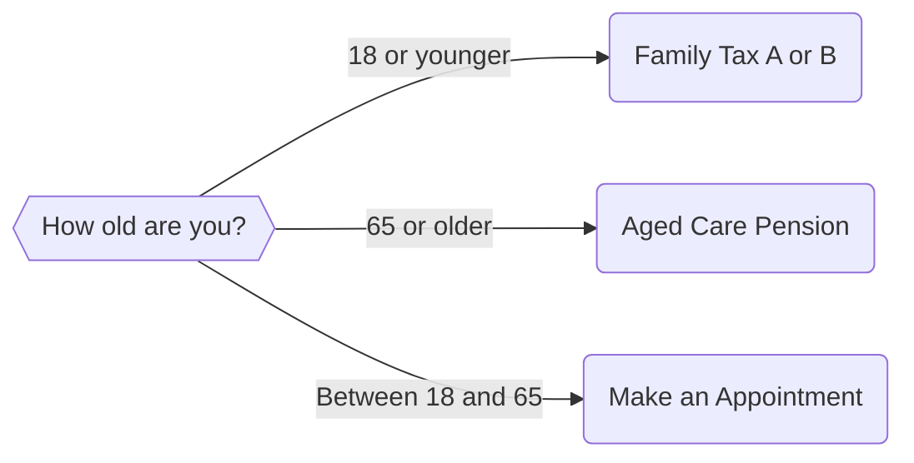

import {Quiz} from '@site/src/components';

## Testing For More Than One Condition
Our basic if-else block works well if we just have two options. What happens if we have more than one option? For example:

* If a person is charged with driving under the influence, there might be different penalties depending on how many times they have been caught
* If a person has been diagnosed with a disability, they might be entitled to different levels of support depending on the level of their disability
* We might want to direct our user to multiple endpoints depending on their circumstances.

We can implement this kind of logic in one of two ways:

* With elif statements; and,
* With nested if statements

In this section, we will explain how to use elif statements.

## An 'Elif' Statement
'Elif' stands for 'Else If'. They allow us to add in conditions for our application if the first if statement condition is not met. 

### Elif Statement Rules

In addition to the rules for using if statements, elif statements:

* Must come after an if statement;
* Must have a space between the elif and the statement

As for an if statement, you do not need to conclude an if-elif statement with an ```else``` clause. If you are using an if-elif statement to evaluate the user's input from a radio buttons option, you should be able to define an ```if``` and ```elif``` statement for each option. However, as a general rule it is safest to end your if-elif statement with an else clause. Let's see how we might implement an example in code.

## Using Elif Statements
Consider the following scenario. We have been contracted by a community legal centre, Adelaide Community Legal Centre, to develop an app that can help people determine whether they are eligible for different forms of welfare. Specifically:

* If the user is younger than 18, they might be eligible for Family Tax A and B;
* Else, if the user is 65 or older, they might be eligible for the aged pension;
* Else, they need to come talk to ACLC (they may be eligible for AusStudy or something similar)

:::info
This example is a simplified version of how the Australian welfare system works. If you are in fact working on a problem for a real client, you will need to make sure that your analysis of the law is correct!
:::

We would first map out the following logic with a flow chart.



This flow chart tells us we need the following:

* We need one question that will ask for the user's age.
* We will then need three endpoints, using event tags, that will redirect the user depending on what answers they have entered

Let's go ahead and implement that:

```yaml showLineNumbers title="Ch4_Age_Eligibility_Elif.yml" showLineNumbers
---
question: |
  What is your age?
fields:
  - no label: userAge
    datatype: integer
---
mandatory: True 
code: |
  if userAge < 18:
    familyTaxAB
  elif userAge >= 65:
    agedPension
  else:
    contactUs
---
# This is the endpoint for familyTaxAB
event: familyTaxAB
question: You Are Eligible for Family Tax A and B
subquestion: |
  Thank you for completing this questionnaire

  Because you are under 18, your parents may be eligible for [Family Tax A and B](https://www.dss.gov.au/families-and-children/benefits-payments/family-tax-benefit)

  Please contact Services Australia to understand more.

buttons:
  - Restart: restart
  - Exit: exit
---
event: agedPension
question: You are Eligible for the Aged Pension
subquestion: |
  Thank you for completing this questionnaire

  Because you are older than 65, you may be eligible for the [Aged Pension](https://www.servicesaustralia.gov.au/age-pension)

  Please contact Services Australia to understand more.

buttons:
  - Restart: restart
  - Exit: exit
---
event: contactUs
question: Please contact us
subquestion: |
  Thank you for completing this questionnaire
  
  You may not be eligible for child support payments or the aged pension

  Howevewr, you may be eligible for 

  Please contact us using one of the following methods to understand more

  Phone Number: (08) XXXX XXXX
  Email Address: contact@adelaideclc.org.au
  Address: 1 Gouger Street Adelaide 5000

buttons:
  - Restart: restart
  - Exit: exit
---
```

Now let's break down this code.

### Lines 8 to 15
Our application has only one ```mandatory``` code block, starting at line 8. Docassemble will therefore execute this code block first. To evaluate the if statement starting at line 10, Docassemble will need a value for ```userAge```.

### Lines 1 to 7
To assign a value for ```userAge```, Docassemble will then fire the question starting on Line 1. Docassemble then returns to the if statement in the ```mandatory``` code block. 

If ```userAge``` is less than 18, the event on Line 18, ```familyTaxAB```, is triggered.

Else (that is, if ```userAge``` is *not* less than 18), if ```userAge``` is more than 65, the event on Line 31, ```agedPension```, is triggered. 

Else (that is, if neither of the two conditions above are met), then the event on Line 44, ```contactUs```, is triggered.

<Quiz title="If-Elif Statement Quiz"></Quiz>