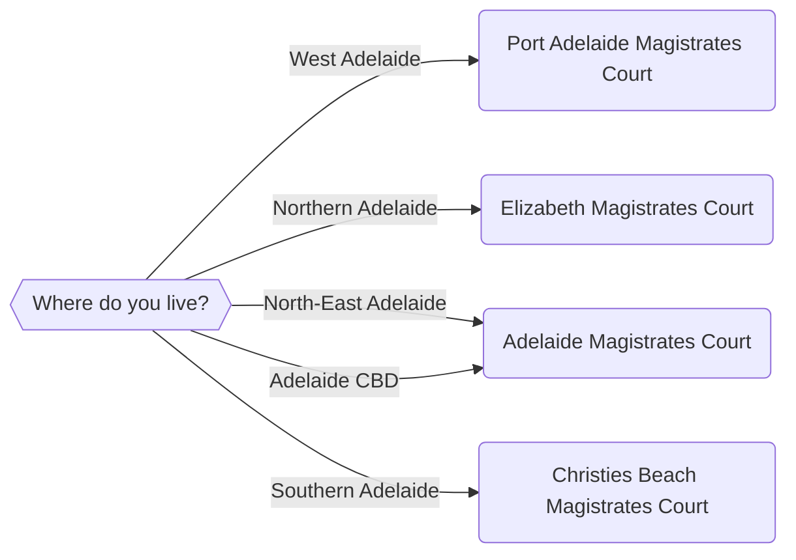

import {Quizlet, Answer, Explanation} from '@site/src/components';
import * as Components from '@site/src/components'

## Testing For More Than One Condition
Our basic if-else block works well if we just have two options. What happens if we have more than one option? For example:

* If a person is charged with driving under the influence, there might be different penalties depending on how many times they have been caught
* If a person has been diagnosed with a disability, they might be entitled to different levels of support depending on the level of their disability
* We might want to direct our user to multiple endpoints depending on their circumstances.

We can implement this kind of logic in one of two ways:

* With elif statements; and,
* With nested if statements

In this section, we will explain how to use elif statements.

## An 'Elif' Statement
'Elif' stands for 'Else If'. They allow us to add in conditions for our application if the first if statement condition is not met. 

### Elif Statement Rules
In addition to the rules for using if statements, elif statements:

* Must come after an if statement;
* Must have a space between the elif and the statement

As for an if statement, you do not need to conclude an if-elif statement with an ```else``` clause. If you are using an if-elif statement to evaluate the user's input from a radio buttons option, you should be able to define an ```if``` and ```elif``` statement for each option. However, as a general rule it is safest to end your if-elif statement with an else clause. Let's see how we might implement an example in code.

## Using Elif Statements
Consider the following scenario. We have been contracted by a community legal centre, Adelaide Community Legal Centre, to develop an app that can help people determine whether they are eligible for different forms of welfare. Specifically:

* If the user is younger than 18, they might be eligible for Family Tax A and B;
* Else, if the user is 65 or older, they might be eligible for the aged pension;
* Else, they need to come talk to ACLC (they may be eligible for AusStudy or something similar)

:::info
This example is a simplified version of how the Australian welfare system works. If you are in fact working on a problem for a real client, you will need to make sure that your analysis of the law is correct!
:::

We would first map out the following logic with a flow chart.


This flow chart tells us we need the following:

* We need one question that will ask for the user's age.
* We will then need three endpoints, using event tags, that will redirect the user depending on what answers they have entered

Let's go ahead and implement that:

```yaml showLineNumbers title="Ch4_Welfare_Elif.yml" showLineNumbers
---
question: |
  What is your age?
fields:
  - no label: userAge
    datatype: integer
---
mandatory: True 
code: |
  if userAge < 18:
    familyTaxAB
  elif userAge >= 65:
    agedPension
  else:
    contactUs
---
# This is the endpoint for familyTaxAB
event: familyTaxAB
question: You Are Eligible for Family Tax A and B
subquestion: |
  Thank you for completing this questionnaire

  Because you are under 18, your parents may be eligible for [Family Tax A and B](https://www.dss.gov.au/families-and-children/benefits-payments/family-tax-benefit)

  Please contact Services Australia to understand more.

buttons:
  - Restart: restart
  - Exit: exit
---
event: agedPension
question: You are Eligible for the Aged Pension
subquestion: |
  Thank you for completing this questionnaire

  Because you are older than 65, you may be eligible for the [Aged Pension](https://www.servicesaustralia.gov.au/age-pension)

  Please contact Services Australia to understand more.

buttons:
  - Restart: restart
  - Exit: exit
---
event: contactUs
question: Please contact us
subquestion: |
  Thank you for completing this questionnaire
  
  You may not be eligible for child support payments or the aged pension

  However, you may be eligible for other forms of welfare.

  Please contact us using one of the following methods to understand more

  Phone Number: (08) XXXX XXXX

  Email Address: contact@adelaideclc.org.au

  Address: 1 Gouger Street Adelaide 5000

buttons:
  - Restart: restart
  - Exit: exit
---
```

Now let's break down this code.

### Lines 8 to 15
Our application has only one ```mandatory``` code block, starting at line 8. Docassemble will therefore execute this code block first. To evaluate the if statement starting at line 10, Docassemble will need a value for ```userAge```.

### Lines 1 to 7
To assign a value for ```userAge```, Docassemble will then fire the question starting on Line 1. Docassemble then returns to the if statement in the ```mandatory``` code block. 

If ```userAge``` is less than 18, the event on Line 18, ```familyTaxAB```, is triggered.

<Components.DisplayImage imageURL='/img/textbook/chapter_04/family_tax_ab_elif_statement.png' altText='The endpoint displayed if the user says they are under 18' />

Else (that is, if ```userAge``` is *not* less than 18), if ```userAge``` is more than 65, the event on Line 31, ```agedPension```, is triggered. 

<Components.DisplayImage imageURL='/img/textbook/chapter_04/aged_pension_elif_statement.png' altText='The endpoint displayed if the user says they are 65 or older' />

Else (that is, if neither of the two conditions above are met), then the event on Line 44, ```contactUs```, is triggered.

<Components.DisplayImage imageURL='/img/textbook/chapter_04/contact_us_elif_statement.png' altText='The endpoint displayed if the user says they are 65 or older' />

<Quizlet title="If-Elif Statement Quiz">
  Which of the following is **not** true about `elif` clauses?
  <Answer>
  An `elif` clause must follow an initial `if` statement clause
  </Answer>
  <Answer>
  An `elif` statement must be concluded with an `:`
  </Answer>
  <Answer isCorrect>
  An `elif` statement must be followed by an `else` statement.
  </Answer>
  <Explanation correctAnswer>
  That's right. We can only use an `elif` statement clause once we have used an `if` statement clause. We also need to conclude the `elif` statement clause with a `:` once we have included the condition. We can also include as many `elif` clauses as we want after an `if` statement clause.
  </Explanation>
  <Explanation>
  That's not quite right. Remember that we can use an `elif` statement clause in an `if` statement once we have defined the initial `if` statement clause. We must also terminate the `elif` statement clause with a `:`. Remember that we do not need to terminate an `if` statement clause with an `else` - we can define each case using an `elif` if we wish.
  </Explanation>
</Quizlet>

## Another If-Elif Statement Example
You might recall this flowchart from the section on if statements:



From this flowchart, our Docassemble application will need three blocks:

* A question block which asks the user where they live
* A code block which determines which court the user will go to
* An endpoint which displays this to the user

Let's see how we can implement this code in Docassemble

```yaml showLineNumbers title="Ch4_Magistrates_Court_Tool.yml" showLineNumbers
---
question: |
  Where do you live?
fields:
  - no label: userLocation
    datatype: radio
    choices:
      - Western Adelaide: west
      - Northern Adelaide: north
      - North-East Adelaide: northeast
      - Adelaide CBD: cbd
      - Southern Adelaide: south
      - None of the above: none
---
mandatory: True 
code: |
  if userLocation == 'west':
    userCourt = 'Port Adelaide Magistrates Court'
    courtAddress = '260 St Vincent St, Port Adelaide SA 5015'
    courtEndscreen
  elif userLocation == 'north':
    userCourt = 'Elizabeth Magistrates Court'
    courtAddress = '15 Frobisher Road, Elizabeth SA 5112'
    courtEndscreen
  elif userLocation == 'northeast':
    userCourt = 'Adelaide Magistrates Court'
    courtAddress = '260 Victoria Square, Adelaide SA 5000'
    courtEndscreen
  elif userLocation == 'cbd':
    userCourt = 'Adelaide Magistrates Court'
    courtAddress = '260 Victoria Square, Adelaide SA 5000'
    courtEndscreen
  elif userLocation == 'south':
    userCourt = 'Christies Beach Magistrates Court'
    courtAddress = '96 Dyson Road, Christie Downs SA 5164'
    courtEndscreen
  else:
    noCourtEndscreen
---
# This is the endpoint for if the user is in range of a Magistrates court
event: courtEndscreen
question: Your local Magistrates Court
subquestion: |
  Thank you for completing this survey.

  Your nearest Magistrates Court is ${userCourt} at ${courtAddress}.

  You can contact them at [this phone number](tel:08 8204 2444).

buttons:
  - Restart: restart
  - Exit: exit
---
# This is the endpoint for if the user is not in range of a Magistrates court
event: noCourtEndscreen
question: There is no Magistrates Court near you
subquestion: |
  Thank you for completing this survey.

  There is no suburban Magistrates Court near you.

buttons:
  - Restart: restart
  - Exit: exit
---
```

Now, let's consider how this code will run. 

### Lines 15 to 38
Docassemble will first execute the mandatory code block that starts on Line 15. To evaluate this code block, it needs a value for ```userLocation```.

### Lines 1 to 14
To obtain a value for ```userLocation```, Docassemble will then need to execute the question block starting on Line 2. This will display a radio options screen to the user.

<Components.DisplayImage imageURL='/img/textbook/chapter_04/magistrates_court_radio_options_elif_statement.png' altText='The radio options screen which allows to select where they live, so Docassemble can display which Magistrates Court in Adelaide they are closest to' />

### Lines 54 to 65
If the user selects **None of the above**, Docassemble will redirect the user to the ```noCourtEndscreen```. 

<Components.DisplayImage imageURL='/img/textbook/chapter_04/no_magistrates_court_endpoint_elif_statement.png' altText='The endpoint screen displayed to the user if they select "None of the above" from the previous screen' />

### Lines 40 to 53
Otherwise, Docassemble will redirect the user to the ```courtEndscreen```. The if-elif block on Lines 17 to 36 will set the value for ```userCourt``` and ```courtAddress```. For example, let's say our user selects **Western Adelaide**. The following screen will be displayed.

<Components.DisplayImage imageURL='/img/textbook/chapter_04/port_magistrates_court_endpoint_elif_statement.png' altText='The endpoint screen displayed to the user if they select "Western Adelaide" on the previous screen' />

<Quizlet title="If-Elif Statement Quiz">
  Consider the following `if-elif` statement:

  ```yaml
  ---
  question: |
    What is your age?
  fields:
    - no label: userAge
      datatype: integer
  ---
  mandatory: True 
  code: |
    if userAge > 22:
      jobSeeker
    elif userAge > 25
      ausStudy
    else:
      contactUs
  ---
  ```

  Why won't our application execute in Docassemble?
  <Answer>
  The test we are using to assess `userAge` is incorrect.
  </Answer>
  <Answer isCorrect>
  We are missing a `:` at the end of our `elif` statement clause.
  </Answer>
  <Answer>
  There is no space between `elif` and `userAge`.
  </Answer>
  <Explanation correctAnswer>
  That's right. Our `elif` statement is testing whether the user's age is greater than 25. We need to put a space between the `elif` and the condition (that is, the variable `userAge` we are assessing). We need to then termiante this with a `:`.
  </Explanation>
  <Explanation>
  That's not right. Remember:
  * We want to assess whether the user is greater than 25 (if they are not greater than 22);
  * We need to put a space between this test and the `elif`; and,
  * We need to terminate this `elif` clause with a `:`.
  </Explanation>
</Quizlet>

## Improving our application
You might have noticed that there is a bit of repetition in ```Ch4_Magistrates_Court_Tool.yml```. For example, we make multiple calls to ```courtEndscreen``` on Lines 20, 24, 28, 32 and 36. It would be easier if we just had one call to ```courtEndscreen``` if the user did not set ```userLocation``` to None of the above. To do this, we would need to use nested if statements, which we will cover in the next section.