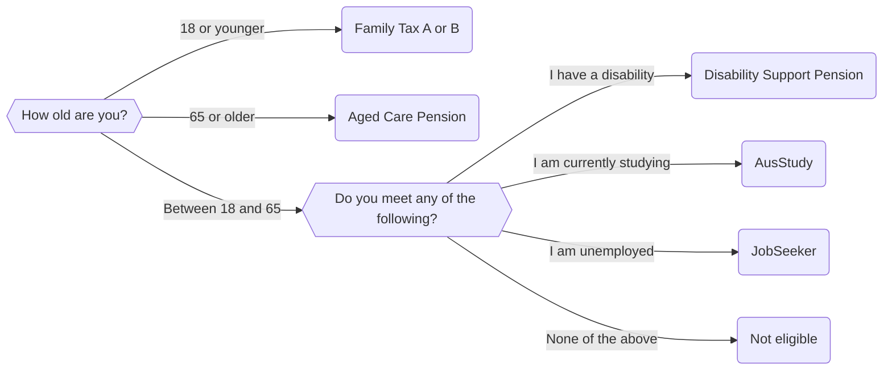

import {Quizlet, Answer, Explanation} from '@site/src/components';

In the previous [section](/docs/textbook/chapter_04/00-30-ch3b-if_elif_statements.mdx), we mentioned that there are two ways we can create an if block with multiple conditions:

* Using an if-elif clause; and,
* Using nested if statements

In this section, we will cover how to use nested if statements. We will first consider the code that we designed for Adelaide Community Legal Centre. We will then create a new set of nested if statement rules from scratch.

## Nested If statements
If statements aren't usually used in isolation, much like decisions aren't made in isolation. Usually we make a set of decisions to arrive at a conclusion. Sometimes we need to segment the flow of control of our application, so that we can ask a series of questions in a particular order. 

The best way to do this is using a nested if statement. A nested if statement is an if statement encased inside another if statement.

### Nested If Statement Rules
In addition to the [rules](/docs/textbook/chapter_04/00-20-ch3b-if_statements.mdx) about if statements we discussed previously:

* All nested if statements need to start on an indented line below the original if statement; and,
* All lines of the nested if statement need to be aligned with one another.

:::info
That is, if our original if statement is indented two spaces, the first line of the nested if statement should be indented four spaces. If we include an elif or an else statement in our nested if statement, this should be aligned *exactly* with the original if statement. If we were to include another nested if statement inside an nested if statement, the first line of that nested if statement should be indented six spaces.
:::

:::tip
Watch how your if statements are aligned! A large and complicated program might have multiple nested if statements. It can be easy to miss a space when creating your if statements. Therefore, it is best to test each nested if statement individually before adding a new one.
:::

## An Example of a Nested If Statement
Let's consider the application that we developed in the previous section for the Adelaide Community Legal Centre. We were told that if a user answers that they are between the ages of 18 and 65, we should recommend that they attend the ACLC for further advice. 

However, what if when our user answers that they are between 18 and 65, we want to ask a series of follow up questions? We could ask whether they have a disability, or whether they are currently studying. If they are, they might be eligible for other forms of welfare, such as the disability support pension, AusStudy or JobSeeker. 

### Flow of Control
We could modify our flowchart from the previous [section](/docs/textbook/chapter_04/00-30-ch3b-if_elif_statements.mdx) to include the following questions:



From this diagram, you can see that we can pretty much recycle the code that we used in ```Ch4_Welfare_Elif.yml```. The key change will be to add in a nested if statement in our else block. 

### Docassemble Code

The following code below shows how we have implemented the flowchart.

```yaml showLineNumbers title="Ch4_Welfare_Nested.yml" showLineNumbers
---
question: |
  What is your age?
fields:
  - no label: userAge
    datatype: integer
---
question: |
  Do you meet any of the following?
fields:
  - no label: userStatus
    datatype: radio
    choices:
      - I suffer from a disability: disability
      - I am studying at University or TAFE: studying
      - I am unemployed: unemployed
      - None of the above: none
---
mandatory: True 
code: |
  if userAge < 18:
    familyTaxAB
  elif userAge >= 65:
    agedPension
  else:
    if userStatus == 'disability':
      dsPension
    elif userStatus == 'studying':
      ausStudy
    elif userStatus == 'unemployed':
      jobSeeker
    else:
      contactUs
---
# This is the endpoint for familyTaxAB
event: familyTaxAB
question: You Are Eligible for Family Tax A and B
subquestion: |
  Thank you for completing this questionnaire

  Because you are under 18, your parents may be eligible for [Family Tax A and B](https://www.dss.gov.au/families-and-children/benefits-payments/family-tax-benefit)

  Please contact Services Australia to understand more.

buttons:
  - Restart: restart
  - Exit: exit
---
event: agedPension
question: You are Eligible for the Aged Pension
subquestion: |
  Thank you for completing this questionnaire

  Because you are older than 65, you may be eligible for the [Aged Pension](https://www.servicesaustralia.gov.au/age-pension)

  Please contact Services Australia to understand more.

buttons:
  - Restart: restart
  - Exit: exit
---
event: dsPension
question: You are Eligible for the Disability Support Pension
subquestion: |
  Thank you for completing this questionnaire

  Because you have indicated that you are disabled, you may be eligible for the [Aged Pension](https://www.servicesaustralia.gov.au/disability-support-pension)

  Please contact Services Australia to understand more.

buttons:
  - Restart: restart
  - Exit: exit
---
event: ausStudy
question: You are Eligible for AustStudy
subquestion: |
  Thank you for completing this questionnaire

  Because you are studying at University or TAFE, you may be eligible for [AusStudy](https://www.servicesaustralia.gov.au/austudy)

  Please contact Services Australia to understand more.

buttons:
  - Restart: restart
  - Exit: exit
---
event: jobSeeker
question: You are Eligible for the Aged Pension
subquestion: |
  Thank you for completing this questionnaire

  Because you are unemployed, you may be eligible for [JobSeeker](https://www.servicesaustralia.gov.au/jobseeker-payment)

  Please contact Services Australia to understand more.

buttons:
  - Restart: restart
  - Exit: exit
---
event: contactUs
question: Please contact us
subquestion: |
  Thank you for completing this questionnaire
  
  Based on your answers, you may not be eligible for welfare support.

  Please contact us using one of the following methods to understand more and to discuss your individual circumstances.

  Phone Number: (08) XXXX XXXX
  Email Address: contact@adelaideclc.org.au
  Address: 1 Gouger Street Adelaide 5000

buttons:
  - Restart: restart
  - Exit: exit
---
```

### Lines 19 to 25
As with ```Ch4_Welfare_Elif.yml```, Docassemble first starts by executing the ```mandatory``` code block. If the user enters a value for ```userAge``` between 18 and 65, the ```if``` statement nested in the ```else``` block on line 25 is executed.

### Lines 26 to 33
To evaluate the nested if statement, Docassemble needs a value for ```userStatus```. It finds that in the question block on line 18.

### Lines 8 to 17
The user must then select one of the values presented in this options list.

**Insert screenshot here**

Note that we have a None of the above option. Although we have not included this option in our if statement, it will be captured by the ```else``` clause on line 32. Depending 

The value that is assigned to ```userStatus``` is then used to evaluate the nested if statement. 

This will change what endscreen is displayed. For example, let's say the user selects that they have a disability. The disability endpoint screeen will be displayed:

**Insert screenshot here**

<Quizlet title="Nested If Statement Quiz"></Quizlet>

## When Should We Not Use Nested If Statements?
Now that we've learned about how great nested if statements are, let's learn about when we should *not* use nested if statements.

Nested if statements are great when we want to control the flow of our application. They are also great if we do not know the answer to a particular question yet. In our ACLC application, we do not know whether the person is disabled when we ask what their age is. Therefore, it makes sense to use a nested if statement. 

However, if we were to ask their age *and* whether they were disabled at the same time, it would not make sense to use a nested if statement. 

## Improving Our Application
Another example lies in the AusStudy branch of our application. An eagle eyed reader, upon examining the link for AusStudy, might note that this is available for students who are over 25. To help make a condition for this, we will need to use [and and or statements](/docs/textbook/chapter_04/00-60-ch3b_test_many_things_at_once.mdx).
