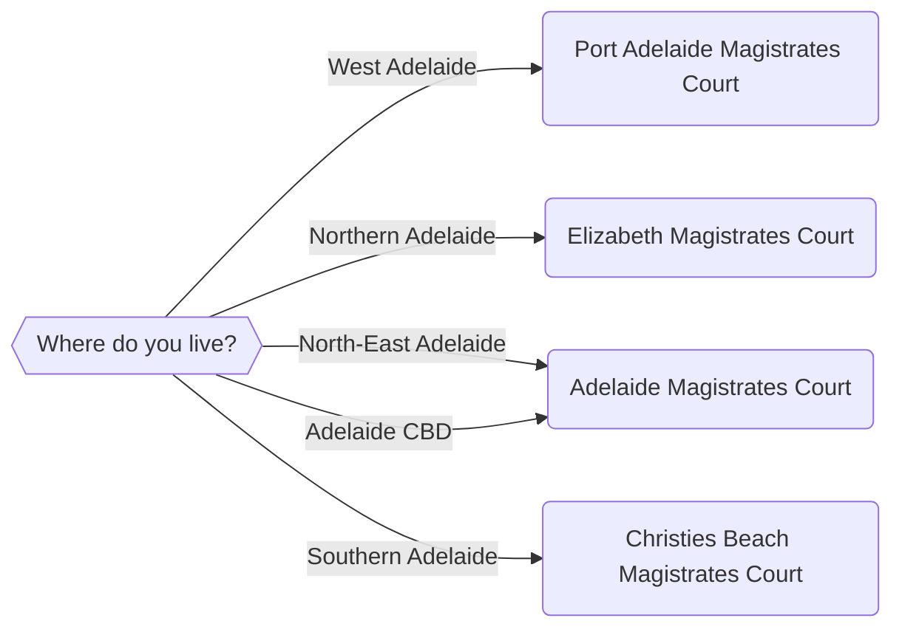
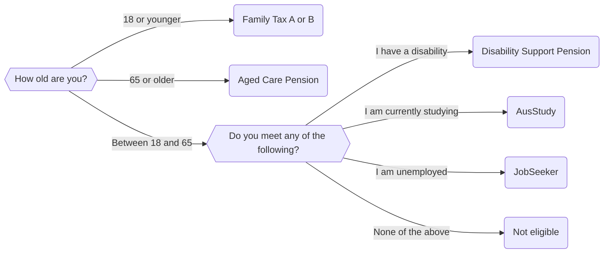
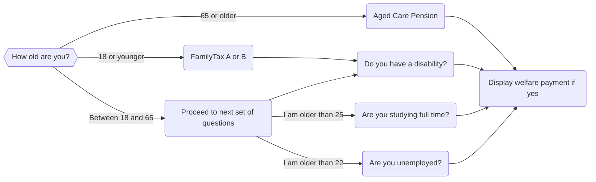

import {Quizlet, Answer, Explanation} from '@site/src/components';
import * as Components from '@site/src/components'

## A Recap On If Statements and Application Design
In the [previous](./00-30.mdx) [sections](./00-40.mdx), we developed a series of applications that used if statements to direct the flow of control for our application. Depending on what the user entered as input, the if statement would trigger an event and Docassemble would display an end screen.

That type of logic works well for multiple different endpoints. For example, each of our endpoints in this chapter so far contains a statement on whether a user is eligible for a particular form of welfare. What if a user is eligible for more than one form of welfare? For example, someone could be eligible for both the Family Tax A and B pensions *and* a disability support pension.

To implement this, we will need to use use Mako if statements.

## Mako If Statements
Rather than embedding our if statements in a code block, we can put Mako if statements into a question block. 

There are multiple advantages to this. We can express more complicated logic in our end screens, and display certain text conditionally, as well as format text differently. We can also reduce how many times we need to duplicate code, particularly question blocks and end screens.

### Rules for Mako If Statements
The rules for using Mako if statements are different than for using if statements in a code block:

* We can only use Mako if statements in a question block *after* a ```subquestion: |``` tag
* The line on which the Mako if statement starts must be two spaces to the right of the ```subquestion: |``` tag
* We start the if statement clause with a ```%``` symbol, which tells Markdown we're about to do something special. **Note that there must be a space between the ```%``` symbol and the start of the if statement clause.** We end the if statement clause with a ```:```
* We can either add Markdown text or other code (for example, a nested if statement) on the next line after the if statement clause
* We end the entire if statement with an ```% endif``` clause, which must be aligned with any ```if```, ```elif``` or  ```else``` clause. 

Note that you do not need to indent the text or code contained in your if statement. If you do, it could cause a syntax error.

## Another Example Mako If Statement
The simplest use of Mako if statements is to condense down the number of screens required for a Docassemble application. Let's consider our court selector from the previous [section](./00-40.mdx). You might recall we used the following flowchart:



Although this would imply that we need to have four endpoints for each court, we can easily combine them together into one using a Mako if statement:

```yaml showLineNumbers title="Ch4_Magistrates_Court_Finder_Mako.yml" showLineNumbers
---
question: |
  Where do you live?
fields:
  - no label: userLocation
    datatype: radio
    choices:
      - Western Adelaide: west
      - Northern Adelaide: north
      - North-East Adelaide: northeast
      - Adelaide CBD: cbd
      - Southern Adelaide: south
      - None of the above: none
---
# This is the one mandatory question block
mandatory: True
question: Your local Magistrates Court
subquestion: |
  Thank you for completing this survey.

  % if userLocation == 'west':
  Your nearest Magistrates Court is the Port Adelaide Magistrates Court at 260 St Vincent Street, Port Adelaide SA 5015.
  % elif userLocation == 'north':
  Your nearest Magistrates Court is the Elizabeth Magistrates Court at 15 Frobisher Road, Elizabeth SA 5112.
  % elif userLocation == 'northeast':
  Your nearest Magistrates Court is the Adelaide CBD Magistrates Court at 260 Victoria Square, Adelaide SA 5000.
  % elif userLocation == 'cbd':
  Your nearest Magistrates Court is the Adelaide CBD Magistrates Court at 260 Victoria Square, Adelaide SA 5000.
  % elif userLocation == 'south':
  Your nearest Magistrates Court is the Christies Beach Magistrates Court at 96 Dyson Road, Christie Downs SA 5164.
  % else:
  We are unable to identify a Magistrates Court near you.
  % endif
  
  Please contact this [telephone number](tel:08 8204 2444) for further details.

buttons:
  - Restart: restart
  - Exit: exit
---
```

With our Mako if statement, we have shortened our code down from 65 lines to only 43. Let's look at how it works.

### Line 16
Unlike the previous application, where we had ```event``` tags, this application just has one mandatory if statement. Therefore, Docassemble will execute this code block first, and attempt to find a value of ```userLocation```.

### Lines 1 to 14
Lines 1 to 14 work exactly as they did in the previous application.

### Lines 21 to 33
The big difference between this code and the previous code is our Mako ```if-elif-else``` statement clause. If the user selects 'Western Adelaide' from the previous screen, they will see the following code:

<Components.DisplayImage imageURL='/img/textbook/chapter_04/magistrates_court_mako_radio_west_adelaide.PNG' altText='The user selecting West Adelaide from the first question block as the area where they live closest to.' />

If the user selects none, they will see the following screen:

<Components.DisplayImage imageURL='/img/textbook/chapter_04/magistrates_court_mako_question_west_adelaide.PNG' altText='The text displayed on the final end screen if the user selects West Adelaide as their location.' />

Again, we see almost identical output from our previous code. However, our code is now shorter, and we do not need to reuse code. That means there are less bugs. 

## Yet Another Example Mako If Statement
As mentioned in previous sections, we can use Mako if statements to refactor our previously designed code. Let's start with our welfare eligibility application. You might recall the following flowchart.



Previously, with ```elif``` and nested ```if``` statement clauses, we had an ```event:``` tag corresponding to each form of welfare. We are going to refactor our application so that someone can be eligible for multiple forms of welfare. We also want to add some new rules so that our application more accurately reflects the rules on welfare in Australia. Specifically:

* Someone can only claim AusStudy if they are 25 or older and are studying full time
* Someone can only claim JobSeeker if they are 22 or older and are studying full time
* Someone cannot claim the Aged Pension or the Disability Support Pension simultaneusly 
* Somone cannot claim AusStudy or JobSeeker simultaneously

Therefore, we need to redesign our flow chart as follows:



So what are we doing in this flowchart is checking the user's answers to see whether they are eligible for different services or not. If they are, we will display them in one final endscreen. 

Now, let's see how we can implement this in code.

```yaml showLineNumbers title="Ch4_Welfare_Mako.yml" showLineNumbers
---
question: |
  What is your age?
fields:
  - no label: userAge
    datatype: integer
---
question: |
  Do you suffer from a disability?
yesno: userHasDisability
---
question: |
  Are you studying full time?
yesno: userIsStudying
---
question: |
  Are you unemployed?
yesno: userIsUnemployed
---
mandatory: True 
question: Your eligibility for welfare services.
subquestion: |
  Thank you for completing this questionnaire.

  % if userAge < 18:
  Because you are under 18, your parents may be eligible for [Family Tax A and B](https://www.dss.gov.au/families-and-children/benefits-payments/family-tax-benefit).
  % if userHasDisability:
  You may also be eligible for the [Disability Support Pension](https://www.servicesaustralia.gov.au/disability-support-pension).
  % endif
  % elif userAge >= 65:
  Because you are older than 65, you may be eligible for the [Aged Pension](https://www.servicesaustralia.gov.au/age-pension)
  % else:
  % if userHasDisability:
  You may also be eligible for the [Disability Support Pension](https://www.servicesaustralia.gov.au/disability-support-pension)
  % elif userIsStudying:
  % if userAge >= 25:
  You may also be eligible for [AusStudy](https://www.servicesaustralia.gov.au/austudy)
  % else:
  It does not appear that you are eligible for any welfare payments. 
  % endif
  % elif userIsUnemployed:
  % if userAge >= 22:
  You may be eligible for [JobSeeker](https://www.servicesaustralia.gov.au/jobseeker-payment)
  % else:
  It does not appear that you are eligible for any welfare payments.
  % endif
  % else:
  It does not appear that you are eligible for any welfare payments. 
  % endif
  % endif

buttons:
  - Restart: restart
  - Exit: exit
---
```

Once again, let's go through how this application works. Immediately we can tell that our application is much shorter (55 lines) than it was previously. However, there are many different sections of this if statement that we will need to break down.

### Lines 20 to 26 - the Mandatory Question Block
The first thing that Docassemble will do is execute the mandatory question block. To do so, it needs a value for ```userAge``` first, so that it can execute the first if statement.

### Lines 1 to 7
In order to assign a value to ```userAge```, Docassemble will execute the first question block on lines 1 to 7.

<Components.DisplayImage imageURL='/img/textbook/chapter_04/nested_mako_if_mako_welfare_age_question.png' altText='The first question displayed to the user in the nested Mako if statement application, asking for their age.' />

### Lines 27 to 28
Unlike our original ```Ch4_Welfare_Elif.yml``` application though, we have an extra nested if statement. This if statement needs a value for ```userHasDisability```. 

### Lines 8 to 10
In order to assign a value to ```userHasDisability```, Docassemble needs to execute the question block on Lines 8 to 10.

<Components.DisplayImage imageURL='/img/textbook/chapter_04/nested_mako_if_welfare_disability_question.png' altText='The disability question - this question is executed if the user says they are under 18 or between 18 and 65.' />

If ```userHasDisability``` is set to True by the user (that is, they press yes), Docassemble will display the additional text from Line 28, along with the text from Line 26:

<Components.DisplayImage imageURL='/img/textbook/chapter_04/nested_mako_if_welfare_familytaxab_and_dsp_eligible.png' altText='This is the endpoint screen displayed if the user states they are under 18 and are disabled.' />

Otherwise, if ```userHasDisability``` is set to False, Docassemble will just display the text from Line 26:

<Components.DisplayImage imageURL='/img/textbook/chapter_04/nested_mako_if_welfare_familytaxab_eligible.png' altText='This is the endpoint screen displayed if the user states they are under 18 and are not disabled.' />

### Lines 30 to 31
What happens if the user indicates that they are 65 years or older? 

<Components.DisplayImage imageURL='/img/textbook/chapter_04/nested_mako_if_welfare_age_question_older_than_65.png' altText='A screenshot of the user entering in a value of 65 or greater for their age.' />

The ```elif``` clause on Line 30 will be executed and the text (and only the text) on Line 31 will be displayed instead.

<Components.DisplayImage imageURL='/img/textbook/chapter_04/nested_mako_if_welfare_age_endpoint_older_than_65.png' altText='This is the endpoint screen displayed if the user states they are 65 or older.' />

Note that none of the other text is being displayed, and therefore none of the other questions are being asked.

### Line 32
What happens if our user indicates they are between 18 and 65?

<Components.DisplayImage imageURL='/img/textbook/chapter_04/nested_mako_if_welfare_age_question_18_to_65.png' altText='A screenshot of the user entering in a value between 18 and 65 for their age.' />

This is where Docassemble executes the nested ```if-elif-else``` statement clause within our ```else``` clause.

### Lines 33 to 34
To evaluate the nested ```if-elif-else``` statement, Docassemble first needs a value for ```userHasDisability```. Therefore, Docassemble will execute the question block on Lines 8 to 10. If the user answers Yes to this question, they will only see the text stating that they are eligible for the Disability Support Pension.

<Components.DisplayImage imageURL='/img/textbook/chapter_04/nested_mako_if_welfare_dsp_eligible.png' altText='This is the endpoint screen displayed if the user indicates they are between 18 and 65, and they suffer from a disability'/>

### Lines 35 to 40
The next five lines of our application evaluate whether the user might be eligible for AusStudy. Remember that unlike the DSP, there are two requirements for AusStudy:

* The user must be studying full time; and,
* The user must be 25 or older.

Docassemble first evaluates the ```elif``` statement clause on Line 35. To do so, it needs a value for ```userIsStudying```.

### Lines 11 to 15
To assign a value for ```userIsStudying```, Docassemble needs to execute the question block on Lines 11 to 15.

<Components.DisplayImage imageURL='/img/textbook/chapter_04/nested_mako_if_welfare_study_question.png' altText='The study question - this question is executed if the user says they are between 18 and 65 and are not disabled.'/>

If the user answers Yes (and Docassemble assigns the value True to ```userIsStudying```), Docassemble then evaluates the if statement on Line 36, and checks whether the variable ```userAge``` contains a value equal to 25 or greater. If they are, they will receive the following text stating that they are eligible for AusStudy. 

<Components.DisplayImage imageURL='/img/textbook/chapter_04/nested_mako_if_welfare_ausstudy_eligible.png' altText='This is the endpoint displayed to the user if they nominate their age as being between 25 and 65 and they say they are studying full time'/>

Otherwise, if the value in ```userAge``` is not between 25 and 65, will be told they are not eligible for AusStudy.

<Components.DisplayImage imageURL='/img/textbook/chapter_04/nested_mako_if_welfare_ausstudy_not_eligible.png' altText='This is the endpoint displayed to the user if they nominate their age as being between 18 and 25 but say they are studying'/>

If the user answers No (and Docassemble assigns the value False to ```userIsStudying```), Docassemble will execute the next ```elif``` statement clause.

### Lines 41 to 46
If the user indicates that the are not studying, Docassemble then executes the next branch of the ```elif``` statement clause. This clause evaluates whether the user might be eligible for JobSeeker. Remember that there are two requirements for a user to be eligible for JobSeeker:

* They must be unemployed; and,
* They must be 22 or older

To evaluate this ```elif``` statement, Docassemble needs a value for ```userIsUnemployed```.

### Lines 16 to 19
To assign a value to ```userIsUnemployed```, Docassemble needs to execute the question block on lines 16 to 19:

<Components.DisplayImage imageURL='/img/textbook/chapter_04/nested_mako_if_welfare_unemployed_question.png' altText='The study question - this question is executed if the user says they are between 18 and 65, are not disabled and are not studying full time.'/>

This value is then used to evaluate the ```elif``` clause on Line 41. If the user answers Yes (and Docassemble assigns the value True to ```userIsUnemployed```), Docassemble then evaluates the nested if statement on Line 42. It already has a value for ```userAge``` so Docassemble does not need to answer this question again. 

If ```userAge``` is set to a value greater than or equal to 22, the text telling the user they are eligible for JobSeeker is displayed.

<Components.DisplayImage imageURL='/img/textbook/chapter_04/nested_mako_if_welfare_jobseeker_eligible.png' altText='This is the endpoint displayed to the user if they nominate their age as being between 22 and 65 and they say they are unemployed'/>

Otherwise, if the user is less than 22, the ```else``` statement clause on Line 44 will be executed and the following text will be displayed.

<Components.DisplayImage imageURL='/img/textbook/chapter_04/nested_mako_if_welfare_jobseeker_ineligible.png' altText='This is the endpoint displayed to the user if they nominate their age as being between 22 and 65 and they say they are not unemployed, or they are unemployed but say they less than 22.'/>

Note that if the user answers No to the question on whether they are unemployed (that is, ```userIsUnemployed``` is assigned the value False), the else clause on Line 47 matching the nested ```if-elif-else``` clause will be executed, and this text will also be displayed.

:::tip
Note that each nested ```if-else``` and ```if-elif-else``` statement in our mandatory question block contains an ending ```% endif``` statement. If you do not include these, Docassemble will not run.
:::

## Improving Our Application
Although this is an improvement over our previous application, there are still things that we can improve. First, we have three layers of nested if statements. That can increase the risk of errors being introduced into our application. Second, some of these ```if``` statements duplicate the text that we might display to the user. There might be a more efficient way to combine these statements together using [logical operators](./00-60.mdx).