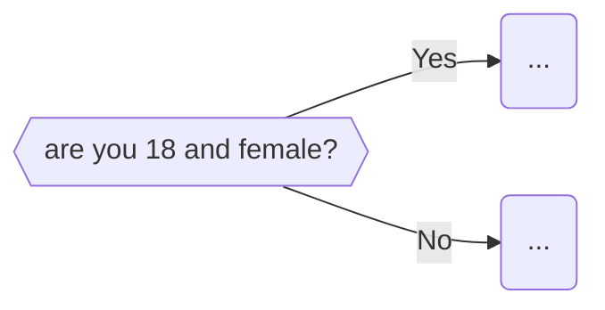

## Testing many things at once
- sometimes may need to check more than one thing at a time before move on eg:

Explain thahis as an `if a == xx and b == yy`
- expand into multiple ands?

Explain that this way is better when you know the result of both (or all) the 
testing variables at once.  If you don't know all the results, then use nested if statements.

## More complex examples
And maybe we transpose the C5 videos into here?