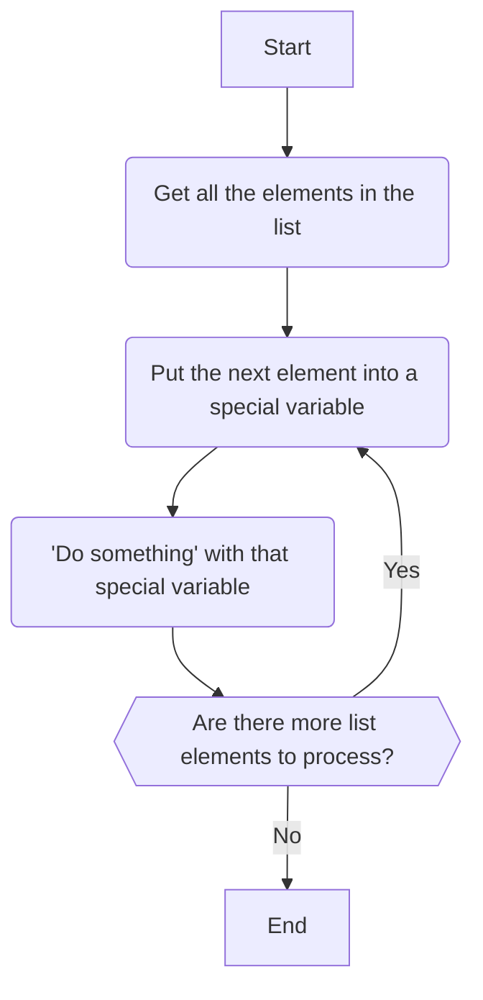

import {DisplayGlossaryItem} from '@site/src/components';
import {DisplayImage} from '@site/src/components';
import {DisplayChapter} from '@site/src/components';
import {Quizlet,Answer,Explanation} from '@site/src/components'

## Introduction
We will cover iteration in more detail in <DisplayChapter chapter='chapter_06' />
but we want to introduce it now as you will almost always use iteration and
lists together.

Iteration allows us to **re-use code without having to copy and paste**.

Let's look at an example.  Let's take our `bread_types` list, which looks like
this:
```python
bread_types = [
    'sourdough',
    'croissant',
    'tip top',
    'artisan',
    'chocolate'
]
```

Let's say we want to print out a list that looks like this:
<DisplayImage imageURL='/img/textbook/chapter_05/bread_types1.png' />

Without iteration, we'd have to write something like this:
```yml showLineNumbers
---
mandatory: True
question: List of bread types
subquestion: |
  List of bread types:
  
  * ${bread_types[0]}
  * ${bread_types[1]}
  * ${bread_types[2]}
  * ${bread_types[3]}
  * ${bread_types[4]}
---
code: | 
  bread_types = [
    'sourdough',
    'croissant',
    'tip top',
    'artisan',
    'chocolate'
  ]
---
```
Firstly, look at lines 7 to 11 and you can see the type of copying
and pasting that's involved.  We are simply copying the bulk of the
first line:
```
  * ${breadtypes[0]}
```
and replacing the `0` with the index as we go.  *This kind of copying and pasting
is a sure-fire indicator of the need to use iteration*.

Second, imagine if we had 1,000 bread types.  Now our inconvenience 
becomes a huge effort for a 1,000-element
list.  Not to mention the possibility of introducing errors.

Third, what happens if we wanted to add a new item to the list?  Or
remove an item from the list?  Each time we make an alteration we need
to modify the code in *two* places - the list data (in the code block)
and the list display commands in the mandatory question block.
Again, this is inefficient and it's very error prone.

The history of coding
is littered with errors arising from unnecessary copying and pasting of code.

What we want is *not* to tell Docassemble to display each item indivdually.  Instead, we want to tell Docassemble this:
> Display all the items in this list from top to bottom as a bullet list.

That's a good summary.  Let's re-phrase it:
> Display each item in this list in turn from top to bottom as a bullet list.

Make sense?  Let's re-phrase it again, this time using the 'I'-word:
> *Iterate* over each item in the list displaying each item as a bullet list item.

Still with us?  Let's re-phrase it in a more code-like way:
> *For each* item *in* the list, display it as a bullet list item.

## Iteration and loops
<DisplayGlossaryItem item='loop' plural /> are what we call the code we
use to carry out iteration.  Many programming languages, Python included,
have more than one way to construct a loop.  But for the purposes of this
textbook we will focus on <DisplayGlossaryItem item='forloop' plural />.

The basic premise of a 'for' loop can be stated as this:
> for each element in a list, do something

Let's apply this to our re-prhasing exercise above.  Let's take that last
statement and repeat it here as we're going to use it:
> for each **item** in **the list**, **display** it as a bullet list item

In sequence what a 'for' loop does is this:

1. It gets the items in the list
1. One at a time, it copies each item into a separate variable for processing
1. It then processes that separate variable and does whatever the 'do something'
instructions are.
1. Once it's finished carring out the 'do something' part, then the next item
is placed into the separate variable and the cycle repeats.

Let's look at a flowhcart of how this works:

## 'For' loop syntax
The basic format of a for loop is as follows:
```python
for item in list:
    do_something
```
The words `for` and `in` are <DisplayGlossaryItem item='reservedword' plural />.
When Python sees these words in this order then it knows that it needs to 
process a for loop.

`item` and `list` are <DisplayGlossaryItem item='variable' plural />.  `list`
is our list data.  `item` is new and Python uses that as the 'special variable'
in which to place each list item.  Any variable name can be used here and good
practice is to use `element` or `item` as a 'special variable' or to use a singluar
noun that reflects the list data.  For example, this is a valid loop to process
our `bread_types` list:
```python
for bread_type in bread_types:
    do_something
```
or
```python
for a_bread_type in bread_types:
  do_something
```
The special variable can be any name.  It's best to choose a name that is descriptive.

The `do_something` part of the loop is the **body** of the loop.  It can contain
more than one line but, in the Python format at least (more on this below), 
each item of the loop body must be indented.

Here's an example that copies the bread types from the `bread_type` list into
another list (`good_types`).  The if statement in the code makes sure that 
`tip top` is not copied across.  At the end of the loop we add a new bread type
to `good_types`.  Note how that last line is not indented.  That means it is
not processed as part of the loop.
```python
good_types = []     # Initialise good_types to an empty list
for bread_type in bread_types:
    if bread_type != 'tip top':
        good_types.append(bread_type)
good_types.append('foccaccia')
```
:::note
We use for loops to copy one list to another **a lot**.  It's a very useful
way of filtering out unwanted elements from lists (like we just did above).
:::

## Python Format and Mako Format
So far we have discussed for loop syntax in 'Python format'.  That is, the 
syntax is something a Python programmer would understand.  Practically, we'll
see this syntax in <DisplayGlossaryItem item='codeblock' plural />.

Docassemble provides another way to write for loops.  This **Mako Format**
is usually used in when the loop must be embedded in with other Markdown text,
such as inside a <DisplayGlossaryItem item='subquestionblock' plural />.

Mako format loops work in the same way as regular for loops, and syntactically
they are quite similar, but they do contain some differences so Docassemble knows
to treat them as loops and not just as text.

The basic format is as follows:
```
  %for item in list:
  do_something
  %endfor
```
In Mako format we must precede the `for` with a `%` (ie: `%for`).  The `%`
character tells Docassemble that what follows is a command and not just the 
word 'for'.

The body of a loop can't be indented in Mako format.  That's because Markdown
treats indentation of four spaces or more as a special command.

Because the loop body can't be indented, Mako format introduces a `%endfor` line
to delimit the end of the loop.

Similarly to the Python format, everything between `%for` and `%endfor` constitutes
the loop body.

Mako format loops are used most commonly in <DisplayGlossaryItem item='subquestionblock' plural />
and are usually used to display items in a table, or to 'dress up' items.
A good example is our original issue - formatting list items as a bullet list!
We can do that using this:
```
  %for bread_type in bread_types:
  * ${bread_type}
  %endfor
```
The body of the loop adds a `* ` before each bread type, which is the 
markdown for displaying a line as a bullet list item.

Let's take that example and plug it back into our original code:

```yml showLineNumbers
---
mandatory: True
question: List of bread types
subquestion: |
  List of bread types:
  
  %for bread_type in bread_types:
  * ${bread_type}
  %endfor
---
code: | 
  bread_types = [
    'sourdough',
    'croissant',
    'tip top',
    'artisan',
    'chocolate'
  ]
---
```
First thing worth noting is that we've cut down the number of lines of code to
display the bullet list from five to three. More importantly though, those same
three lines of code will display a list containing *any number* of bread types.
Moreso, as we change the number of items in `bread_types` we can leave our 
loop code unchanged.

We are officially in code efficiency nirvana.

<DisplayImage imageURL='/img/textbook/chapter_05/codeefficiencynirvana.png' size="65%" />

## More on iteration
Iteration is one of the most powerful coding concepts you will learn.  We have
only touched on iteration in this chapter.  Docassemble provides a rich set of
tools to iterate over list data, including [table blocks](https://docassemble.org/docs/initial.html#table)
and [groups](https://docassemble.org/docs/groups.html).  We will cover these
in more detail in <DisplayChapter chapter='chapter_06' />.

Iteration and lists go hand-in-hand.  Lists are how data is provided to iterate oveIteration and lists go hand-in-hand.  Lists are how data is provided to iterate over.
We will usually go to great lengths to take data that is not in a list and 
somehow copy, filter or otherwise convert it into a list so that we can take
advantage of iteration.

:::caution Finally...
If you are deep in your coding and you find your self copying and pasting the
same lines of code over and over while making small changes... **Don't!!**
That's a good indication that you need to get your data into a list and
use iteration to process it.
:::