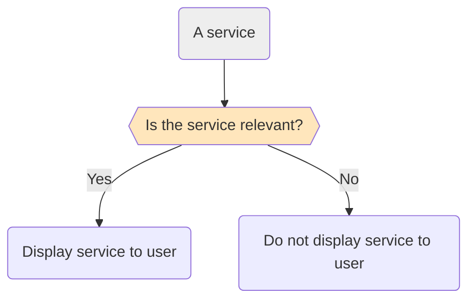
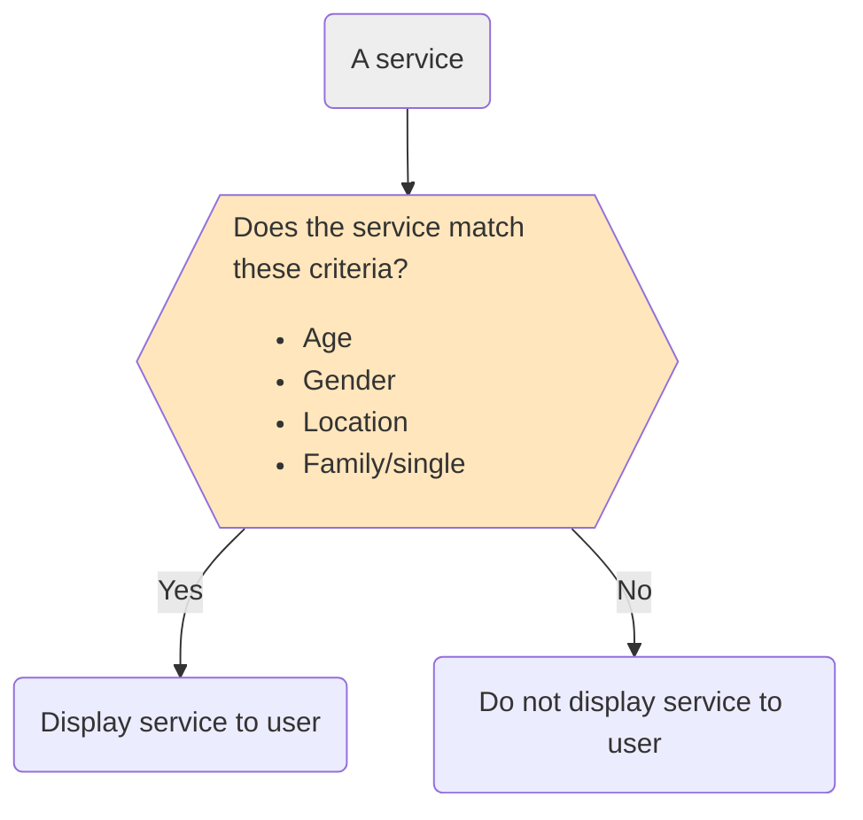
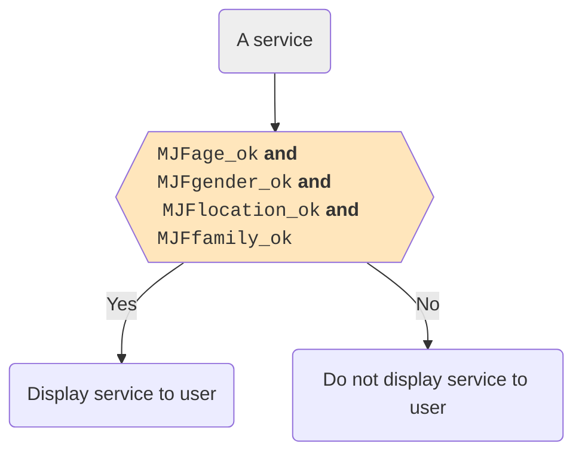
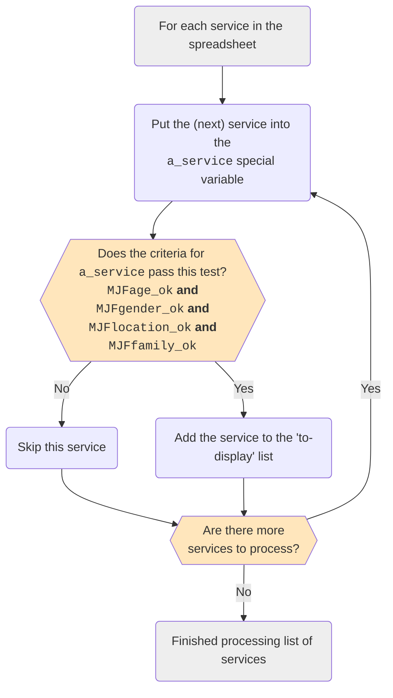
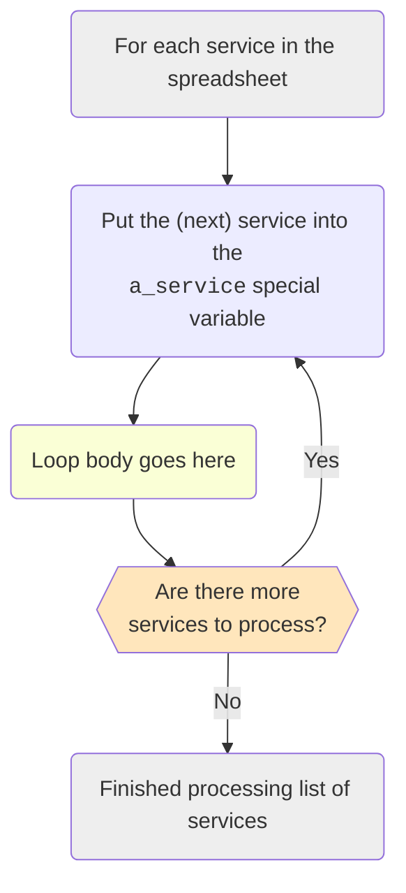
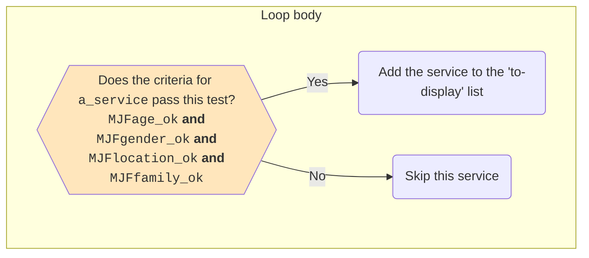
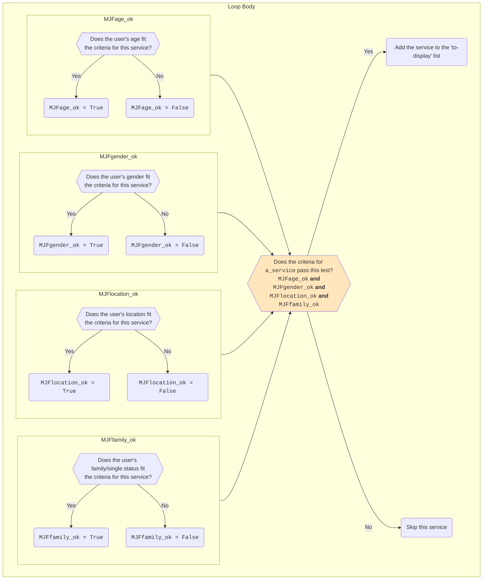

import {DisplayImage} from '@site/src/components';
import {DisplayChapter} from '@site/src/components';
import {DisplayGlossaryItem} from '@site/src/components';
import ServiceTable from './_service_table.mdx';

## ABC's Requirements 

To summarise the key points, ABC require:

* an application to display a list of emergency accommodation providers tailored
to the circumstances of each user;
* ABC's existing emergency accommodation database has emergency accommodation
providers organised agaisnt these categories.
  * the minimum and maximum ages of clients each service will accept;
  * the genders each service will accept;
  * whether the servics accommodates families or individuals only; and
  * in which part of Adelaide the service is located. ABC's location data is
  broken down into north, south, east and west.
  
Other requirements are:

* a user should be able to select multiple locations if they wish; and
* ABC want to maintain the data themselves.

## Example Data
ABC have given us a spreadsheet containing a list of service providers, their 
details and the above criteria.

<ServiceTable />

## Evaluating a Service
Our app will display the relevant services to a user by asking the user questions
and then filtering out the irrelevant services depending on the user's answers.

The program flow at a high level looks something like this:


Let's build out that relevance question:

In other words, if our service matches the age, gender, location
and family criteria entered we add that service to the list
of services to display.  Otherwise, we skip that service.

Let's make this more code-y:

First, we have replaced each of the critera with variable names, one each for
the age, gender, location and family criteria.  These variables will be
<DisplayGlossaryItem item='boolean' /> variables and will be used to store whether
a particular service meets that particular criteria for the user.  For example, if
a user is 16 years of age, then, when we process ABC Services (the first item in
our data list), `MJFage_ok` will be `False` as the user doesn't meet the minimum
age requirement.

So, `MJFage_ok` will store the answer to the
question 'does the user meet the age requirements'?  The same goes for each of the
other `_ok` variables.

Once we have answers to each of these criteria questions we can then test if a
service meets the user's criteria using a series of logical 'and' tests as we discussed in <DisplayChapter chapter='chapter_03' /> ie:
```python
MJFage_ok and MJFgender_ok and MJFlocation_ok and MJFfamily_ok
```

## Evaluating Each Service
We have a grasp on how to evaluate a single service.  Now we need to expand this
and work out how we are going to evaluate *each* service in turn.  Our flow 
diagram would look something like this:


This looks a bit more complex but fundamentally we have two parts to this flowchart.
The first is the loop - the part that will iterate over each service.  The second
is the body of the loop ie: the processing that is done for each service.

Let's break our flow diagram into two.  Here's the loop part

The loop body currently looks like this:


We need to build this out and include the tests that determine the values of each
of the `_ok` variables.  Our body might look something like this:



In code, the loop might look something like this:
```python
# Assume our list of services is stored in MJFservices
for a_service in MJFservices:
  # The loop body goes here
  # We need to insert code into here that will set 
  # each of the _ok variables to true or false depending
  # on whether the user's criteria match up with the current
  # service in a_service
  #
  # Once we have all the tests we then need a final test to
  # make sure all the tests match ie:
  if MJFage_ok and MJFgender_ok and MJFlocation_ok and MJFfamily_ok:
    # Here we will put code to add a_service to the list
    # of services to display to the user
  else:
    # This is where we'd put code if skip the service.  
    # We may not need to put anything here as, by simply not
    # adding the service to our display list, the service
    # is automatically skipped
```
