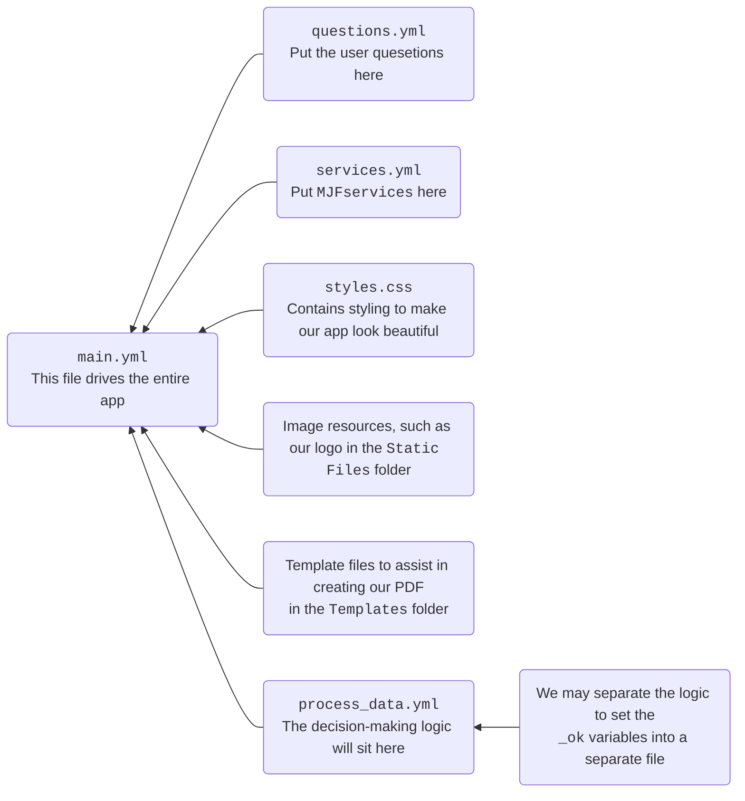

import {DisplayImage} from '@site/src/components';
import {DisplayChapter} from '@site/src/components';
import {DisplayGlossaryItem} from '@site/src/components';
import * as Flowcharts from './_flowcharts';
import * as Tables from './_tables';

In this part of the Case Study we work through writing the code for the app we have
designed.  Working code snippets will be included on this page.  You are encouraged
to copy the code into your playground and 'code along' as the app is built out.

This project will ultimately consist of many different files.  There will be a `main.yml`
which will contain the code the drives the app overall. We will put the questions into a 
separate file and we'll also put the database into a separate file.  We'll also have a
CSS file for our styling, image files for our logo and maybe other image resources.  In
addition we may decide to break the decision-making part of the app into at least one 
but possibly more separate files.  The idea is to compartmentalise each part of the code
to make it easier to read.

We may end up having coding resources that look like this:


Each code snippet in this part will include the name of the file that contains the code.

## Starting code
Let's start with our usual setup, that is a welcome screen, a mandatory block that drives our app and
a final screen to display the final output.  We can then build this out as we go.
```yml title="main.yml" showLineNumbers
---
mandatory: True
question: Welcome screen
subquestion: |
  Welcome screen text will go here eventually.
buttons:
  - Continue: continue
  - Exit: exit
  - Restart: restart
---
# This code block drives our app
mandatory: True
code: |
  final_screen
---
# This is our final screen
event: final_screen
question: Final Scren
subquestion: |
  Eventually the list of services will be displayed here
buttons:
  - Exit: exit
  - Restart: restart
---
```
Copy and paste this code into your Playground, Save and Run, and you will be presented with the start and end
screens.

<DisplayImage imageURL='/img/textbook/chapter_06/filter/coding1.png' />
<DisplayImage imageURL='/img/textbook/chapter_06/filter/coding2.png' />

We can now work through generating the code in a similar order to which we conducted the design.
