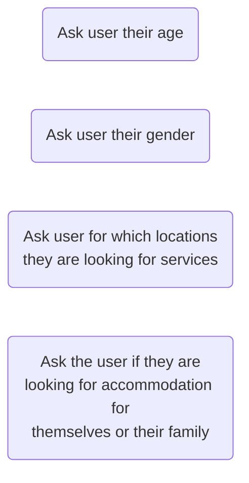

```mermaid
flowchart TD
    id0(Ask user their age)
    id1(Ask user their gender)
    id2(Ask user for which locations<br>they are looking for services)
    id3(Ask the user if they are<br>looking for accommodation for<br>themselves or their family)
    
    %% Invisible links so the boxes appear vertically
    id0 ~~~ id1 ~~~ id2 ~~~ id3
```