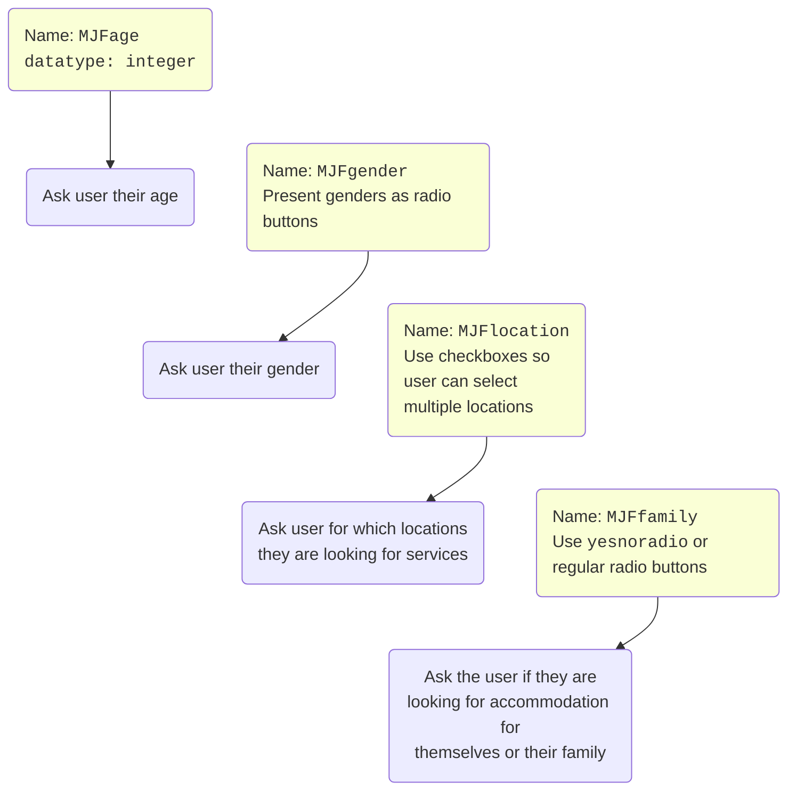

```mermaid
flowchart TD
    id0(Ask user their age)
    id1(Ask user their gender)
    id2(Ask user for which locations<br>they are looking for services)
    id3(Ask the user if they are<br>looking for accommodation for<br>themselves or their family)

    co0(Name: <code>MJFage</code><br><code>datatype: integer</code>)
    co1(Name: <code>MJFgender</code><br>Present genders as radio buttons)
    co2(Name: <code>MJFlocation</code><br>Use checkboxes so<br>user can select<br>multiple locations)
    co3(Name: <code>MJFfamily</code><br>Use <code>yesnoradio</code> or regular radio buttons)

    
    %% Invisible links so the boxes appear vertically
    id0 ~~~ id1 ~~~ id2 ~~~ id3

    co0 --> id0
    co1 --> id1
    co2 --> id2
    co3 --> id3


    %% Define styles for flowchart items.  We want to make comments yellow
    %% and have a larger font size for regular items
    classDef commentClass fill:#faffd6,text-align:left
    classDef questionClass fill:#ffe6bc
    classDef boundaryClass fill:#eeeeee,text-fill-color:#fff
    classDef itemClass font-size:16pt
    classDef leftListClass text-align:left

    class co0,co1,co2,co3 commentClass

```