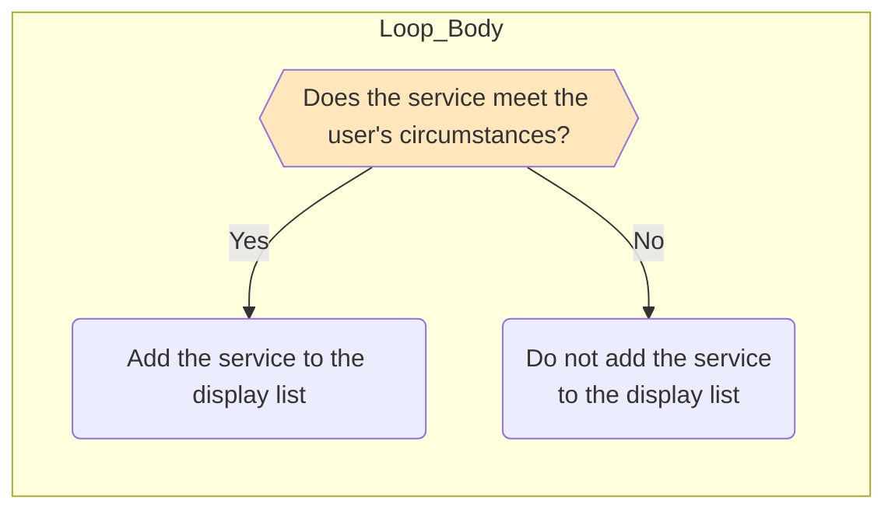

```mermaid
flowchart TD
  subgraph Loop_Body
      direction TB
      id2{{Does the service meet the user's circumstances?}}
      id2 -- Yes --> id3(Add the service to the display list)
      id2 -- No --> id4(Do not add the service<br>to the display list)
  end

  %% Define styles for flowchart items.  We want to make comments yellow
  %% and have a larger font size for regular items
  classDef commentClass fill:#faffd6,text-align:left
  classDef questionClass fill:#ffe6bc
  classDef boundaryClass fill:#eeeeee,text-fill-color:#fff
  classDef itemClass font-size:16pt
  classDef leftListClass text-align:left

  class id2 questionClass
```