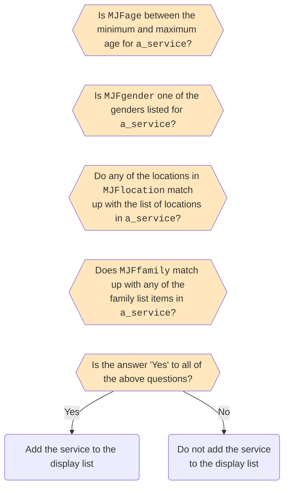

```mermaid
flowchart TD
  id1{{Is <code>MJFage</code> between the minimum and maximum age for <code>a_service</code>?}}
  id2{{Is <code>MJFgender</code> one of the genders listed for <code>a_service</code>?}}
  id3{{Do any of the locations in <code>MJFlocation</code> match<br>up with the list of locations in <code>a_service</code>?}}
  id4{{Does <code>MJFfamily</code> match up with any of the<br>family list items in <code>a_service</code>?}}

  id5{{Is the answer 'Yes' to all of the above questions?}}
  id5 -- Yes --> id6(Add the service to the display list)
  id5 -- No --> id7(Do not add the service<br>to the display list)

  id1 ~~~ id2 ~~~ id3 ~~~ id4 ~~~ id5

  %% Define styles for flowchart items.  We want to make comments yellow
  %% and have a larger font size for regular items
  classDef commentClass fill:#faffd6,text-align:left
  classDef questionClass fill:#ffe6bc
  classDef boundaryClass fill:#eeeeee,text-fill-color:#fff
  classDef itemClass font-size:16pt
  classDef leftListClass text-align:left

  class id1,id2,id3,id4,id5 questionClass
```