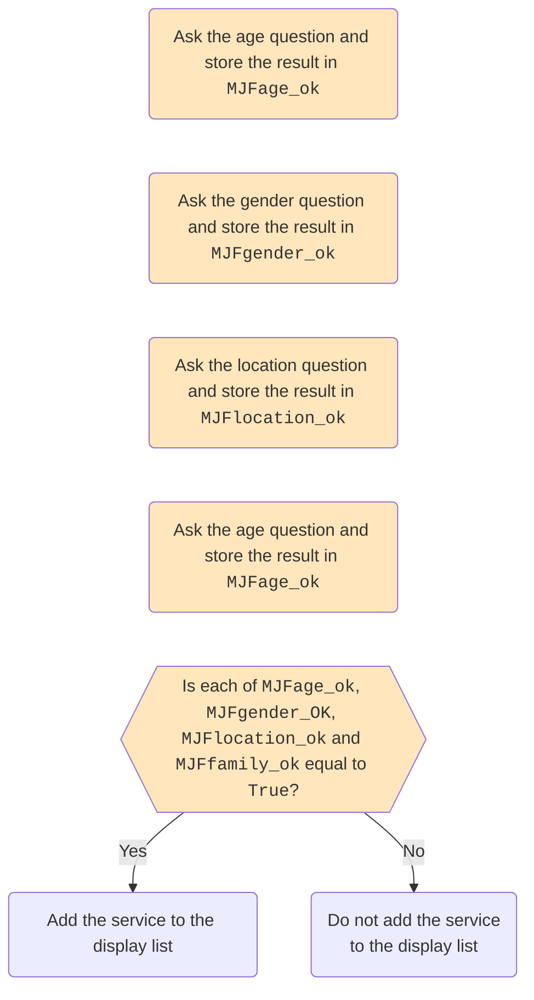

```mermaid
flowchart TD
  id1(Ask the age question and store the result in <code>MJFage_ok</code>)
  id2(Ask the gender question and store the result in <code>MJFgender_ok</code>)
  id3(Ask the location question and store the result in <code>MJFlocation_ok</code>)
  id4(Ask the age question and store the result in <code>MJFage_ok</code>)

  id5{{Is each of <code>MJFage_ok</code>, <code>MJFgender_OK</code>, <code>MJFlocation_ok</code> and <code>MJFfamily_ok</code> equal to <code>True</code>?}}
  id5 -- Yes --> id6(Add the service to the display list)
  id5 -- No --> id7(Do not add the service<br>to the display list)

  id1 ~~~ id2 ~~~ id3 ~~~ id4 ~~~ id5

  %% Define styles for flowchart items.  We want to make comments yellow
  %% and have a larger font size for regular items
  classDef commentClass fill:#faffd6,text-align:left
  classDef questionClass fill:#ffe6bc
  classDef boundaryClass fill:#eeeeee,text-fill-color:#fff
  classDef itemClass font-size:16pt
  classDef leftListClass text-align:left

  class id1,id2,id3,id4,id5 questionClass
```