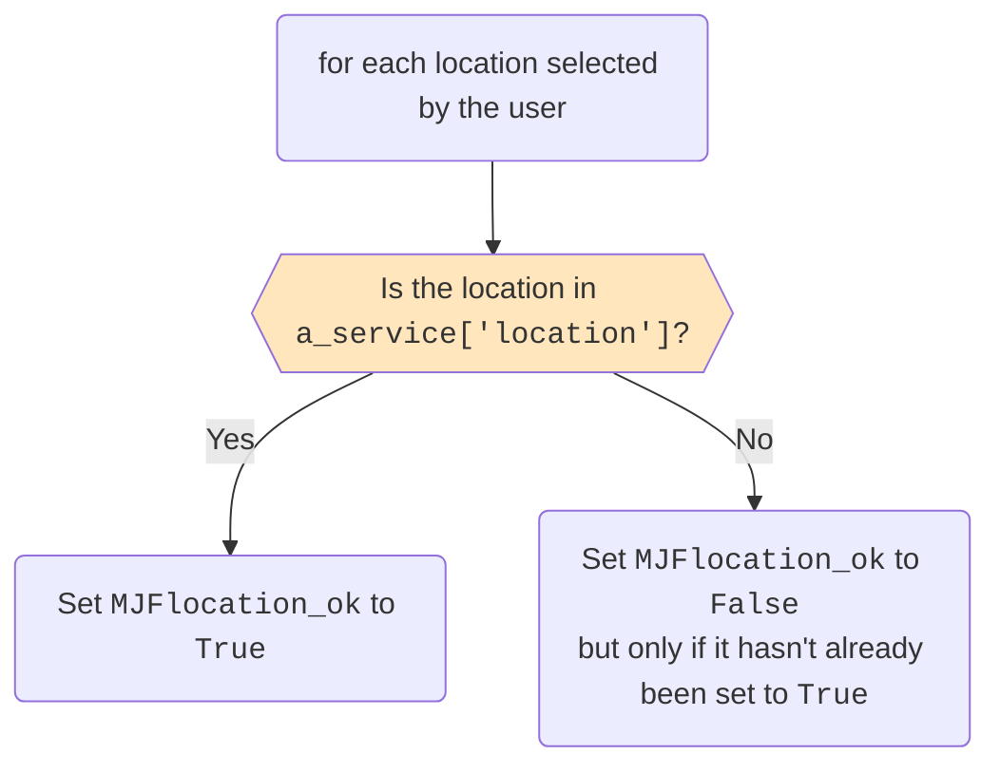

```mermaid
flowchart TD
  id0(for each location selected by the user)
  id0 --> id1{{"Is the location in <code>a_service['location']</code>?"}}
  id1 -- Yes --> id2(Set <code>MJFlocation_ok</code> to <code>True</code>)
  id1 -- No --> id3(Set <code>MJFlocation_ok</code> to <code>False</code><br>but only if it hasn't already been set to <code>True</code>)

  %% Define styles for flowchart items.  We want to make comments yellow
  %% and have a larger font size for regular items
  classDef commentClass fill:#faffd6,text-align:left
  classDef questionClass fill:#ffe6bc
  classDef boundaryClass fill:#eeeeee,text-fill-color:#fff
  classDef itemClass font-size:16pt
  classDef leftListClass text-align:left

  class id1 questionClass
```