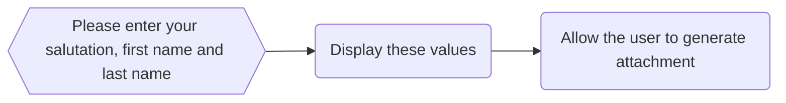

import { useAllPluginInstancesData } from '@docusaurus/useGlobalData';
import * as Components from '@site/src/components'
import {Quizlet, Answer, Explanation} from '@site/src/components';

As the name implies, Docassemble allows you to assessmble documents. This section covers how to create documents.

## Limits of Markdown
You might have noticed in previous chapters that Markdown has some limits. The formatting is pretty basic and you cannot add coloured text or backgrounds. That means it is good for displaying text to a user in a web page, but not so good for assembling documents.

## Jinja
To help us assemble documents, we need to use Jinja. Jinja works like Mako, which we have covered in previous chapters, but for word processing documents. We can add Jinja codes into a word processing document. Docassemble can then read this document and replace the Jinja codes with values our user has entered.

:::tip
Throughout this chapter, we refer to the Microsoft Word .docx format. However you can use other document formats as well (such as the LibreOffice .odt format).
:::

We can handle the other formatting, such as text effects and images, in the document. 

### Adding Jinja Codes Into a Document
To use Jinja to fill in a document, we first need to create our document. Open your preferred word processor and add the following text:

<Components.DisplayImage imageURL='/img/textbook/chapter_08/ch08_jinja_template_fields.PNG' altText='A Microsoft Word template document with completed Jinja fields.'/>

Note how our Jinja codes are formatted. We need to encase each variable in two sets of braces (curly brackets). 

:::caution
Note that your Jinja variables need to match *exactly* the name of the variables you write in Docassemble (including the case). Pay close attention to this!
:::

Once you have filled out this document, save it somewhere where you can find it on your computer.

### Creating Our Application
Our next step is to create a Docassemble application which sets values for these variables. Our Docassemble application should implement the following flowchart.



We can implement this flowchart using this Docassemble code:

```yaml showLineNumbers title="Ch8_First_Docassemble_Template.yml"
---
question: Please answer these details about yourself
fields: 
  - Salutation: userSalutation
    choices:
      - Dr
      - Mr
      - Mrs
      - Ms
  - First Name: userFirstName
  - Last Name: userLastName
---
mandatory: True
question: Thank you for completing this form
subquestion: |
  ### Welcome to Docassemble!

  Dear ${ userSalutation + ' ' + userLastName}, 

  Thank you for completing this form. 

  You can download an attachment with your answers below.

attachment:
  docx template file: Docassemble_Template.docx
buttons: 
  - Exit: exit
  - Restart: restart
---
```

To create an attachment, you need to add an attachment block, which we have included on lines 24 and 25. The `docx template file:` tag needs to be aligned two spaces to the right of the `attachment:` tag.

:::tip
Copy and paste this code into a fresh Docassemble playground. 
:::

When you paste this code into Docassemble and press **Save**, you will see a syntax error. 

<Components.DisplayImage imageURL='/img/textbook/chapter_08/ch08_missing_template_syntax_error.PNG' altText='The syntax error that we will get if we copy and paste this text into Docassemble - oh no!!!.'/>

Don't panic! We will fix this shortly.

### Uploading our Template
For Docassemble to generate a template, we need to upload that template to Docassemble. From the Playground menu, click on the **Folders** menu:

<Components.DisplayImage imageURL='/img/textbook/chapter_08/ch08_folder_menu_drop_down.PNG' altText='The drop down menu that will take us to the templates screen in Docassemble.'/>

From this menu, we select **Templates**.

<Components.DisplayImage imageURL='/img/textbook/chapter_08/ch08_templates_screen_no_template.PNG' altText='The template screen in Docassemble - so far we can see that no templates have been uploaded.'/>

On this page, we first need to navigate and find the file we saved by clicking on the **Browse** button. This opens up a window where you can search for the file. Once you find your template file, select it and press **Open**:

<Components.DisplayImage imageURL='/img/textbook/chapter_08/ch08_template_to_be_uploaded.PNG' altText='This screen shows that we are about to upload our template.'/>

:::tip
If you try and open your template in Docassemble whilst it is open in your word processor, your file manager will display a 'Not implemented' error. Close the document in your word processor and try again.
:::

Then, back in Docassemble press the **Upload** button. The template will then be uploaded to your Docassemble playground.

<Components.DisplayImage imageURL='/img/textbook/chapter_08/ch08_template_uploaded.PNG' altText='This screen shows that our template has been successfully uploaded to Docassemble.'/>

If you return to your Docassemble playground, you will see that the syntax error has disappeared!

<Components.DisplayImage imageURL='/img/textbook/chapter_08/ch08_no_more_syntax_error.PNG' altText='This screen shows that our template has been successfully uploaded to Docassemble - woohoo! yay!!!'/>

If you then press **Save and Run** and complete the questions in the application, you will see (after a short break) that there is a new section at the bottom of the mandatory question block. This attachment section allows you to download the template.

<Components.DisplayImage imageURL='/img/textbook/chapter_08/ch08_attachments_block_in_docassemble.PNG' altText='This screen shows how we can download our template in Docassemble'/>

You can either press the PDF or DOCX hyperlinks to download the Docassemble template, or you can send it to your email address. When you open the document, you will see that the Jinja fields we have entered have been filled in.

<Components.DisplayImage imageURL='/img/textbook/chapter_08/ch08_completed_attachment.PNG' altText='Et voila! Our completed attachment, with the Jinja fields filled in with the values entered by the user.'/>

## Summary and Next Steps
In this section, we have covered:

* How to create Jinja fields
* How to add an attachment block to Docassemble
* How to upload our template to Docassemble

<Quizlet title="Jinja variable syntax">
  We would like to refer to the variable `userAge` using Jinja syntax in a Microsoft Word template. How would we do this?
  <Answer>
    `${userAge}`
  </Answer>
  <Answer>
    `{userAge}`
  </Answer>
  <Answer isCorrect>
    `{{userAge}}`
  </Answer>
  <Answer isCorrect>
    `{{ userAge }}`
  </Answer>
  <Explanation correctAnswer>
  That's right! Note that it does not matter whether we have a space between the braces and the variable name.
  </Explanation>
  <Explanation>
  That's not quite right. Try again. 
  </Explanation>
</Quizlet>