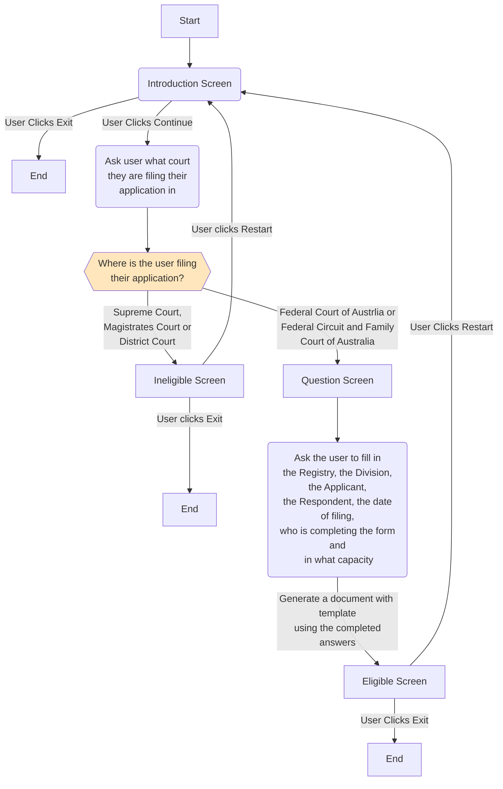

import { useAllPluginInstancesData } from '@docusaurus/useGlobalData';
import * as Components from '@site/src/components'
import {Quizlet, Answer, Explanation} from '@site/src/components';
import {DisplayChapter} from '@site/src/components';

As the name implies, Docassemble allows you to assessmble documents. This section covers how to create documents.

## Assembling Documents with Jinja
To help us assemble documents, we need to use Jinja. We have covered how to use Jinja in previous chapters.  By adding Jinja codes into a word processing document, Docassemble can then read this document and replace the Jinja codes with values our user has entered.

:::tip
Throughout this chapter, we refer to the Microsoft Word .docx format. However you can use other document formats as well (such as the LibreOffice .odt format).
:::

We can handle the other formatting, such as text effects and images, in the document. 

### Our Application Specification
What we will do in this section is create a legal application that helps the user fill in a Federal Court of Australia/Federal Circuit and Family Court of Australia [Form 17](https://www.fedcourt.gov.au/forms-and-fees/forms/federal-court-rules/FCA_form017_20110801.doc). The application will do the following:

* The application will open by explaining what it does
* The application will then ask the user where they are filling their application
* If they are filling their application in either the Supreme Court, the Magistrates Court or the District Court, they will be taken to an ineligible screen
* Otherwise, they will be asked to fill in the details about their application. These include the following:
    - The District Registry (state or territory) where the application is being filed 
    - The Division (that is, the matter type) of the Federal and Family Court court where the application is being filed
    - The full name of the applicant
    - The full name of the respondent
    - The date of filling
    - Who is completing the form
    - In what capacity they are acting in (Applicant, Respondent, Lawyer for the Applicant, Lawyer for the Respondent)
* The user can then download this template and file it themselves

:::tip
If you look at the template, you might see that there are some other fields. We will work out how to complete these in the next [section](00-20).
:::

### Turning Our Design into a flowchart
Once we have these specifications, we can then start to work on how to implement them via a flowchart. We know that we will need the following:

* An opening screen to display the purpose of the application, that allows the user to exit or continue
* A question screen that asks the user in which court they are filing their matter
* A code block which will assess whether the user is eligible or ineligible to use the application
* An ineligible screen that explains to the user why the application cannot help them, and which allows the user to exit or restart if they have made a mistake
* A question screen which collects the details about the matter from the user
* An eligible screen which displays the allows the user to download the completed template

From this, we can construct the following flowchart:



### Constructing Our Application from our Flowchart
Once we have charted out this flowchart, we can create our application in Docassemble. Remember that the various segments of the flowchart will help us map out how many screens we need.

```yaml showLineNumbers title="Ch8_Form_17_Generator.yml"
# We will deifne an objects block to store our endpoint DADict object
---
objects: 
  - endpoint: DADict
---
# Welcome Screen for Form 17 generator app
# This screen contains information about what the app does, as well as a disclaimer
# It also contains a continue and exit button
mandatory: True
question: Federal Court Form 17 generator app
subquestion: |
  Welcome to the Form 17 generator app
  
  This application will help you generate a [Form 17](https://www.fedcourt.gov.au/forms-and-fees/forms/federal-court-rules/FCA_form017_20110801.doc). You can then file this form in either the Federal Court of Australia, or the Federal Circuit and Family Court of Australia.
  
  *Please note that forms completed by this application should be checked by a lawyer first. This app does not provide any legal advice.*
  
  Please click **Continue** to accept these terms. Otherwise, click **Exit**.

buttons:
   - Continue: continue
   - Exit: exit
---
# First question block
# This asks the user in which court they are filing their application
# Note that they can only choose one court
question: In which court are you filing your application
fields:
  - no label: userCourtFiling
    datatype: radio
    choices:
      - Supreme Court
      - District Court
      - Magistrates Court
      - Federal Court of Australia
      - Federal Circuit and Family Court of Australia
---
# Code block
# This code block directs the user to the eligible or ineligible screen depending on their answers.
mandatory: True
code: |
  if userCourtFiling == 'Federal Court of Australia' or userCourtFiling == 'Federal Circuit and Family Court of Australia':
    endpoint['eligible']
  else:
    endpoint['ineligible']
---
# Ineligible screen
# This screen is selected if we select either Magistrates, District or Supreme Court
event: endpoint['ineligible']
question: You are not eligible
subquestion: |
  This application is meant to help users complete a Form 17 to submit to the Federal Court of Australia or the Federal Circuit and Family Court of Australia.
  
  Because you are not submitting a form to either of these courts, you are not eligible to use this application.
  
  Please press **Exit* to exit this application or **Restart** to restart.
buttons:
  - Exit: exit
  - Restart: restart
---
# Our question block
# This is where we gather the details to fill in our form
question: Please fill out these details to complete your Form 17
fields: 
  - State of District Registry: courtRegistry
    datatype: radio
    choices:
      - ACT
      - NSW
      - NT
      - QLD
      - SA
      - TAS
      - VIC
      - WA
  - National Practice Area/Division: courtNPA
    datatype: radio
    choices:
      - Administrative, Constitutional Law and Human Rights
      - Admiralty and Maritime
      - Commercial Contracts, Banking, Finance and Inusrance 
      - Corporations and Corporate Insolvency
      - General and Personal Insolvency
      - Regulatory and Consumer Protection
      - Economic Regulator, Competition and Access
      - Commercial Arbitration
      - Employment and Industrial Relations
      - Federal Crime and Related Proceedings
      - Patents and Associated Statutes
      - Trade Marks
      - Copyright and Industrial Design
      - Native Title
      - Family Law
      - Migration
      - Privacy Law
  - Full Name of the Applicant: applicantFullName
    datatype: string
  - Full Name of the Respondent: respondentFullName
    datatype: string
  - Date of filing: dateOfFiling
    datatype: date
  - Who is completing this Form? : whoFiledForm
    datatype: string
  - In what capacity are they Acting?: capacityOfFiler
    datatype: string
---
# Eligible screen
event: endpoint['eligible']
question: You are eligible
subquestion: |
  Thank you for completing this form
  
  Please find attached your answers:
  
  Questions | Your Answers
  ----------|-------------
  Court | ${userCourtFiling}
  District Registry | ${courtRegistry}
  NPA/Division | ${courtNPA}
  Applicant | ${applicantFullName}
  Respondent | ${respondentFullName}
  Date of Filing | ${dateOfFiling}
  Who Completed the Form | ${whoFiledForm}
  Capacity of Filer | ${capacityOfFiler}

attachment:
  docx template file: Federal_Court_Form_17.docx
buttons:
  - Exit: exit
  - Restart: restart
---
```

### Uploading Our Template
Immediately if we save this form we can see that we have an error:

<Components.DisplayImage imageURL='/textbook/img/textbook/chapter_08/ch08_missing_template_syntax_error.PNG' altText='This is the error that you will see if you just copy this code from above and paste it in without uploading anything else.'/>

We see this error because we are missing a template. Instead, we need to upload a template file called `Federal_Court_Form_17.docx` exactly. We also need to make sure that we insert the correct Jinja codes for each field that the user will fill in.

Fortunately, as with <DisplayChapter chapter='chapter_03' />, we have a template you can download with the Jinja fields pre-filled.

You can download this form [here](/templates/Federal_Court_Form_17.docx).

:::caution
Note that some of our fields (including many of those on page 2) have not yet been filled in. Don't worry - we will fix that in the next section!
:::

As we did in Chapter 3, you will need to press on the **Folders** menu in the Docassemble playground and select **Templates**. You will then need to upload the template that you just downloaded from this textbook into Docassemble. 

Once you do, the syntax error message should disappear. However, we now have a new error:

<Components.DisplayImage imageURL='/textbook/img/textbook/chapter_08/ch08_undefined_name_error.PNG' altText='This is the error that you will see if you upload the template from this textbook without making any changes.'/>

Why are we getting this error? Docassemble normally generates an Undefined Name error message if we use a variable without referring to it in a question block or giving it a value in a code block. In other words, we are referring to the variable `whoFileForm` without defining it first.

:::tip
We cover some more detail on how to debug our application in <DisplayChapter chapter='chapter_09' />
:::

We can use the search feature in our playground in Docassemble to look for an undefined variable. Doing so shows that there is no variable called `whoFileForm` in our Docassemble playground:

<Components.DisplayImage imageURL='/textbook/img/textbook/chapter_08/ch08_undefined_name_error_playground.PNG' altText='A screenshot of a user searching for the variable `whoFileForm` in the Docassemble playground. The closest match is `whoFiledForm`'/>

As we can see, the closest match is `whoFiledForm`.  Another way to check is if we run our application and then check the debug output. We will see that needs a definition of `whoFileForm` to display our eligible endpoint:

<Components.DisplayImage imageURL='/textbook/img/textbook/chapter_08/ch08_undefined_name_error_debug.PNG' altText='A screenshot of our application running. '/>

That indicates the error is somewhere in our template. Sure enough, on page one of our template we have a reference to `whoFileForm`:

<Components.DisplayImage imageURL='/textbook/img/textbook/chapter_08/ch08_undefined_name_error_template.PNG' altText='A screenshot of our template, with the error on page one (a reference to the variable `whoFileForm`) highlighted'/>

Once we have uploaded and corrected our template again, the error will disappear. If we run the application, we will see that Docassemble has filled in the variables that we have defined:

<Components.DisplayImage imageURL='/textbook/img/textbook/chapter_08/ch08_federal_court_complete_screen.PNG' altText='A screenshot of our application if the user selects the eligible branch and enters in values.'/>

<Components.DisplayImage imageURL='/textbook/img/textbook/chapter_08/ch08_federal_court_complete_template.PNG' altText='A screenshot of the same completed template.'/>

## Summary and Next Steps
In this section, we have covered:

* How to create Jinja fields
* How to add an attachment block to Docassemble
* How to upload our template to Docassemble
* How to identify errors

In the next section, we will cover how to introduce some more advanced features in Docassemble.

<Quizlet title="Jinja variable syntax">
  We would like to refer to the variable `userAge` using Jinja syntax in a Microsoft Word template. How would we do this?
  <Answer>
    `${userAge}`
  </Answer>
  <Answer>
    `{userAge}`
  </Answer>
  <Answer isCorrect>
    `{{userAge}}`
  </Answer>
  <Answer isCorrect>
    `{{ userAge }}`
  </Answer>
  <Explanation correctAnswer>
  That's right! Note that it does not matter whether we have a space between the braces and the variable name.
  </Explanation>
  <Explanation>
  That's not quite right. Try again. 
  </Explanation>
</Quizlet>