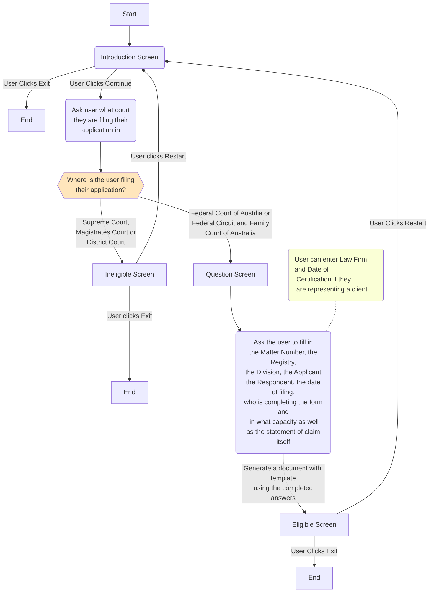

import * as Components from '@site/src/components'
import {DisplayChapter} from '@site/src/components';

Now that we have covered how to add Jinja fields to a template in Docassemble, we will consider how to create more advanced templates, and how to integrate these into the features in Word. This section will also cover some more advanced material on groups, which we considered previously in <DisplayChapter chapter='chapter_05' />. 

## Creating More Advanced Templates
For this section, we will reuse our Form 17 generator application code. We have been asked to extend our application in a number of ways:

* Our user should be able to enter a matter number for their application
* Our application should be able to display multiple applicants or respondents
* Our application should allow a user to enter their pleadings as a numbered list
* If our template is being filed by a lawyer for the applicant or the respondent, our application should allow our user to fill in the following details
    - Law Firm
    - Date of Certification
* If our templater is **not** being filled in by a lawyer, the paragraph on 
* Irrespective of who is filing the application, our user should be able to fill in:
   - Who prepared the form
   - Telephone Number
   - Fax Number
   - Email
   - Address for service
* All dates should be formatted in an AGLC format
* The user can only download the file as a PDF

### Amending our Flowchart
For these changes, we will need to amend our overall flowchart we developed [previously](./00-10.mdx):



### Amending Our Application
Once we have amended our flowchart we will need to amend both our Docassemble application.

```yaml showLineNumbers title="Ch8_Form_17_Generator.yml"
# We will define an objects block to store our endpoint DADict object
# We will also define a new DAList object in this block to store our pleadings
# We know that our form must have at least one pleading
---
objects: 
  - endpoint: DADict
  - soc: DAList.using(there_are_any=True, object_type=DAObject, complete_attribute='pleading')
---
# Welcome Screen for Form 17 generator app
# This screen contains information about what the app does, as well as a disclaimer
# It also contains a continue and exit button
mandatory: True
question: Federal Court Form 17 generator app
subquestion: |
  Welcome to the Form 17 generator app
  
  This application will help you generate a [Form 17](https://www.fedcourt.gov.au/forms-and-fees/forms/federal-court-rules/FCA_form017_20110801.doc). You can then file this form in either the Federal Court of Australia, or the Federal Circuit and Family Court of Australia.
  
  *Please note that forms completed by this application should be checked by a lawyer first. This app does not provide any legal advice.*
  
  Please click **Continue** to accept these terms. Otherwise, click **Exit**.

buttons:
   - Continue: continue
   - Exit: exit
---
# First question block
# This asks the user in which court they are filing their application
# Note that they can only choose one court
question: In which court are you filing your application
fields:
  - no label: userCourtFiling
    datatype: radio
    choices:
      - Supreme Court
      - District Court
      - Magistrates Court
      - Federal Court of Australia
      - Federal Circuit and Family Court of Australia
---
# Code block
# This code block directs the user to the eligible or ineligible screen depending on their answers.
mandatory: True
code: |
  if userCourtFiling == 'Federal Court of Australia' or userCourtFiling == 'Federal Circuit and Family Court of Australia':
    endpoint['eligible']
  else:
    endpoint['ineligible']
---
# Ineligible screen
# This screen is selected if we select either Magistrates, District or Supreme Court
event: endpoint['ineligible']
question: You are not eligible
subquestion: |
  This application is meant to help users complete a Form 17 to submit to the Federal Court of Australia or the Federal Circuit and Family Court of Australia.
  
  Because you are not submitting a form to either of these courts, you are not eligible to use this application.
  
  Please press **Exit* to exit this application or **Restart** to restart.
buttons:
  - Exit: exit
  - Restart: restart
---
# Our question block
# This is where we gather the details to fill in our form
question: Please fill out these details to complete your Form 17
fields:
  - Matter Number: courtMatterNo
    datatype: integer
  - State of District Registry: courtRegistry
    datatype: radio
    choices:
      - ACT
      - NSW
      - NT
      - QLD
      - SA
      - TAS
      - VIC
      - WA
  - National Practice Area/Division: courtNPA
    datatype: radio
    choices:
      - Administrative, Constitutional Law and Human Rights
      - Admiralty and Maritime
      - Commercial Contracts, Banking, Finance and Inusrance 
      - Corporations and Corporate Insolvency
      - General and Personal Insolvency
      - Regulatory and Consumer Protection
      - Economic Regulator, Competition and Access
      - Commercial Arbitration
      - Employment and Industrial Relations
      - Federal Crime and Related Proceedings
      - Patents and Associated Statutes
      - Trade Marks
      - Copyright and Industrial Design
      - Native Title
      - Family Law
      - Migration
      - Privacy Law
  - Full Name of the Applicant: applicantFullName
    datatype: string
  - Only Applicant?: onlyApplicant
    datatype: yesnoradio
  - How many other Applicants?: otherApplicants
    datatype: radio
    choices:
      - One
      - Two or more
    show if:
      variable: onlyApplicant
      is: False
  - Full Name of the Respondent: respondentFullName
    datatype: string
  - Only Respondent?: onlyRespondent
    datatype: yesnoradio
  - How many other Respondents?: otherRespondents
    datatype: radio
    choices:
      - One
      - Two or more
    show if:
      variable: onlyRespondent
      is: False
  - Who is completing this Form? : whoFiledForm
    datatype: string
  - Who prepared this Form?: whoPreparedForm
    datatype: string
  - In what capacity are they Acting?: capacityOfFiler
    datatype: radio
    choices:
      - Applicant
      - Respondent
      - Lawyer for the Applicant
      - Lawyer for the Respondent
  - Law Firm: lawFirm
    datatype: string
    js show if: |
      val("capacityOfFiler") == "Lawyer for the Applicant" || val("capacityOfFiler") == "Lawyer for the Respondent"
  - Telephone Number: telNumber
    datatype: integer
  - Fax Number: faxNumber
    datatype: integer
  - Email: contactEmail
    datatype: email
  - Address for Service: addressForService
  - Date of filing: dateOfFiling
    datatype: date
  - Date of certification: dateOfCert
    datatype: date
    js show if: |
      val("capacityOfFiler") == "Lawyer for the Applicant" || val("capacityOfFiler") == "Lawyer for the Respondent"
---
# Pleadings initial question
# This question asks for the first pleading
question: |
  What is the ${ ordinal(i) } pleading in your statement of claim?
fields:
  - Pleading: soc[i].pleading
---
# This question asks if there is another pleading
question: |
  Is there another pleading?
yesno: soc.there_is_another
---
# Eligible screen
event: endpoint['eligible']
question: You are eligible
subquestion: |
  Thank you for completing this form
  
  Please find attached your answers:
  
  Questions | Your Answers
  ----------|-------------
  Court | ${userCourtFiling}
  Matter Number | ${courtMatterNo}
  District Registry | ${courtRegistry}
  NPA/Division | ${courtNPA}
  Applicant | ${applicantFullName}
  % if onlyApplicant:
  Only Applicant? | Yes
  % else:
  Only Applicant? | No
  % endif
  Respondent | ${respondentFullName}
  % if onlyRespondent:
  Only Respondent? | Yes
  % else:
  Only Respondent? | No
  % endif
  Who Completed the Form | ${whoFiledForm}
  Who Prepared this Form | ${whoPreparedForm}
  Capacity of Filer | ${capacityOfFiler}
  % if capacityOfFiler == 'Lawyer for the Applicant' or capacityOfFiler == 'Lawyer for the Respondent':
  Law Firm | ${lawFirm}
  % endif
  Telephone Number | ${telNumber}
  Fax Number | ${faxNumber}
  Contact Email | ${contactEmail}
  Address for Service | ${addressForService}
  Date of Filing | ${dateOfFiling}
  % if capacityOfFiler == 'Lawyer for the Applicant' or capacityOfFiler == 'Lawyer for the Respondent':
  Date of Certification | ${dateOfCert}
  % endif
  
  Your statement of claim:
  
  % for x in soc:
  1. ${ x.pleading }
  % endfor
  
attachment:
  docx template file: Federal_Court_Form_17_Final.docx
  valid formats:
    - pdf
buttons:
  - Exit: exit
  - Restart: restart
---
# In this code block, we turn the date of filing (and the date of certification, if the matter is being filed by a lawyer) into an AGLC compliant date
# We also strip out the year so we can record the matter year
code: |
  dateOfFilingAGLC = format_date(dateOfFiling, format='d MMMM YYYY')
  matterYear = format_date(dateOfFiling, 'YYYY')
  if capacityOfFiler == 'Lawyer for the Applicant' or capacityOfFiler == 'Lawyer for the Respondent':
    dateOfCertAGLC = format_date(dateOfCert, format='d MMMM YYYY')
---
```

We also have a new template to include, which you can donwload here. 

:::tip
As with the previous code, you can copy and paste this application directly into your Docassemble playground. You can also upload the template above into your Docassemble playground. Legal Aid NSW has a [sample statement of claim](https://www.legalaid.nsw.gov.au/content/dam/legalaidnsw/documents/pdf/my-problem-is-about/my-job/wages-and-entitlements-forms/Sample%20-%20Form%2017%20-%20Statement%20of%20Claim%20-%20unpaid%20wages%20and%20entilements.pdf) that you can use to help test your application as well. 
:::

### Using If Statements in Jinja
The first thing different that we have implemented in this version is a series of if statements in our Jinja template. These if statements allow us to control the content that we insert into our template. 

Jinja if statements are similar to Mako if statements [put in a reference to Chapter 4.4 here], except:

* The if statement needs to be encased in *braces*, or curly brackets
* The if statement clause should start and end with a `%` symbol
* There needs to be an `endif` clause encased in a single set of curly brackets and a set of `%` symbols.

For example, if our form is being prepared by a lawyer, we only want certain content to be displayed, such as the name of the law firm. We can do this using Jinja if statements. We have implemented this in our template in the following manner:

<Components.DisplayImage imageURL='/img/textbook/chapter_08/ch08_jinja_if_statement_law_firm_template.PNG' altText='A screenshot of our final template with if statements included. In particular, note the if statements for {{lawFirm}}'/>

Note that in this screenshot we can also can see that for the variable next to Filed on behalf of, we have an `if-elif` statement block. We can use this block if we always want some text to be displayed. 

### Using Complex Data Structures
Where we put our discussion of how to put in the pleadings and how to add multiple pleadings.

### Using Paragraphs
Where we put in our discussion of how to add in pleadings into our template.

### Using Functions
Where we put in a section on how to format the dates.

### Controlling What Our User Can Download
You might have noticed when working with Jinja previously that your user can either download a PDF or a DOCX template. In some cases though, we might not want to allow our user to download a DOCX document. In this case, we can control what content we display to our user using the `valid formats` tag. We need to add this to our code in the following format:

```yaml showLineNumbers title="Ch8_Federal_Court_Form_17_PDF_Only.yml"
```
When our user fills in their details, they will only be able to download the completed template as a PDF:

<Components.DisplayImage imageURL='/img/textbook/chapter_08/ch08_completed_attachment_PDF_only.PNG' altText='Our completed attachment, only now the user can only download the completed template as a PDF.'/>

## Summary