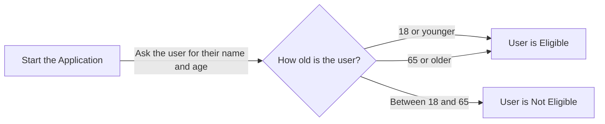

What we will do in this section is work through a legal software application which has bugs. We will work out how to spot these errors and how to fix them.

## Our Broken Code
First, let's look at our broken code.

:::tip
To work your way through this chapter, you can copy this code in a new file in your Docassemble playground.
:::

```yaml showLineNumbers title="Ch9_Buggy_Code.yml"
---
objects:
  - events: DADict
---
metadata:
  title: |
    The Means Testinator
---
mandatory: True
question: Welcome to the Means Testinator
subquestion: |
  The Means Testinator App 
  
  Press **Continue** to use the app.
buttons:
  -Continue: continue
---
mandatory: True
question: Thank you for Completing the Means Testinator
subquestion: |
  Hello **${userSalutation} ${userFirstname} ${userLastname}**,
  
  Looks like you are:
  % if userAgeCategory = 'adult:
    *an adult*
  % elif userAgeCategory = 'child':
  *just a child!*
  % elif userAgeCategory == 'pensioner':
  *a pensioner*
  % else:
  - Sorry, I don't know what you are (and you're not getting welfare)!
  % endif
  
  Anyway, let's move on
buttons:
  - Let's move on indeed!: continue
  - Nope, I'm done with this: exit
---
# We displayd ifferent endpoints based on the age category
mandatory: True
code: |
  if userAgeCategory == 'child' or userAgeCategory == 'pensioner'
  endpoint['get_welfare']
  elif userAgeCategory == 'adult
  endpoint['no_welfare_for_you']
  else:
    endpoint['should_not_be_here']
---
event: endpoint['get_welfare']
question: You are eligible for welfare
subquestion: |
  You are eligible for welfare.
  
  Go to [Services Australia](https://www.servicesaustralia.gov.au/) to see what you might be eligible for.
buttons:
  - Exit: exit
  - I want to see how people who are not eligible for welfare live: restart
---
event: endpoint['no_welfare_for_you']
question: You are not eligible for welfare
subquestion: |
  The government thinks you don't deserve welfare. 
buttons:
  - Fair enough: exit
  - I want to change my age and try again: restart
---
question: Please enter your details
fields: 
  - First name: userFirstname
      default: John
      - Last name: userLastname
        default: Smith
  - Age: userAge
default: 20
datatype: integer
---
code: |
  if 18 <= userAge < 65:
    userAgeCategory = adult
  elif userAge < 18:
    userAgeCategory = 'child'
  else userAgeCategory == 'pensioner:
    userAgeCategory = 'pensioner'
---
```

### How should this code work?
We are attempting to implement the following flowchart in our code:



In other words, if the user is either 18 or younger, or 65 or older, they are eligible for welfare. Otherwise, they are not. 

:::caution
As per what we covered in [Chapter Four](/docs/textbook/chapter_04/index.mdx), note that this is not actually how welfare works in Australia. If you are developing an app to help someone with welfare, you will need to do your own research to make sure that you correctly interpret the law!
:::

## Fixing Our Broken Code
The best place to start with when we want to fix broken code is to run it.