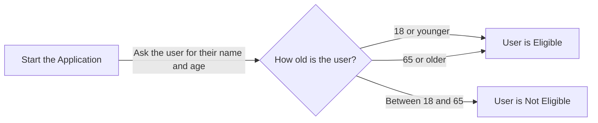

import * as Components from '@site/src/components'
import {Quizlet, Answer, Explanation} from '@site/src/components';
import {DisplayChapter} from '@site/src/components';

What we will do in this section is work through a legal software application which has bugs. We will work out how to spot these errors and how to fix them.

## Our Broken Code
First, let's look at our broken code.

:::tip
To work your way through this chapter, you can copy this code in a new file in your Docassemble playground.
:::

```yaml showLineNumbers title="Ch9_Buggy_Code.yml"
---
objects:
  - events: DADict
---
metadata:
  title: |
    The Means Testinator
---
mandatory: True
question: Welcome to the Means Testinator
subquestion: |
  The Means Testinator App 
  
  Press **Continue** to use the app.
buttons:
  -Continue: continue
---
mandatory: True
question: Thank you for Completing the Means Testinator
subquestion: |
  Hello **${userSalutation} ${userFirstname} ${userLastname}**,
  
  Looks like you are:
  % if userAgeCategory = 'adult:
    *an adult*
  % elif userAgeCategory = 'child':
  *just a child!*
  % elif userAgeCategory == 'pensioner':
  *a pensioner*
  % else:
  - Sorry, I don't know what you are (and you're not getting welfare)!
  % endif
  
  Anyway, let's move on
buttons:
  - Let's move on indeed!: continue
  - Nope, I'm done with this: exit
---
# We display different endpoints based on the age category
mandatory: True
code: |
  if userAgeCategory == 'child' or userAgeCategory == 'pensioner'
  endpoint['get_welfare']
  elif userAgeCategory == 'adult
  endpoint['no_welfare_for_you']
  else:
    endpoint['should_not_be_here']
---
event: endpoint['get_welfare']
question: You are eligible for welfare
subquestion: |
  You are eligible for welfare.
  
  Go to [Services Australia](https://www.servicesaustralia.gov.au/) to see what you might be eligible for.
buttons:
  - Exit: exit
  - I want to see how people who are not eligible for welfare live: restart
---
event: endpoint['no_welfare_for_you']
question: You are not eligible for welfare
subquestion: |
  The government thinks you don't deserve welfare. 
buttons:
  - Fair enough: exit
  - I want to change my age and try again: restart
---
question: Please enter your details
fields: 
  - First name: userFirstname
      default: John
      - Last name: userLastname
        default: Smith
  - Age: userAge
default: 20
datatype: integer
---
code: |
  if 18 <= userAge < 65:
    userAgeCategory = adult
  elif userAge < 18:
    userAgeCategory = 'child'
  else userAgeCategory == 'pensioner:
    userAgeCategory = 'pensioner'
---
```

### How should this code work?
We are attempting to implement the following flowchart in our code:



In other words, if the user is either 18 or younger, or 65 or older, they are eligible for welfare. Otherwise, they are not. 

:::caution
As per what we covered in [Chapter Four](/docs/textbook/chapter_04), note that this is not actually how welfare works in Australia. If you are developing an app to help someone with welfare, you will need to do your own research to make sure that you correctly interpret the law!
:::

## Fixing Our Broken Code
The best place to start with when we want to fix broken code is to run it. 

### Syntax Errors
If we press **Save and Run** from the Docassemble playground, we immediately get the following error:

<Components.DisplayImage imageURL='/img/textbook/chapter_09/ch09_buggy_code_unterminated_string_literal.PNG' altText='This is the first error that we encounter.'/>

:::tip
It's a good idea to read through any errors generated by Docassemble to sees if you can figure out what they mean.
:::

What does 'unterminated string literal mean'? We know from [Chapter Three](/docs/textbook/chapter_03) that a string is a type of variable in Python and Docassemble. Specifically, a string stands for a **string of characters**. We normally put strings in a set of single quotes. That suggests we should be looking for a missing set of quotes.

Sure enough, our Mako if statement on line 24 is missing a single quote afrer the string `adult`. 

<Components.DisplayImage imageURL='/img/textbook/chapter_09/ch09_buggy_code_unterminated_string_source.PNG' altText='This is the source of our unterminated string literal error'/>

Let's add in a single quote at the end of line 24 after 'adult. If we press **Save** again, we see that we still have a syntax error. Let's press **Save and Run** again. This time we will get a different syntax error:

<Components.DisplayImage imageURL='/img/textbook/chapter_09/ch09_buggy_code_invalid_syntax.PNG' altText='This is the next error that we encounter - it looks like it has something to do with our if statements'/>

Again, reading this if statement, it appears that there is a problem with our if statements. We know from [Chapter Four](/docs/textbook/chapter_04/index) that for a valid Mako if statement, we need two equals signs, not just one. Again, if we look at lines 24 and 26, we can see the error.

<Components.DisplayImage imageURL='/img/textbook/chapter_09/ch09_buggy_code_invalid_syntax_source.PNG' altText='This is the source of our invalid syntax error'/>

We can fix this by adding in an extra `=` after the first one on Lines 24 and 26.

<Components.DisplayImage imageURL='/img/textbook/chapter_09/ch09_buggy_code_invalid_syntax_fix.PNG' altText='As you can see, we have fixed our invalid syntax error.'/>

If we press save though, we can still see that we have a syntax error. However, this time our playground has changed ever so slightly:

<Components.DisplayImage imageURL='/img/textbook/chapter_09/ch09_buggy_code_invalid_playground_changes.PNG' altText='We are still running into a syntax error, but we can see that four of our variables are undefined.'/>

#### Finding Errors by Counting Line Numbers
Let's try running this code again. 

<Components.DisplayImage imageURL='/img/textbook/chapter_09/ch09_buggy_code_unterminated_string_literal_line_3.PNG' altText='This is another unterminated string literal error message.'/>

Docassemble has generated another unterminated string literal. This means that we have another incomplete string somewhere. Rather than try to search for it manually, we are going to use the message on the first line of our error message, `(detected at line 3) (<code block>, line 3)` to find the error. We can see after this message, there is a snippet of our first code block. This code block starts on line 38:

<Components.DisplayImage imageURL='/img/textbook/chapter_09/ch09_buggy_code_unterminated_string_source_line_38.PNG' altText='This screenshot shows us the start of our code block.'/>

However, what Docassemble is telling us is that the error is in line 3 of our code block. What we need to do then is to look (quite literally) for line 3 in our code block, which is the third line after the `code: |` tag - that is, Line 44. Sure enough, we can see that our `elif` statement clause is missing a quote at the end of `adult`. Let's add that in:

<Components.DisplayImage imageURL='/img/textbook/chapter_09/ch09_buggy_code_unterminated_string_fix_line_38.PNG' altText='We have fixed our syntax error - or have we?'/>

We might think that this is enough, but alas if we press **Save** our celebrations are premature - there is still a syntax error! This time it's a different syntax error:

<Components.DisplayImage imageURL='/img/textbook/chapter_09/ch09_buggy_code_expected.PNG' altText='Another syntax error, this time telling us that there is a problem in Line 1 of our code'/>

By using the same technique as what we did previously, we can see that the error is on Line 1 of our code block (that is, Line 42). We can then read the above error message to see that we are missing an `:` at the end of Line 42 (and Line 44, for that matter). Let's add those in.

<Components.DisplayImage imageURL='/img/textbook/chapter_09/ch09_buggy_code_expected_fix.PNG' altText='We have fixed our expected : syntax error message. Of course, there are still more syntax errors to fix. '/>

Nevertheless, if we run our code again, we will still get a syntax error!

<Components.DisplayImage imageURL='/img/textbook/chapter_09/ch09_buggy_code_expected_indented.PNG' altText='Another syntax error, related to another expected feature.'/>

This time, we know that the syntax error is on Line 1 of our code block (that is, Line 42). However, the error message indicates that Docassemble expected the contents of the if statement to be indented. Let's go ahead and do that.

<Components.DisplayImage imageURL='/img/textbook/chapter_09/ch09_buggy_code_expected_indented_fix.PNG' altText='Another syntax error, related to another expected feature.'/>

That will fix this syntax error in our first question block and our code block. 

### Mapping Errors
We can see now that Docassemble is displaying that we have a syntax error. However, if we run our code, we will see that we have a mapping error:

<Components.DisplayImage imageURL='/img/textbook/chapter_09/ch09_buggy_code_mapping_error.PNG' altText='A mapping error when we try and run our last question block.'/>

What is a mapping error? Somewhat confusingly, Docassemble is actually referring to a set of key errors here. You might recall that we covered keys and data structures in <DisplayChapter chapter='chapter_05' />. 

You will note that our fields tab is not aligned correctly. Therefore, Docassemble cannot find the labels (that is, the keys) which map to the values (that is, the fields we are setting), so we need to align them properly. As a rule:

* We start each `field` in a `fields` block with a `-`
* Any tags after the field label and variable (such as `datatypes` and `default values`) should be indented two lines to the right

We can see how we have fixed these in the following screenshot:

<Components.DisplayImage imageURL='/img/textbook/chapter_09/ch09_buggy_code_mapping_error_fixed.PNG' altText='Our code block on lines 76 to 84 with the indenting fixed.'/>

### Logical Errors
So far we have considered errors that arise when we try and run Docassemble code where the syntax is not correct. However, these syntax errors might mask some deeper, underlying logic issues with our application. We can see some of these with our application.

For example, let's look at the following chunk of code:

<Components.DisplayImage imageURL='/img/textbook/chapter_09/ch09_buggy_code_final_if_statement.PNG' altText='This is the final if statement in our application on lines 77 to 83'/>

When we run this if statement, it generates a syntax error. 

<Components.DisplayImage imageURL='/img/textbook/chapter_09/ch09_buggy_code_final_if_statement_error.PNG' altText='This is the syntax error generated by this code if we run it'/>

We have an unterminated string on this line as well but, more fundmentally, this line of code does not make any sense.

First, we have combined an `else` clause with an equality test on line 82.  As we discussed in <DisplayChapter chapter='chapter_04' />, an `else` clause is meant to be a catch all clause for anything that does not match the `if` or `elif` clauses above it.

Second, the point of this if statement is to assign a value for `userAgeCategory`. However, in this `else` statement we are evaluating a value for `userAgeCategory`. Therefore, we should get rid of the if statement test on line 82, and just have an else clause:

<Components.DisplayImage imageURL='/img/textbook/chapter_09/ch09_buggy_code_final_if_statement_else_fix.PNG' altText='This is the syntax error generated by this code if we run it'/>

Once we make these changes, you will see that our red syntax error message has disappeared. Hooray!

<Components.DisplayImage imageURL='/img/textbook/chapter_09/ch09_buggy_code_final_if_statement_else_fix.PNG' altText='This is the syntax error generated by this code if we run it'/>

### Missing Variables
However, we still have a few errors. Based on what we covered in <DisplayChapter chapter='chapter_08' />, you should know that these errors are being caused by missing variables, or variables which we are referring to in a mandatory code block but which have not been defined. You need to review your code to see where we evaluate `userAgeCategory`. We do so twice; once on lines 24 to 32, and once on lines 42 to 47:

<Components.DisplayImage imageURL='/img/textbook/chapter_09/ch09_buggy_code_lines_24_to_32.PNG' altText='Our first  (Mako) if statement on lines 24 to 32 that references `userAgeCategory`'/>

<Components.DisplayImage imageURL='/img/textbook/chapter_09/ch09_buggy_code_lines_24_to_32.PNG' altText='Our second if statement on lines 42 to 47 that references `userAgeCategory`'/>

You can see in these if statements we are evaluating whether `userAgeCategory` contains a string. However, on line 79, we are not placing the string 'adult' in single quotes. Therefore, our if statements will not evaluate properly.

In addition, on line 21, we are referring to a variable called `userSalutation`. However, we do not have a question block asking for this variable anywhere. Therefore, when we run our application, we will see this error immediately after we press continue:

<Components.DisplayImage imageURL='/img/textbook/chapter_09/ch09_buggy_code_no_salutation' altText='The error that we will see once we run our new code and press **Continue**'/>

Therefore, we need to make a few changes to our code:

```yaml title="Ch9_Buggy_Code.yml"
---
question: Please enter your details
fields:
  - Salutation: userSalutation
    default: Mr
  - First name: userFirstname
    default: John
  - Last name: userLastname
    default: Smith
  - Age: userAge
    default: 20
    datatype: integer
---
code: |
  if 18 <= userAge < 65:
    userAgeCategory = 'adult'
  elif userAge < 18:
    userAgeCategory = 'child'
  else:
    userAgeCategory = 'pensioner'
---
```

Saving this code now will remove two of our undefined variables - `userSalutation` and `adult`. However, we still have one undefined variable:

<Components.DisplayImage imageURL='/img/textbook/chapter_09/ch09_buggy_code_undefined_endpoint.PNG' altText='The error that we get with one undefined endpoint'/>

Sure enough, we have defined our `DADict` object on line three as `events` rather than `endpoint`. If we change that, our application should work.

```yaml showLineNumbers title="Ch9_Buggy_Code_All_Fixed.yml"
---
objects:
  - endpoint: DADict
---
metadata:
  title: |
    The Means Testinator
---
mandatory: True
question: Welcome to the Means Testinator
subquestion: |
  The Means Testinator App 
  
  Press **Continue** to use the app.
buttons:
  -Continue: continue
---
mandatory: True
question: Thank you for Completing the Means Testinator
subquestion: |
  Hello **${userSalutation} ${userFirstname} ${userLastname}**,
  
  Looks like you are:
  % if userAgeCategory == 'adult':
    *an adult*
  % elif userAgeCategory == 'child':
  *just a child!*
  % elif userAgeCategory == 'pensioner':
  *a pensioner*
  % else:
  - Sorry, I don't know what you are (and you're not getting welfare)!
  % endif
  
  Anyway, let's move on
buttons:
  - Let's move on indeed!: continue
  - Nope, I'm done with this: exit
---
# We display different endpoints based on the age category
mandatory: True
code: |
  if userAgeCategory == 'child' or userAgeCategory == 'pensioner':
    endpoint['get_welfare']
  elif userAgeCategory == 'adult':
    endpoint['no_welfare_for_you']
  else:
    endpoint['should_not_be_here']
---
event: endpoint['get_welfare']
question: You are eligible for welfare
subquestion: |
  You are eligible for welfare.
  
  Go to [Services Australia](https://www.servicesaustralia.gov.au/) to see what you might be eligible for.
buttons:
  - Exit: exit
  - I want to see how people who are not eligible for welfare live: restart
---
event: endpoint['no_welfare_for_you']
question: You are not eligible for welfare
subquestion: |
  The government thinks you don't deserve welfare. 
buttons:
  - Fair enough: exit
  - IO want to change my age and try again: restart
---
question: Please enter your details
fields:
  - Salutation: userSalutation
    default: Mr
  - First name: userFirstname
    default: John
  - Last name: userLastname
    default: Smith
  - Age: userAge
    default: 20
    datatype: integer
---
code: |
  if 18 <= userAge < 65:
    userAgeCategory = 'adult'
  elif userAge < 18:
    userAgeCategory = 'child'
  else:
    userAgeCategory = 'pensioner'
---
```

### Tidying Up Our Application
Almost there! Even though our code runs, you can still see that we have a few things that might be worthwhile fixing.

First, our opening screen just says 'The Means Testinator App' without any further description. There is also a dash right before the `Continue` button. Although this will not stop our application from running, it is not pretty!

<Components.DisplayImage imageURL='/img/textbook/chapter_09/ch09_continue_dash_ugly.PNG' altText='Our continue button screen, with a dash added to the continue button. Although it does work, it is not pretty.'/>

Also, as a best practice, we should include an exit button as well. 

```yaml title="Ch9_Buggy_Code.yml"
---
mandatory: True
question: Welcome to the Means Testinator
subquestion: |
  The Means Testinator App helps tell whether you are eligible for welfare.
  
  Press **Continue** to use the app.
buttons:
  - Continue: continue
  - Exit: exit
---
```

Our welcome screen should now look like this:

<Components.DisplayImage imageURL='/img/textbook/chapter_09/ch09_new_welcome_screen.PNG' altText='Our new welcome screen, with the correct continue button and application description.'/>

In <DisplayChapter chapter='chapter_10' />, we will cover how to fix up our application to make it more presentable in more detail.

Another logical issue we should tidy up concerns our Mako if statement on lines 25 to 33 and our if statement in our mandatory code block on line 41 to 49. Each of those if statements has an else clause. However, our if statement on lines 79 to 87 only sets `userAgeCategory` to one of three values - 'adult', 'child' or 'pensioner'. In our mandatory code block, we are referring to an `endpoint` block that does not exist. Therefore, we could clean up our code to remove those else clauses:

```yaml showLineNumbers title="Ch9_Buggy_Code_Final.yml"
---
objects:
  - endpoint: DADict
---
metadata:
  title: |
    The Means Testinator
---
mandatory: True
question: Welcome to the Means Testinator
subquestion: |
  The Means Testinator App helps tell whether you are eligible for welfare.
  
  Press **Continue** to use the app.
buttons:
  - Continue: continue
  - Exit: exit
---
mandatory: True
question: Thank you for Completing the Means Testinator
subquestion: |
  Hello **${userSalutation} ${userFirstname} ${userLastname}**,
  
  Looks like you are:
  % if userAgeCategory == 'adult':
    *an adult*
  % elif userAgeCategory == 'child':
  *just a child!*
  % elif userAgeCategory == 'pensioner':
  *a pensioner*
  % endif
  
  Anyway, let's move on
buttons:
  - Let's move on indeed!: continue
  - Nope, I'm done with this: exit
---
# We display different endpoints based on the age category
mandatory: True
code: |
  if userAgeCategory == 'child' or userAgeCategory == 'pensioner':
    endpoint['get_welfare']
  elif userAgeCategory == 'adult':
    endpoint['no_welfare_for_you']
---
event: endpoint['get_welfare']
question: You are eligible for welfare
subquestion: |
  You are eligible for welfare.
  
  Go to [Services Australia](https://www.servicesaustralia.gov.au/) to see what you might be eligible for.
buttons:
  - Exit: exit
  - I want to see how people who are not eligible for welfare live: restart
---
event: endpoint['no_welfare_for_you']
question: You are not eligible for welfare
subquestion: |
  The government thinks you don't deserve welfare. 
buttons:
  - Fair enough: exit
  - IO want to change my age and try again: restart
---
question: Please enter your details
fields:
  - Salutation: userSalutation
    default: Mr
  - First name: userFirstname
    default: John
  - Last name: userLastname
    default: Smith
  - Age: userAge
    default: 20
    datatype: integer
---
code: |
  if 18 <= userAge < 65:
    userAgeCategory = 'adult'
  elif userAge < 18:
    userAgeCategory = 'child'
  else:
    userAgeCategory = 'pensioner'
---
```

## Summary and Next Steps
In this section, we have:

* Discussed the main causes of syntax errors
* Discussed how to distinguish between syntax, scanner and mapping errors
* Discussed how to identify logical errors