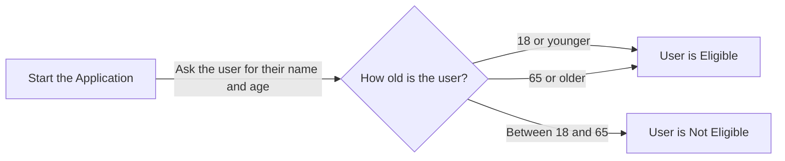

import * as Components from '@site/src/components'
import {Quizlet, Answer, Explanation} from '@site/src/components';

What we will do in this section is work through a legal software application which has bugs. We will work out how to spot these errors and how to fix them.

## Our Broken Code
First, let's look at our broken code.

:::tip
To work your way through this chapter, you can copy this code in a new file in your Docassemble playground.
:::

```yaml showLineNumbers title="Ch9_Buggy_Code.yml"
---
objects:
  - events: DADict
---
metadata:
  title: |
    The Means Testinator
---
mandatory: True
question: Welcome to the Means Testinator
subquestion: |
  The Means Testinator App 
  
  Press **Continue** to use the app.
buttons:
  -Continue: continue
---
mandatory: True
question: Thank you for Completing the Means Testinator
subquestion: |
  Hello **${userSalutation} ${userFirstname} ${userLastname}**,
  
  Looks like you are:
  % if userAgeCategory = 'adult:
    *an adult*
  % elif userAgeCategory = 'child':
  *just a child!*
  % elif userAgeCategory == 'pensioner':
  *a pensioner*
  % else:
  - Sorry, I don't know what you are (and you're not getting welfare)!
  % endif
  
  Anyway, let's move on
buttons:
  - Let's move on indeed!: continue
  - Nope, I'm done with this: exit
---
# We display different endpoints based on the age category
mandatory: True
code: |
  if userAgeCategory == 'child' or userAgeCategory == 'pensioner'
  endpoint['get_welfare']
  elif userAgeCategory == 'adult
  endpoint['no_welfare_for_you']
  else:
    endpoint['should_not_be_here']
---
event: endpoint['get_welfare']
question: You are eligible for welfare
subquestion: |
  You are eligible for welfare.
  
  Go to [Services Australia](https://www.servicesaustralia.gov.au/) to see what you might be eligible for.
buttons:
  - Exit: exit
  - I want to see how people who are not eligible for welfare live: restart
---
event: endpoint['no_welfare_for_you']
question: You are not eligible for welfare
subquestion: |
  The government thinks you don't deserve welfare. 
buttons:
  - Fair enough: exit
  - I want to change my age and try again: restart
---
question: Please enter your details
fields: 
  - First name: userFirstname
      default: John
      - Last name: userLastname
        default: Smith
  - Age: userAge
default: 20
datatype: integer
---
code: |
  if 18 <= userAge < 65:
    userAgeCategory = adult
  elif userAge < 18:
    userAgeCategory = 'child'
  else userAgeCategory == 'pensioner:
    userAgeCategory = 'pensioner'
---
```

### How should this code work?
We are attempting to implement the following flowchart in our code:



In other words, if the user is either 18 or younger, or 65 or older, they are eligible for welfare. Otherwise, they are not. 

:::caution
As per what we covered in [Chapter Four](/docs/textbook/chapter_04/index.mdx), note that this is not actually how welfare works in Australia. If you are developing an app to help someone with welfare, you will need to do your own research to make sure that you correctly interpret the law!
:::

## Fixing Our Broken Code
The best place to start with when we want to fix broken code is to run it. 

### Finding Syntax Errors
If we press **Save and Run** from the Docassemble playground, we immediately get the following error:

<Components.DisplayImage imageURL='/img/textbook/chapter_09/ch09_buggy_code_unterminated_string_literal.PNG' altText='This is the first error that we encounter.'/>

:::tip
It's a good idea to read through any errors generated by Docassemble to sees if you can figure out what they mean.
:::

What does 'unterminated string literal mean'? We know from [Chapter Three](/docs/textbook/chapter_03/index.mdx) that a string is a type of variable in Python and Docassemble. Specifically, a string stands for a **string of characters**. We normally put strings in a set of single quotes. That suggests we should be looking for a missing set of quotes.

Sure enough, our Mako if statement on line 24 is missing a single quote afrer the string `adult`. 

<Components.DisplayImage imageURL='/img/textbook/chapter_09/ch09_buggy_code_unterminated_string_source.PNG' altText='This is the source of our unterminated string literal error'/>

Let's add in a single quote at the end of line 24 after 'adult. If we press **Save** again, we see that we still have a syntax error. Let's press **Save and Run** again. This time we will get a different syntax error:

<Components.DisplayImage imageURL='/img/textbook/chapter_09/ch09_buggy_code_invalid_syntax.PNG' altText='This is the next error that we encounter - it looks like it has something to do with our if statements'/>

Again, reading this if statement, it appears that there is a problem with our if statements. We know from [Chapter Four](/docs/textbook/chapter_04/index.mdx) that for a valid Mako if statement, we need two equals signs, not just one. Again, if we look at lines 24 and 26, we can see the error.

<Components.DisplayImage imageURL='/img/textbook/chapter_09/ch09_buggy_code_invalid_syntax_source.PNG' altText='This is the source of our invalid syntax error'/>

We can fix this by adding in an extra `=` after the first one on Lines 24 and 26.

<Components.DisplayImage imageURL='/img/textbook/chapter_09/ch09_buggy_code_invalid_syntax_fix.PNG' altText='As you can see, we have fixed our invalid syntax error.'/>

If we press save though, we can still see that we have a syntax error. However, this time our playground has changed ever so slightly:

<Components.DisplayImage imageURL='/img/textbook/chapter_09/ch09_buggy_code_invalid_playground_changes.PNG' altText='We are still running into a syntax error, but we can see that four of our variables are undefined.'/>

### Finding Errors by Counting Line Numbers
Let's try running this code again. 

<Components.DisplayImage imageURL='/img/textbook/chapter_09/ch09_buggy_code_unterminated_string_literal_line_3.PNG' altText='This is another unterminated string literal error message.'/>

Docassemble has generated another unterminated string literal. This means that we have another incomplete string somewhere. Rather than try to search for it manually, we are going to use the message on the first line of our error message, `(detected at line 3) (<code block>, line 3)` to find the error. We can see after this message, there is a snippet of our first code block. This code block starts on line 38:

<Components.DisplayImage imageURL='/img/textbook/chapter_09/ch09_buggy_code_unterminated_string_source_line_38.PNG' altText='This screenshot shows us the start of our code block.'/>

However, what Docassemble is telling us is that the error is in line 3 of our code block. What we need to do then is to look (quite literally) for line 3 in our code block, which is the third line after the `code: |` tag - that is, Line 44. Sure enough, we can see that our `elif` statement clause is missing a quote at the end of `adult`. Let's add that in:

<Components.DisplayImage imageURL='/img/textbook/chapter_09/ch09_buggy_code_unterminated_string_fix_line_38.PNG' altText='We have fixed our syntax error - or have we?'/>

We might think that this is enough, but alas if we press **Save** our celebrations are premature - there is still a syntax error! This time it's a different syntax error:

<Components.DisplayImage imageURL='/img/textbook/chapter_09/ch09_buggy_code_expected.PNG' altText='Another syntax error, this time telling us that there is a problem in Line 1 of our code'/>

By using the same technique as what we did previously, we can see that the error is on Line 1 of our code block (that is, Line 42). We can then read the above error message to see that we are missing an `:` at the end of Line 42 (and Line 44, for that matter). Let's add those in.

<Components.DisplayImage imageURL='/img/textbook/chapter_09/ch09_buggy_code_expected_fix.PNG' altText='We have fixed our expected : syntax error message. Of course, there are still more syntax errors to fix. '/>

Nevertheless, if we run our code again, we will still get a syntax error!

<Components.DisplayImage imageURL='/img/textbook/chapter_09/ch09_buggy_code_expected_indented.PNG' altText='Another syntax error, related to another expected feature.'/>

This time, we know that the syntax error is on Line 1 of our code block (that is, Line 42). However, the error message indicates that Docassemble expected the contents of the if statement to be indented. Let's go ahead and do that.

<Components.DisplayImage imageURL='/img/textbook/chapter_09/ch09_buggy_code_expected_indented_fix.PNG' altText='Another syntax error, related to another expected feature.'/>

That will fix this syntax error in our first question block and our code block. 