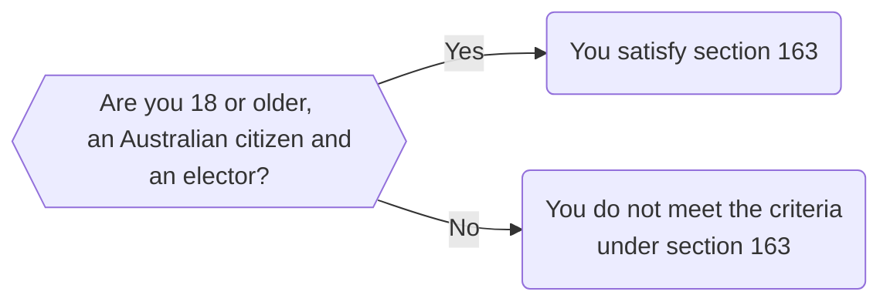

This section will explain how to write questions for your legal application. 

## Design Your Application Before Writing Questions
In carpentry, there is a proverb; '[measure twice, cut once](https://en.wiktionary.org/wiki/measure_twice_and_cut_once)'. The same is true for legal application design. You should plan what your application will look like before you start writing any code.

If you have been following along with this textbook so far, you would have seen that we first map out all of our applications as flowcharts. Doing so can help you visualise your application flow of control.

## Think About What Values You Need From Your User
In [Chapter 3](/docs/textbook/chapter_03), you learned about variables. You can *assign* a value to a variable, as well as *evaluate* that variable. 

In [Chapter 4](/docs/textbook/chapter_04/00-20.mdx), you learned about how to use variables to drive the logic of your application.

When you plan out your application, you should think about what information you need from your user. Let's take the eligibility criteria to stand for Federal Parliament as an example. The requirements from section 163 of the *Commonwealth Electoral Act 1918* (Cth):

* The person must be 18 years or older
* The person must be an Australian citizen
* The person must be registered as an elector

To evaluate the first requirement, we could ask for a person's age. To do so, we would set it as an integer value. The next two questions could be stored in variables as Boolean values (either True or False).

We could then plan out our flow chart like this:



When you are designing your application, only collect the information from your user that you need. Do not ask for unnecessary information. Doing so could frustrate your user, as well as raise issues around privacy.

:::tip
Remember that you should only collect the information that you need from your user! If you can complete the application without certain information you should do so.
:::

## Grouping your questions together
When you start thinking about what questions you need, you should also think about how you will group your questions together. This will largely depend on the type of app you have been commissioned to develop, as well as the relevant law. This section will provide some general advice on how to structure your application.

### Open with an introductory screen
Your application should always start with an introductory screen. You might include different things in this screen depending on your application. However, there are a few features you should include:

First, you should include the name of the application, as well as which organisation is providing the application.

Second, you should explain what the application does. Ideally, this should be as simple as possible. 

Third, you should include a disclaimer. Remember that in Australia, only lawyers can provide legal advice. What your application will do is provide *legal information*. If your user needs more precise legal advice, they should speak to a lawyer.

Fourth, you should explain what types of information you are collecting. If you are collecting personal information (include ref to personal information), that means your app will need to comply with relevant privacy legislation. For most apps, the relevant legislation will be the [*Privacy Act 1988* (Cth)](https://www.legislation.gov.au/Details/C2014C00076) if you are working for non-for-profits and other private organisations (such as community legal centres). However, there may be other relevant laws governing personal information in different contexts. For example, organisations that work with vulnerable people in South Australia are bound by the *[Information Sharing Guidelines](https://www.dpc.sa.gov.au/__data/assets/pdf_file/0009/45396/Information-Sharing-Guidelines.pdf)*. 

Fifth, you should also consider any requirements under the [Australian Solicitors' Conduct Rules](https://lawcouncil.au/policy-agenda/regulation-of-the-profession-and-ethics/australian-solicitors-conduct-rules) (ASCR) if you are working for a law firm. Rule 9 prohibits legal practitioners from disclosing any of a client's confidential information to a third party except in specific circumstances. Rule 11 requires legal practitioners to avoid conflicts of interest, and prohibits practitioners from representing two or more clients in the same matter when they possess confidential information about a client. You should indicate how you intend to collect, use and store information your user provides. 

Sixth, your landing screen should tell the user that they can exit the application if they do not agree to the terms of this disclaimer. Otherwise, they can continue with using the application. Pressing a continue button or agreeing to the terms of service amounts to consent to collect and use the user's information. 

### Start with Filtering Questions
Filtering questions help determine whether someone is eligible for a service or can use your application. For example:

* Your app might refer to services that are only available to people in a particular age range, such as the Aged Pension
* Your app might only be available to people in a particular geographic location, such as a particular State or Territory
* Your app might only be available to people who meet other criteria, such as having a recognised disability

Start broad with filtering questions, and then narrow them down depending on the legal requirements you have identified.

### Include Any Assumptions About Your User
Most of your users might give only one answer to a particular question. You might just want to make your application as easy to use as possible. Therefore, you should work out where these pain points are in your application. You can use default values to help your user.

### Do Not Eject Users Without Helpful Information
Someone might use your app and discover that they are not eligible for a particular service, or do not meet other criteria. If so, they should not be ejected from the application without any helpful information.

For example, let's say that your app is only targeted at people in particular state of Australia, such as South Australia. If your user answers that they are located in the Northern Territory, you might want to refer them on to another service.

### Consider the Order of Your Questions
In previous chapters (insert appropriate ref) we would have explained how to control the logic of your application. We usually recommend that you design your application with one mandatory code block. You can then put references into this code block to each variable assigned by a question block or an ```event``` for an endpoint (see below).

### Consider How Many Endpoints You Will Need
Depending on the answers that your users enter, they will be directed to an endpoint.

Sometimes, you might only need one endpoint. For example, if you are designing a client intake form for a law firm, your application should ask a user several questions, and then send their information onto the law firm. 

For other applications, you might have two or more endpoints. You can direct users to different endpoints using an ```event:``` tag, followed by a variable name. You can refer to this variable name in your mandatory code block which drives your application.

:::tip
Flowcharts can help you map out the scope of your application, as well as how many endpoints you need.
:::