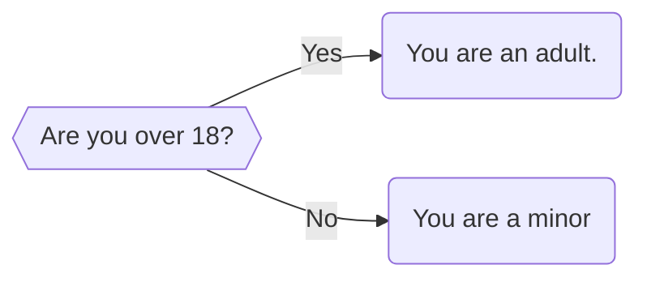
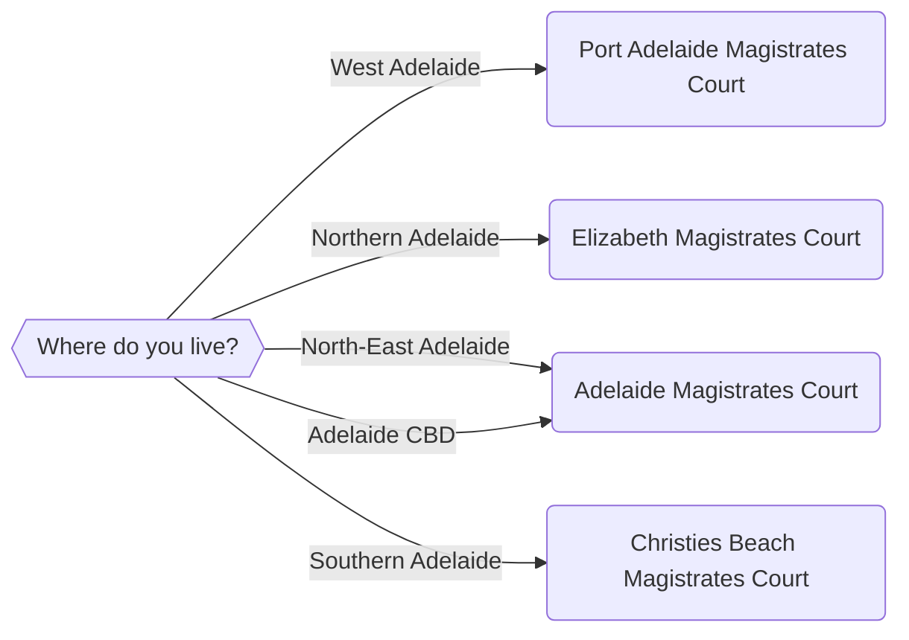
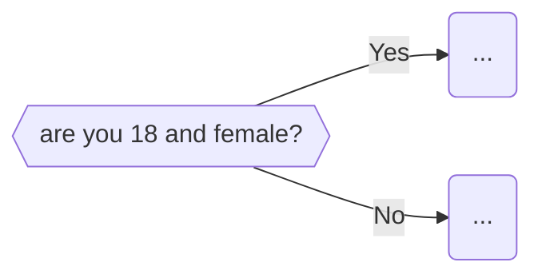

import {DisplayGlossaryItem} from '@site/src/components';

## An introduction to Logic
- This is one of the main ways of controlling logic.
- We need to make decisions in our app.  We need to decide if a user is eligible for a pension, or for a vaccine booster, or to be elected to parliament, or of they're allowed to destroy a tree.  These are decisions.
- Every decision we make will usually have two or more potential answers (otherwise, it's not a decision).  
- Simple decisions might be 'Yes/No' decisions.

- More complex decisions might have many different answers.  For example, when deciding on the closest court

:::tip todo
Style the flowcharts with the styles we already have in other flowcharts
:::
:::tip todo
Is there a way to centralise the flowchart styles instead of copying them into
every single flowchart manually?

Is there a way to automatically assign, for example the `{{...}}` elements in the 
flowchart the appropriate style automatically?
:::

## Express logic in code - If statements
- we need a way to express this decision-making process in code.  To do so we use  <DisplayGlossaryItem item='ifstatement' plural />.
An if statement allows us to express 'if-this-then-that' decision-making that is central to application design.

- express the two flowcharts above as if statements but don't go into them straight away.  Just draw the relationship between the two.

Then we go into if statements.  

Review C2.01.  From memory I think we had these shortcomings.
- we need to cover it a bit more slowly.  Introduce if, then if/else, then if/elif.  Maybe have mini-quizzes after each one?
    - we want quite a few examples under here.
    - If/else will be used the most - it's for Yes/No answers
        - point back to the 'Yes/No' discussion we had in ch3a
    - If/elif is used when there's more than one answer
        - maybe show some simple ones (like the example above) but then go into some more complex ones
- Relate back to testing.  If statments basically test if something is true.  So, if age is over 18 would be to test the mathematical expression `age >= 18` is true.
- If we want to test something is false we need to
    1. either use the `else` part of the statement; or
    2. express our test so that it returns true.  For example if we want to test if someone is **not** over 18, then we re-express that test as someone being **under** 18 (`age < 18`)

## Nested If statements
If statements aren't usually used in isolation, much like decisions aren't made in isolation.
Usually we make a set of decisions to arrive at a conclusion.  For example,

> Something like the dog legislation?  Or maybe there's something we can take from the C5 videos?

- Discuss how we express this code by having an if statement inside another if statement (show an example, or an example of the above code would be great).
- These are called **nested if statements** 
:::note
not a glossary term. Should it be?
:::
- In practice you will use many nested if statements precisely because you'll 
need to make many decisions, one after the other.
:::tip todo
quizzes or exercises exploring nested if statements. Maybe match the if statement to a flowchart?
:::

## Testing many things at once
- sometimes may need to check more than one thing at a time before move on eg:

Explain thahis as an `if a == xx and b == yy`
- expand into multiple ands?

Explain that this way is better when you know the result of both (or all) the 
testing variables at once.  If you don't know all the results, then use nested if statements.

## More complex examples
And maybe we transpose the C5 videos into here?

## Mako if
Probably need to introduce this earlier?

- express if statements in subquestion blocks so can control display output
    - show an example
- emphasise the distinction between Mako and code block if statements
- emphasise can't indent Mako ifs
    - and need a `% endif`